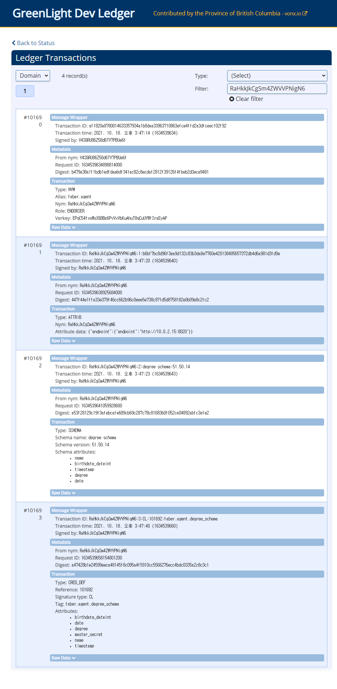

# Hyperledger Aries

`Need to know Hyperledger Indy before learn Hyperledger Aries`

[github : `aries`](https://github.com/hyperledger/aries)<br>


 - Aries = Agent


<br>
<hr>
<br>

# [ What is Hyperledger Aries ]

<br><br>

## _프로젝트 개요_

`indy-node`를 통해 DID 및 신원 인증 관련 데이터를 블록체인에 저장하고 `indy-sdk`를 통해 클라이언트단과 블록체인 네트워크와 통신하였다.

Hyperledger Aries는 클라이언트 간의 데이터 전송에 관련된 표준과 프레임워크를 개발하는 프로젝트이다.

프로젝트 개발 프로세스는 다음과 같다.

 - `aries-rfcs` ACCEPT --> Aries Framework 개발

 - `aries-rfcs` ACCEPT --> Aries Cloud/Static Agent 개발


[github : `aries-rfcs`](https://github.com/hyperledger/aries-rfcs)<br>

<br><br>

## _Why Aries_


When it first began, the Hyperledger Indy project included code for all three of the lower layers—for the Indy SSI ledger at layer 1; for SSI agents, wallets and DID-to-DID communications at layer 2, and for ZKP-based credential exchange at layer 3.

This was very powerful, but also somewhat overwhelming for new developers. And it gave the impression that layers 2 and 3 were tied to the Hyperledger Indy permissioned blockchain code at layer 1.

Separating out layer 2 and 3 code into a new independent project brings clarity to the fact that the goal of this four-layer stack is universal interoperability among all SSI ledgers, agents, wallets, verifiable credentials, and governance frameworks. This includes new DID networks such as the Bitcoin-based ION network announced by Microsoft at Consensus, the Ethereum network, the Veres One network, or any other modern blockchain capable of supporting DIDs and the other cryptographic primitives necessary for the DID Communications protocol at layer 2.


<br><br>

## _Aries 구조_


All Aries agent deployments have two logical components: a `framework` and a `controller`.


### - Framework

The framework contains the standard capabilities that enable an Aries agent to interact with its surroundings—ledgers, storage and other agents. A framework is an artifact of an Aries project that you don’t have to create or maintain, you just embed in your solution. The framework knows how to initiate connections, respond to requests, send messages and more. However, a framework needs to be told when to initiate a connection. It doesn’t know what response should be sent to a given request. It just sits there until it’s told what to do.

### - Controller

The controller is the component that, well, controls, an instance of an Aries framework’s behavior—the business rules for that particular instance of an agent. The controller is the part of a deployment that you build to create an Aries agent that handles your use case for responding to requests from other agents, and for initiating requests.

<br><br>


## _대표 Framework_ : `aries-cloudagent-python`

[github : `aries-cloudagent-python`](https://github.com/hyperledger/aries-cloudagent-python)<br>


## _Indy + Aries 플랫폼_


<br><br><br><br><hr><br><br><br><br>

# [DEMO : Aries OpenAPI DEMO]

_`DIDComm Layer`_

## _Using GreenLight Dev Ledger `vonx.io`_

http://dev.greenlight.bcovrin.vonx.io/

<br><br>

## _aries-cloudagent-python_

```cmd
git clone https://github.com/hyperledger/aries-cloudagent-python
```

<br><br>

## _Terminal A : Start the Faber Agent_

```cmd
cd aries-cloudagent-python/demo

LEDGER_URL=http://dev.greenlight.bcovrin.vonx.io ./run_demo faber --events --no-auto --bg

docker logs -f faber
```
`Starting [faber] agent with args [--port 8020 --no-auto`

###### Initializing demo agent faber with AIP 20 and credential type indy

 - RESULT : Provision an agent and wallet, get back configuration details
```
Faber      | nym_info: {'did': 'RaHkkJkCgSm4ZWVVPNigN6', 'seed': 'd_000000000000000000000000437328', 'verkey': 'EPqC54fvoWsXG8Bp6PvVxVbKuAhuT8qCuUYWfSraEyAP'}
Faber      | Registered DID: RaHkkJkCgSm4ZWVVPNigN6
```
 
 - RESULT : Created public DID

```
[
  '/home/indy/.pyenv/versions/3.6.13/bin/python', '-m', 'aries_cloudagent', 'start', 
  '--endpoint', 'http://10.0.2.15:8020', 
  '--label', 'faber.agent', 
  '--auto-ping-connection', 
  '--auto-respond-messages', 
  '--inbound-transport', 'http', '0.0.0.0', '8020', '--outbound-transport', 'http', 
  '--admin', '0.0.0.0', '8021',
  '--admin-insecure-mode', 
  '--wallet-type', 'indy', 
  '--wallet-name', 'faber.agent437328', 
  '--wallet-key', 'faber.agent437328', 
  '--preserve-exchange-records', 
  '--auto-provision', 
  '--emit-new-didcomm-prefix', 
  '--genesis-transactions', '{
    "reqSignature": {},
    "txn": {
        "data": {
            "data": {
                "alias": "Node1",
                "blskey": "4N8aUNHSgjQVgkpm8nhNEfDf6txHznoYREg9kirmJrkivgL4oSEimFF6nsQ6M41QvhM2Z33nves5vfSn9n1UwNFJBYtWVnHYMATn76vLuL3zU88KyeAYcHfsih3He6UHcXDxcaecHVz6jhCYz1P2UZn2bDVruL5wXpehgBfBaLKm3Ba",
                "blskey_pop": "RahHYiCvoNCtPTrVtP7nMC5eTYrsUA8WjXbdhNc8debh1agE9bGiJxWBXYNFbnJXoXhWFMvyqhqhRoq737YQemH5ik9oL7R4NTTCz2LEZhkgLJzB3QRQqJyBNyv7acbdHrAT8nQ9UkLbaVL9NBpnWXBTw4LEMePaSHEw66RzPNdAX1",
                "client_ip": "159.203.21.90",
                "client_port": 9702,
                "node_ip": "159.203.21.90",
                "node_port": 9701,
                "services": [
                    "VALIDATOR"
                ]
            },
            "dest": "Gw6pDLhcBcoQesN72qfotTgFa7cbuqZpkX3Xo6pLhPhv"
        },
        "metadata": {
            "from": "Th7MpTaRZVRYnPiabds81Y"
        },
        "type": "0"
    },
    "txnMetadata": {
        "seqNo": 1,
        "txnId": "fea82e10e894419fe2bea7d96296a6d46f50f93f9eeda954ec461b2ed2950b62"
    },
    "ver": "1"
}\n
{
    "reqSignature": {},
    "txn": {
        "data": {
            "data": {
                "alias": "Node2",
                "blskey": "37rAPpXVoxzKhz7d9gkUe52XuXryuLXoM6P6LbWDB7LSbG62Lsb33sfG7zqS8TK1MXwuCHj1FKNzVpsnafmqLG1vXN88rt38mNFs9TENzm4QHdBzsvCuoBnPH7rpYYDo9DZNJePaDvRvqJKByCabubJz3XXKbEeshzpz4Ma5QYpJqjk",
                "blskey_pop": "Qr658mWZ2YC8JXGXwMDQTzuZCWF7NK9EwxphGmcBvCh6ybUuLxbG65nsX4JvD4SPNtkJ2w9ug1yLTj6fgmuDg41TgECXjLCij3RMsV8CwewBVgVN67wsA45DFWvqvLtu4rjNnE9JbdFTc1Z4WCPA3Xan44K1HoHAq9EVeaRYs8zoF5",
                "client_ip": "159.203.21.90",
                "client_port": 9704,
                "node_ip": "159.203.21.90",
                "node_port": 9703,
                "services": [
                    "VALIDATOR"
                ]
            },
            "dest": "8ECVSk179mjsjKRLWiQtssMLgp6EPhWXtaYyStWPSGAb"
        },
        "metadata": {
            "from": "EbP4aYNeTHL6q385GuVpRV"
        },
        "type": "0"
    },
    "txnMetadata": {
        "seqNo": 2,
        "txnId": "1ac8aece2a18ced660fef8694b61aac3af08ba875ce3026a160acbc3a3af35fc"
    },
    "ver": "1"
}\n
{
    "reqSignature": {},
    "txn": {
        "data": {
            "data": {
                "alias": "Node3",
                "blskey": "3WFpdbg7C5cnLYZwFZevJqhubkFALBfCBBok15GdrKMUhUjGsk3jV6QKj6MZgEubF7oqCafxNdkm7eswgA4sdKTRc82tLGzZBd6vNqU8dupzup6uYUf32KTHTPQbuUM8Yk4QFXjEf2Usu2TJcNkdgpyeUSX42u5LqdDDpNSWUK5deC5",
                "blskey_pop": "QwDeb2CkNSx6r8QC8vGQK3GRv7Yndn84TGNijX8YXHPiagXajyfTjoR87rXUu4G4QLk2cF8NNyqWiYMus1623dELWwx57rLCFqGh7N4ZRbGDRP4fnVcaKg1BcUxQ866Ven4gw8y4N56S5HzxXNBZtLYmhGHvDtk6PFkFwCvxYrNYjh",
                "client_ip": "159.203.21.90",
                "client_port": 9706,
                "node_ip": "159.203.21.90",
                "node_port": 9705,
                "services": [
                    "VALIDATOR"
                ]
            },
            "dest": "DKVxG2fXXTU8yT5N7hGEbXB3dfdAnYv1JczDUHpmDxya"
        },
        "metadata": {
            "from": "4cU41vWW82ArfxJxHkzXPG"
        },
        "type": "0"
    },
    "txnMetadata": {
        "seqNo": 3,
        "txnId": "7e9f355dffa78ed24668f0e0e369fd8c224076571c51e2ea8be5f26479edebe4"
    },
    "ver": "1"
}\n
{
    "reqSignature": {},
    "txn": {
        "data": {
            "data": {
                "alias": "Node4",
                "blskey": "2zN3bHM1m4rLz54MJHYSwvqzPchYp8jkHswveCLAEJVcX6Mm1wHQD1SkPYMzUDTZvWvhuE6VNAkK3KxVeEmsanSmvjVkReDeBEMxeDaayjcZjFGPydyey1qxBHmTvAnBKoPydvuTAqx5f7YNNRAdeLmUi99gERUU7TD8KfAa6MpQ9bw",
                "blskey_pop": "RPLagxaR5xdimFzwmzYnz4ZhWtYQEj8iR5ZU53T2gitPCyCHQneUn2Huc4oeLd2B2HzkGnjAff4hWTJT6C7qHYB1Mv2wU5iHHGFWkhnTX9WsEAbunJCV2qcaXScKj4tTfvdDKfLiVuU2av6hbsMztirRze7LvYBkRHV3tGwyCptsrP",
                "client_ip": "159.203.21.90",
                "client_port": 9708,
                "node_ip": "159.203.21.90",
                "node_port": 9707,
                "services": [
                    "VALIDATOR"
                ]
            },
            "dest": "4PS3EDQ3dW1tci1Bp6543CfuuebjFrg36kLAUcskGfaA"
        },
        "metadata": {
            "from": "TWwCRQRZ2ZHMJFn9TzLp7W"
        },
        "type": "0"
    },
    "txnMetadata": {
        "seqNo": 4,
        "txnId": "aa5e817d7cc626170eca175822029339a444eb0ee8f0bd20d3b0b76e566fb008"
    },
    "ver": "1"
}\n', 
  '--seed', 'd_000000000000000000000000437328', 
  '--webhook-url', 'http://10.0.2.15:8022/webhooks', 
  '--trace-target', 'log', 
  '--trace-tag', 'acapy.events', 
  '--trace-label', 'faber.agent.trace'
]
```
```
Faber      | 
Faber      | ::::::::::::::::::::::::::::::::::::::::::::::
Faber      | :: faber.agent                              ::
Faber      | ::                                          ::
Faber      | ::                                          ::
Faber      | :: Inbound Transports:                      ::
Faber      | ::                                          ::
Faber      | ::   - http://0.0.0.0:8020                  ::
Faber      | ::                                          ::
Faber      | :: Outbound Transports:                     ::
Faber      | ::                                          ::
Faber      | ::   - http                                 ::
Faber      | ::   - https                                ::
Faber      | ::                                          ::
Faber      | :: Public DID Information:                  ::
Faber      | ::                                          ::
Faber      | ::   - DID: RaHkkJkCgSm4ZWVVPNigN6          ::
Faber      | ::                                          ::
Faber      | :: Administration API:                      ::
Faber      | ::                                          ::
Faber      | ::   - http://0.0.0.0:8021                  ::
Faber      | ::                                          ::
Faber      | ::                           ver: 0.7.2-rc0 ::
Faber      | ::::::::::::::::::::::::::::::::::::::::::::::
Faber      | 
Faber      | Listening...
Faber      | 
Startup duration: 6.53s
Admin URL is at: http://10.0.2.15:8021
Endpoint URL is at: http://10.0.2.15:8020
```
- RESULT : Create a new schema/cred def on the ledge
```
EVENT: Controller POST /schemas request to Agent with data: 
{
    "schema_name": "degree schema",
    "schema_version": "51.50.14",
    "attributes": [
        "name",
        "date",
        "degree",
        "birthdate_dateint",
        "timestamp"
    ]
}

EVENT: Response from POST /schemas received: 
{
    "schema_id": "RaHkkJkCgSm4ZWVVPNigN6:2:degree schema:51.50.14",
    "schema": {
        "ver": "1.0",
        "id": "RaHkkJkCgSm4ZWVVPNigN6:2:degree schema:51.50.14",
        "name": "degree schema",
        "version": "51.50.14",
        "attrNames": [
            "degree",
            "timestamp",
            "name",
            "birthdate_dateint",
            "date"
        ],
        "seqNo": 101692
    }
}
Schema:
  {
    "schema_id": "RaHkkJkCgSm4ZWVVPNigN6:2:degree schema:51.50.14",
    "schema": {
      "ver": "1.0",
      "id": "RaHkkJkCgSm4ZWVVPNigN6:2:degree schema:51.50.14",
      "name": "degree schema",
      "version": "51.50.14",
      "attrNames": [
        "degree",
        "timestamp",
        "name",
        "birthdate_dateint",
        "date"
      ],
      "seqNo": 101692
    }
  }
  
Schema ID: RaHkkJkCgSm4ZWVVPNigN6:2:degree schema:51.50.14

EVENT: Controller POST /credential-definitions request to Agent with data: 
{
    "schema_id": "RaHkkJkCgSm4ZWVVPNigN6:2:degree schema:51.50.14",
    "support_revocation": false,
    "tag": "faber.agent.degree_schema"
}

EVENT: Response from POST /credential-definitions received: 
{
    "credential_definition_id": "RaHkkJkCgSm4ZWVVPNigN6:3:CL:101692:faber.agent.degree_schema"
}
Cred def ID: RaHkkJkCgSm4ZWVVPNigN6:3:CL:101692:faber.agent.degree_schema
Publish schema/cred def duration: 18.66s
```
- RESULT : Create a connection to alice and print out the invite details

```
EVENT: Controller POST /connections/create-invitation request to Agent

EVENT: Response from POST /connections/create-invitation received: 
{
    "connection_id": "a2546d65-b0f7-42bf-980d-011c19f204b1",
    "invitation": {
        "@type": "https://didcomm.org/connections/1.0/invitation",
        "@id": "33c3ca94-22fa-4b63-bf6e-27be6dff7012",
        "label": "faber.agent",
        "recipientKeys": [
            "9HUpUKC6bJHZjRRsFPVDxmPTThdE2cfbwd9SehGTptca"
        ],
        "serviceEndpoint": "http://10.0.2.15:8020"
    },
    "invitation_url": "http://10.0.2.15:8020?c_i=eyJAdHlwZSI6ICJodHRwczovL2RpZGNvbW0ub3JnL2Nvbm5lY3Rpb25zLzEuMC9pbnZpdGF0aW9uIiwgIkBpZCI6ICIzM2MzY2E5NC0yMmZhLTRiNjMtYmY2ZS0yN2JlNmRmZjcwMTIiLCAibGFiZWwiOiAiZmFiZXIuYWdlbnQiLCAicmVjaXBpZW50S2V5cyI6IFsiOUhVcFVLQzZiSkhaalJSc0ZQVkR4bVBUVGhkRTJjZmJ3ZDlTZWhHVHB0Y2EiXSwgInNlcnZpY2VFbmRwb2ludCI6ICJodHRwOi8vMTAuMC4yLjE1OjgwMjAifQ=="
}
Generate invitation duration: 0.02s
Use the following JSON to accept the invite from another demo agent. Or use the QR code to connect from a mobile agent.
Invitation Data:
{"@type": "https://didcomm.org/connections/1.0/invitation", "@id": "33c3ca94-22fa-4b63-bf6e-27be6dff7012", "label": "faber.agent", "recipientKeys": ["9HUpUKC6bJHZjRRsFPVDxmPTThdE2cfbwd9SehGTptca"], "serviceEndpoint": "http://10.0.2.15:8020"}
```

 - RESULT : `/connections`

```
EVENT: Agent called controller webhook: handle_connections
POST http://10.0.2.15:8022/webhooks/topic/connections/ with payload: 
{
    "invitation_mode": "once",
    "created_at": "2021-10-18 06:47:39.519021Z",
    "updated_at": "2021-10-18 06:47:39.519021Z",
    "rfc23_state": "invitation-sent",
    "state": "invitation",
    "routing_state": "none",
    "connection_id": "a2546d65-b0f7-42bf-980d-011c19f204b1",
    "connection_protocol": "connections/1.0",
    "invitation_key": "9HUpUKC6bJHZjRRsFPVDxmPTThdE2cfbwd9SehGTptca",
    "accept": "manual",
    "their_role": "invitee"
}
```

<br><br>

## _Terminal B : Start the Alice Agent_
```cmd
cd aries-cloudagent-python/demo

LEDGER_URL=http://dev.greenlight.bcovrin.vonx.io ./run_demo alice --events --no-auto --bg

docker logs -f alice
```
`Starting [alice] agent with args [--port 8030 --no-auto]`

###### Initializing demo agent alice with AIP 20 and credential type None
- RESULT : Provision an agent and wallet, get back configuration details
```
[
  '/home/indy/.pyenv/versions/3.6.13/bin/python', '-m', 'aries_cloudagent', 'start', 
  '--endpoint', 'http://10.0.2.15:8030', 
  '--label', 'alice.agent', 
  '--auto-ping-connection', 
  '--auto-respond-messages', 
  '--inbound-transport', 'http', '0.0.0.0', '8030', 
  '--outbound-transport', 'http', 
  '--admin', '0.0.0.0', '8031', 
  '--admin-insecure-mode', 
  '--wallet-type', 'indy', 
  '--wallet-name', 'alice.agent483200', 
  '--wallet-key', 'alice.agent483200', 
  '--preserve-exchange-records', 
  '--auto-provision', 
  '--emit-new-didcomm-prefix', 
  '--genesis-transactions', '{
    "reqSignature": {},
    "txn": {
        "data": {
            "data": {
                "alias": "Node1",
                "blskey": "4N8aUNHSgjQVgkpm8nhNEfDf6txHznoYREg9kirmJrkivgL4oSEimFF6nsQ6M41QvhM2Z33nves5vfSn9n1UwNFJBYtWVnHYMATn76vLuL3zU88KyeAYcHfsih3He6UHcXDxcaecHVz6jhCYz1P2UZn2bDVruL5wXpehgBfBaLKm3Ba",
                "blskey_pop": "RahHYiCvoNCtPTrVtP7nMC5eTYrsUA8WjXbdhNc8debh1agE9bGiJxWBXYNFbnJXoXhWFMvyqhqhRoq737YQemH5ik9oL7R4NTTCz2LEZhkgLJzB3QRQqJyBNyv7acbdHrAT8nQ9UkLbaVL9NBpnWXBTw4LEMePaSHEw66RzPNdAX1",
                "client_ip": "159.203.21.90",
                "client_port": 9702,
                "node_ip": "159.203.21.90",
                "node_port": 9701,
                "services": [
                    "VALIDATOR"
                ]
            },
            "dest": "Gw6pDLhcBcoQesN72qfotTgFa7cbuqZpkX3Xo6pLhPhv"
        },
        "metadata": {
            "from": "Th7MpTaRZVRYnPiabds81Y"
        },
        "type": "0"
    },
    "txnMetadata": {
        "seqNo": 1,
        "txnId": "fea82e10e894419fe2bea7d96296a6d46f50f93f9eeda954ec461b2ed2950b62"
    },
    "ver": "1"
}\n
{
    "reqSignature": {},
    "txn": {
        "data": {
            "data": {
                "alias": "Node2",
                "blskey": "37rAPpXVoxzKhz7d9gkUe52XuXryuLXoM6P6LbWDB7LSbG62Lsb33sfG7zqS8TK1MXwuCHj1FKNzVpsnafmqLG1vXN88rt38mNFs9TENzm4QHdBzsvCuoBnPH7rpYYDo9DZNJePaDvRvqJKByCabubJz3XXKbEeshzpz4Ma5QYpJqjk",
                "blskey_pop": "Qr658mWZ2YC8JXGXwMDQTzuZCWF7NK9EwxphGmcBvCh6ybUuLxbG65nsX4JvD4SPNtkJ2w9ug1yLTj6fgmuDg41TgECXjLCij3RMsV8CwewBVgVN67wsA45DFWvqvLtu4rjNnE9JbdFTc1Z4WCPA3Xan44K1HoHAq9EVeaRYs8zoF5",
                "client_ip": "159.203.21.90",
                "client_port": 9704,
                "node_ip": "159.203.21.90",
                "node_port": 9703,
                "services": [
                    "VALIDATOR"
                ]
            },
            "dest": "8ECVSk179mjsjKRLWiQtssMLgp6EPhWXtaYyStWPSGAb"
        },
        "metadata": {
            "from": "EbP4aYNeTHL6q385GuVpRV"
        },
        "type": "0"
    },
    "txnMetadata": {
        "seqNo": 2,
        "txnId": "1ac8aece2a18ced660fef8694b61aac3af08ba875ce3026a160acbc3a3af35fc"
    },
    "ver": "1"
}\n
{
    "reqSignature": {},
    "txn": {
        "data": {
            "data": {
                "alias": "Node3",
                "blskey": "3WFpdbg7C5cnLYZwFZevJqhubkFALBfCBBok15GdrKMUhUjGsk3jV6QKj6MZgEubF7oqCafxNdkm7eswgA4sdKTRc82tLGzZBd6vNqU8dupzup6uYUf32KTHTPQbuUM8Yk4QFXjEf2Usu2TJcNkdgpyeUSX42u5LqdDDpNSWUK5deC5",
                "blskey_pop": "QwDeb2CkNSx6r8QC8vGQK3GRv7Yndn84TGNijX8YXHPiagXajyfTjoR87rXUu4G4QLk2cF8NNyqWiYMus1623dELWwx57rLCFqGh7N4ZRbGDRP4fnVcaKg1BcUxQ866Ven4gw8y4N56S5HzxXNBZtLYmhGHvDtk6PFkFwCvxYrNYjh",
                "client_ip": "159.203.21.90",
                "client_port": 9706,
                "node_ip": "159.203.21.90",
                "node_port": 9705,
                "services": [
                    "VALIDATOR"
                ]
            },
            "dest": "DKVxG2fXXTU8yT5N7hGEbXB3dfdAnYv1JczDUHpmDxya"
        },
        "metadata": {
            "from": "4cU41vWW82ArfxJxHkzXPG"
        },
        "type": "0"
    },
    "txnMetadata": {
        "seqNo": 3,
        "txnId": "7e9f355dffa78ed24668f0e0e369fd8c224076571c51e2ea8be5f26479edebe4"
    },
    "ver": "1"
}\n
{
    "reqSignature": {},
    "txn": {
        "data": {
            "data": {
                "alias": "Node4",
                "blskey": "2zN3bHM1m4rLz54MJHYSwvqzPchYp8jkHswveCLAEJVcX6Mm1wHQD1SkPYMzUDTZvWvhuE6VNAkK3KxVeEmsanSmvjVkReDeBEMxeDaayjcZjFGPydyey1qxBHmTvAnBKoPydvuTAqx5f7YNNRAdeLmUi99gERUU7TD8KfAa6MpQ9bw",
                "blskey_pop": "RPLagxaR5xdimFzwmzYnz4ZhWtYQEj8iR5ZU53T2gitPCyCHQneUn2Huc4oeLd2B2HzkGnjAff4hWTJT6C7qHYB1Mv2wU5iHHGFWkhnTX9WsEAbunJCV2qcaXScKj4tTfvdDKfLiVuU2av6hbsMztirRze7LvYBkRHV3tGwyCptsrP",
                "client_ip": "159.203.21.90",
                "client_port": 9708,
                "node_ip": "159.203.21.90",
                "node_port": 9707,
                "services": [
                    "VALIDATOR"
                ]
            },
            "dest": "4PS3EDQ3dW1tci1Bp6543CfuuebjFrg36kLAUcskGfaA"
        },
        "metadata": {
            "from": "TWwCRQRZ2ZHMJFn9TzLp7W"
        },
        "type": "0"
    },
    "txnMetadata": {
        "seqNo": 4,
        "txnId": "aa5e817d7cc626170eca175822029339a444eb0ee8f0bd20d3b0b76e566fb008"
    },
    "ver": "1"
}\n', 
  '--webhook-url', 'http://10.0.2.15:8032/webhooks', 
  '--trace-target', 'log', 
  '--trace-tag', 'acapy.events', 
  '--trace-label', 'alice.agent.trace'
]
```
```
Alice      | 
Alice      | ::::::::::::::::::::::::::::::::::::::::::::::
Alice      | :: alice.agent                              ::
Alice      | ::                                          ::
Alice      | ::                                          ::
Alice      | :: Inbound Transports:                      ::
Alice      | ::                                          ::
Alice      | ::   - http://0.0.0.0:8030                  ::
Alice      | ::                                          ::
Alice      | :: Outbound Transports:                     ::
Alice      | ::                                          ::
Alice      | ::   - http                                 ::
Alice      | ::   - https                                ::
Alice      | ::                                          ::
Alice      | :: Administration API:                      ::
Alice      | ::                                          ::
Alice      | ::   - http://0.0.0.0:8031                  ::
Alice      | ::                                          ::
Alice      | ::                           ver: 0.7.2-rc0 ::
Alice      | ::::::::::::::::::::::::::::::::::::::::::::::
Alice      | 
Alice      | Listening...
Alice      | 
Startup duration: 7.56s
Admin URL is at: http://10.0.2.15:8031
Endpoint URL is at: http://10.0.2.15:8030
```

<br><br>

## _SCENARIO : Connect Agent_

### - Faber : Create an Invitation

`POST /connections/create-invitation`

```js
body : {}
```
 - RESULT
```
{
  "connection_id": "a1dc85f7-b609-4c78-a918-778e3a7e8827",
  "invitation": {
    "@type": "https://didcomm.org/connections/1.0/invitation",
    "@id": "123e991a-39f3-4521-92c8-d750ec196612",
    "label": "faber.agent",
    "recipientKeys": [
      "CNAmtsSE7i1E1DzPwFng7t8qgTYeMB6YGBKKE7g5uGWk"
    ],
    "serviceEndpoint": "http://10.0.2.15:8020"
  },
  "invitation_url": "http://10.0.2.15:8020?c_i=eyJAdHlwZSI6ICJodHRwczovL2RpZGNvbW0ub3JnL2Nvbm5lY3Rpb25zLzEuMC9pbnZpdGF0aW9uIiwgIkBpZCI6ICIxMjNlOTkxYS0zOWYzLTQ1MjEtOTJjOC1kNzUwZWMxOTY2MTIiLCAibGFiZWwiOiAiZmFiZXIuYWdlbnQiLCAicmVjaXBpZW50S2V5cyI6IFsiQ05BbXRzU0U3aTFFMUR6UHdGbmc3dDhxZ1RZZU1CNllHQktLRTdnNXVHV2siXSwgInNlcnZpY2VFbmRwb2ludCI6ICJodHRwOi8vMTAuMC4yLjE1OjgwMjAifQ=="
}
```

<br><br>

### - Faber : Copy the Invitation Object

```
{
  "@type": "https://didcomm.org/connections/1.0/invitation",
  "@id": "123e991a-39f3-4521-92c8-d750ec196612",
  "label": "faber.agent",
  "recipientKeys": [
    "CNAmtsSE7i1E1DzPwFng7t8qgTYeMB6YGBKKE7g5uGWk"
  ],
  "serviceEndpoint": "http://10.0.2.15:8020"
}
```

<br><br>

### - Faber : make state `invitation`

`GET /connections`

 - RESULT

```
{
  "results": [
    {
      "connection_id": "a2546d65-b0f7-42bf-980d-011c19f204b1",
      "invitation_mode": "once",
      "created_at": "2021-10-18 06:47:39.519021Z",
      "updated_at": "2021-10-18 06:47:39.519021Z",
      "rfc23_state": "invitation-sent",
      "state": "invitation",
      "routing_state": "none",
      "connection_protocol": "connections/1.0",
      "invitation_key": "9HUpUKC6bJHZjRRsFPVDxmPTThdE2cfbwd9SehGTptca",
      "accept": "manual",
      "their_role": "invitee"
    },
    {
      "connection_id": "a1dc85f7-b609-4c78-a918-778e3a7e8827",
      "invitation_mode": "once",
      "created_at": "2021-10-18 13:03:18.535318Z",
      "updated_at": "2021-10-18 13:03:18.535318Z",
      "rfc23_state": "invitation-sent",
      "state": "invitation",
      "routing_state": "none",
      "connection_protocol": "connections/1.0",
      "invitation_key": "CNAmtsSE7i1E1DzPwFng7t8qgTYeMB6YGBKKE7g5uGWk",
      "accept": "manual",
      "their_role": "invitee"
    }
  ]
}
```

<br><br>

### - Alice : receive Faber's invitation

`POST /connections/receive-invitation`

```
body : 
{
    "@type": "https://didcomm.org/connections/1.0/invitation",
    "@id": "123e991a-39f3-4521-92c8-d750ec196612",
    "label": "faber.agent",
    "recipientKeys": [
      "CNAmtsSE7i1E1DzPwFng7t8qgTYeMB6YGBKKE7g5uGWk"
    ],
    "serviceEndpoint": "http://10.0.2.15:8020"
}
```
 - RESULT

```
{
  "connection_id": "62d5c22d-04d1-4e21-bf9c-20ff1cc1bef5",
  "invitation_msg_id": "123e991a-39f3-4521-92c8-d750ec196612",
  "invitation_key": "CNAmtsSE7i1E1DzPwFng7t8qgTYeMB6YGBKKE7g5uGWk",
  "rfc23_state": "invitation-received",
  "routing_state": "none",
  "invitation_mode": "once",
  "their_role": "inviter",
  "accept": "manual",
  "connection_protocol": "connections/1.0",
  "state": "invitation",
  "their_label": "faber.agent",
  "updated_at": "2021-10-18 13:08:40.938031Z",
  "created_at": "2021-10-18 13:08:40.938031Z"
}
```

<br><br>

### - Alice : Accept Faber's invitation

`POST /connections/{conn_id}/accept-invitation`

```
conn_id = 62d5c22d-04d1-4e21-bf9c-20ff1cc1bef5
```
 - RESULT

```
{
  "connection_id": "62d5c22d-04d1-4e21-bf9c-20ff1cc1bef5",
  "invitation_msg_id": "123e991a-39f3-4521-92c8-d750ec196612",
  "invitation_key": "CNAmtsSE7i1E1DzPwFng7t8qgTYeMB6YGBKKE7g5uGWk",
  "request_id": "5fb6daa1-d73a-4e0c-bc3a-e54f6d32d018",
  "rfc23_state": "request-sent",
  "routing_state": "none",
  "invitation_mode": "once",
  "their_role": "inviter",
  "accept": "manual",
  "connection_protocol": "connections/1.0",
  "state": "request",
  "their_label": "faber.agent",
  "updated_at": "2021-10-18 13:10:01.105749Z",
  "created_at": "2021-10-18 13:08:40.938031Z",
  "my_did": "LyVtYXexi2auYYS4KKXcr"
}
```

 - Faber Receive Message From Alice

```
{
  "connection_id": "a1dc85f7-b609-4c78-a918-778e3a7e8827",
  "invitation_mode": "once",
  "created_at": "2021-10-18 13:03:18.535318Z",
  "updated_at": "2021-10-18 13:10:01.141944Z",
  "their_did": "LyVtYXexi2auYYS4KKXcr",
  "rfc23_state": "request-received",
  "state": "request",
  "routing_state": "none",
  "connection_protocol": "connections/1.0",
  "invitation_key": "CNAmtsSE7i1E1DzPwFng7t8qgTYeMB6YGBKKE7g5uGWk",
  "accept": "manual",
  "their_role": "invitee",
  "their_label": "alice.agent"
}
```

<br><br>

### - Faber : Get Request

`POST /connections/{conn_id}/accept-request`

```
conn_id = a1dc85f7-b609-4c78-a918-778e3a7e8827
```
 - RESULT

```
{
  "invitation_mode": "once",
  "created_at": "2021-10-18 13:03:18.535318Z",
  "updated_at": "2021-10-18 13:17:04.077343Z",
  "their_did": "LyVtYXexi2auYYS4KKXcr",
  "rfc23_state": "response-sent",
  "state": "response",
  "routing_state": "none",
  "connection_id": "a1dc85f7-b609-4c78-a918-778e3a7e8827",
  "connection_protocol": "connections/1.0",
  "invitation_key": "CNAmtsSE7i1E1DzPwFng7t8qgTYeMB6YGBKKE7g5uGWk",
  "accept": "manual",
  "their_role": "invitee",
  "my_did": "G7aL2vuSXNPADUtjzwG1sG",
  "their_label": "alice.agent"
}
```

<br><br>

### - Alice : Review Connection Status

`GET /connections`

```
{
  "results": [
    {
      "connection_id": "62d5c22d-04d1-4e21-bf9c-20ff1cc1bef5",
      "state": "active", <--- 확인~!
      "invitation_msg_id": "123e991a-39f3-4521-92c8-d750ec196612",
      "invitation_key": "CNAmtsSE7i1E1DzPwFng7t8qgTYeMB6YGBKKE7g5uGWk",
      "their_did": "G7aL2vuSXNPADUtjzwG1sG",
      "request_id": "5fb6daa1-d73a-4e0c-bc3a-e54f6d32d018",
      "rfc23_state": "completed",
      "routing_state": "none",
      "invitation_mode": "once",
      "their_role": "inviter",
      "accept": "manual",
      "connection_protocol": "connections/1.0",
      "their_label": "faber.agent",
      "updated_at": "2021-10-18 13:17:04.174725Z",
      "created_at": "2021-10-18 13:08:40.938031Z",
      "my_did": "LyVtYXexi2auYYS4KKXcr"
    }
  ]
}
```

<br><br>

### - Faber : Review Connection Status

`GET /connections`

```
{
  "results": [
    {
      "connection_id": "a1dc85f7-b609-4c78-a918-778e3a7e8827",
      "state": "active", <--- 확인~!
      "invitation_mode": "once",
      "created_at": "2021-10-18 13:03:18.535318Z",
      "updated_at": "2021-10-18 13:17:04.149638Z",
      "their_did": "LyVtYXexi2auYYS4KKXcr",
      "rfc23_state": "completed",
      "routing_state": "none",
      "connection_protocol": "connections/1.0",
      "invitation_key": "CNAmtsSE7i1E1DzPwFng7t8qgTYeMB6YGBKKE7g5uGWk",
      "accept": "manual",
      "their_role": "invitee",
      "my_did": "G7aL2vuSXNPADUtjzwG1sG",
      "their_label": "alice.agent"
    },
    {
      "invitation_mode": "once",
      "created_at": "2021-10-18 06:47:39.519021Z",
      "updated_at": "2021-10-18 06:47:39.519021Z",
      "rfc23_state": "invitation-sent",
      "state": "invitation",
      "routing_state": "none",
      "connection_id": "a2546d65-b0f7-42bf-980d-011c19f204b1",
      "connection_protocol": "connections/1.0",
      "invitation_key": "9HUpUKC6bJHZjRRsFPVDxmPTThdE2cfbwd9SehGTptca",
      "accept": "manual",
      "their_role": "invitee"
    }
  ]
}
```

## _SCENARIO : Send Message_


### - Connection ID Check

 - Faber : `a1dc85f7-b609-4c78-a918-778e3a7e8827`
 - Alice : `62d5c22d-04d1-4e21-bf9c-20ff1cc1bef5`

<br><br>

### - Alice : Send Message --> Faber

`POST /connections/{conn_id}/send-message`

```
body: {"content": "Hello Faber"}
```

<br><br>

## _SCENARIO : Credential_

Faber agent issue a credential to Alice’s agent.

we have not used the Indy ledger at all

stablishing the connection and messaging has been done with pairwise DIDs based on the `did:peer` method

Verifiable credentials must be rooted in a public DID ledger to enable the presentation of proofs.

Before the Faber agent can issue a credential, it must register a DID on the Indy public ledger, publish a schema, and create a credential definition.

In the “real world”, the Faber agent would do this before connecting with any other agents

 we are using the handy "./run_demo" scripts to start up our agents, the Faber version of the script has already:

 1. registered a public DID and stored it on the ledger;
 1. created a schema and registered it on the ledger;
 1. created a credential definition and registered it on the ledger.

### - DID 확인해보기

You can confirm the schema and credential definition were published by going back to the Indy ledger browser tab using Faber's public DID.

you will see Faber's public DID by using `GET /wallet/did/public`

 - RESULT

```
{
  "result": {
    "did": "RaHkkJkCgSm4ZWVVPNigN6",
    "verkey": "EPqC54fvoWsXG8Bp6PvVxVbKuAhuT8qCuUYWfSraEyAP",
    "posture": "posted",
    "key_type": "ed25519",
    "method": "sov"
  }
}
```

On the ledger browser of the BCovrin ledger, click the Domain page, refresh, and paste the Faber public DID into the Filter: field:

http://dev.greenlight.bcovrin.vonx.io/



<br><br>

## - DID Document 확인해보기

`GET /resolver/resolve/{did}`

```
did = did:sov:RaHkkJkCgSm4ZWVVPNigN6
```

 - RESULT

```
{
  "did_document": {
    "@context": [
      "https://www.w3.org/ns/did/v1"
    ],
    "id": "did:sov:RaHkkJkCgSm4ZWVVPNigN6",
    "verificationMethod": [
      {
        "id": "did:sov:RaHkkJkCgSm4ZWVVPNigN6#key-1",
        "type": "Ed25519VerificationKey2018",
        "controller": "did:sov:RaHkkJkCgSm4ZWVVPNigN6",
        "publicKeyBase58": "EPqC54fvoWsXG8Bp6PvVxVbKuAhuT8qCuUYWfSraEyAP"
      }
    ],
    "authentication": [
      "did:sov:RaHkkJkCgSm4ZWVVPNigN6#key-1"
    ],
    "assertionMethod": [
      "did:sov:RaHkkJkCgSm4ZWVVPNigN6#key-1"
    ],
    "service": [
      {
        "id": "did:sov:RaHkkJkCgSm4ZWVVPNigN6#did-communication",
        "type": "did-communication",
        "serviceEndpoint": "http://10.0.2.15:8020",
        "recipientKeys": [
          "did:sov:RaHkkJkCgSm4ZWVVPNigN6#key-1"
        ],
        "routingKeys": [],
        "priority": 1
      }
    ]
  },
  "metadata": {
    "resolver_type": "native",
    "resolver": "IndyDIDResolver",
    "retrieved_time": "2021-10-18T13:59:29Z",
    "duration": 1673
  }
}
```

<br><br>

### - Credential Schema와 Credential Definition 확인하기

`GET /schemas/created`

 - RESULT

```
{
  "schema_ids": [
    "RaHkkJkCgSm4ZWVVPNigN6:2:degree schema:51.50.14"
  ]
}
```

`GET /credential-definitions/created`

 - RESULT

```
{
  "credential_definition_ids": [
    "RaHkkJkCgSm4ZWVVPNigN6:3:CL:101692:faber.agent.degree_schema"
  ]
}
```

<br><br>

#### * Connection ID Check

 - Faber : `a1dc85f7-b609-4c78-a918-778e3a7e8827`
 - Alice : `62d5c22d-04d1-4e21-bf9c-20ff1cc1bef5`

<br><br>

### - Preparing to Issue a Credential

 - from `GET /connections` already get `connection_id`

```
Faber : a1dc85f7-b609-4c78-a918-778e3a7e8827
```

<br>

 - from `GET /wallet/DID/public` already get `issuer_id`

```
{
  "result": {
    "did": "RaHkkJkCgSm4ZWVVPNigN6",
    "verkey": "EPqC54fvoWsXG8Bp6PvVxVbKuAhuT8qCuUYWfSraEyAP",
    "posture": "posted",
    "key_type": "ed25519",
    "method": "sov"
  }
}
```


<br>

 - from `GET /schemas/created` already get `schema_id`


```
{
  "schema_ids": [
    "RaHkkJkCgSm4ZWVVPNigN6:2:degree schema:51.50.14"
  ]
}
```


<br>

 - from `GET /credential-definitions/created` already get `cred_def_id`


```
{
  "credential_definition_ids": [
    "RaHkkJkCgSm4ZWVVPNigN6:3:CL:101692:faber.agent.degree_schema"
  ]
}
```

<br>


### - Send Credential : Faber -> Alice

`POST /issue-credential-2.0/send`

```
{
    "auto_remove": true,
    "comment": "string",
    "connection_id": "a1dc85f7-b609-4c78-a918-778e3a7e8827",
    "credential_preview": {
        "@type": "issue-credential/2.0/credential-preview",
        "attributes": [
            {
                "name": "name",
                "value": "Alice Smith"
            },
            {
                "name": "timestamp",
                "value": "1234567890"
            },
            {
                "name": "date",
                "value": "2018-05-28"
            },
            {
                "name": "degree",
                "value": "Maths"
            },
            {
                "name": "birthdate_dateint",
                "value": "19640101"
            }
        ]
    },
    "filter": {
        "indy": {
            "issuer_did": "RaHkkJkCgSm4ZWVVPNigN6",
            "cred_def_id": "RaHkkJkCgSm4ZWVVPNigN6:3:CL:101692:faber.agent.degree_schema",
            "schema_id": "RaHkkJkCgSm4ZWVVPNigN6:2:degree schema:51.50.14",
            "schema_issuer_did": "RaHkkJkCgSm4ZWVVPNigN6",
            "schema_name": "degree schema",
            "schema_version": "51.50.14"
        }
    }
}
```
 - RESULT

```
{
  "created_at": "2021-10-19 08:10:31.712993Z",
  "updated_at": "2021-10-19 08:10:31.712993Z",
  "by_format": {
    "cred_proposal": {
      "indy": {
        "issuer_did": "RaHkkJkCgSm4ZWVVPNigN6",
        "cred_def_id": "RaHkkJkCgSm4ZWVVPNigN6:3:CL:101692:faber.agent.degree_schema",
        "schema_id": "RaHkkJkCgSm4ZWVVPNigN6:2:degree schema:51.50.14",
        "schema_issuer_did": "RaHkkJkCgSm4ZWVVPNigN6",
        "schema_name": "degree schema",
        "schema_version": "51.50.14"
      }
    },
    "cred_offer": {
      "indy": {
        "schema_id": "RaHkkJkCgSm4ZWVVPNigN6:2:degree schema:51.50.14",
        "cred_def_id": "RaHkkJkCgSm4ZWVVPNigN6:3:CL:101692:faber.agent.degree_schema",
        "key_correctness_proof": {
          "c": "97818041197566367640327889459523680814636294187722807075566560575785388998574",
          "xz_cap": "961239181189103732668650691793565218087105101123872424450924639306785329397789642977732971876681601903116068563948203276547688183092004735527711490430419906071938448410242051750933043910800206382382256199483366272949540126297642417078675985608897138635841194823415609216646410234915785758492588655935701804670862628210377801587607361219259152330789503638827193330417196875781642091558329172947058052174994565980914478949741514374170731976178883203941108432788314968556981862642899954976002925158689641986044652009603457739865079466508490814783012557327768352101613771937234039168470030615648371199007617351878578585462833831971736361333326884238544886106191751892889043737121878263399666468644",
          "xr_cap": [
            [
              "degree",
              "2463452277060346198152197205692765196405514937501638144781012258940211638703564890472536402603352960003118143757239100811071350365412842705278393985057359193313742883152807237574430712437074673720821180035960257514776051323783220039127793829803463113831944003020099826427629765905317571849605462444112942809102956606603382212153434963078684467517869177306034338883389143342026244159342358963024992852945922190869971826576058517694417564776867778278229958424804395508341985420044843301359950888096326492346704326557707105483978513185977895201249813160308170113718539351462879582833873867970843640825813754271315711110167144288459392737298004316003761338285579734415811602990881991197347798881104"
            ],
            [
              "timestamp",
              "2779095324719215119929780369637615840626554063557953247160426088668847557043489384346489660146146885842614658626450671208395605089178766469920173439245789525824565856890332757306878056877460680706299128399798926368389688545560130577176279928217000052802807328297666454877348776023694759920454637750494542347513214505231410411935226029722030063264076292892463965511408007291392140582592680741282980849479219929330200147072097524338475726238780667590684982100422617063687851364391412692146100666029865847344598701787648047503033878938737809635748291520797757333928435817109417565771010052177592992970995918251330145238530472521403387240269066814921639080679534661910815606568488530408457483280677"
            ],
            [
              "birthdate_dateint",
              "376740381906953090069073547394522545289623905330498557346194618679883476599748991231186685671361811942701587708889814805739999358076748331306538988153978661407676142979917297205730024151261544728518844574726296710413246208352751873468021568828747480053023646728506599434985477667756410343041728156235122160015510802648376909576080621381320363677519315049322096415859370417776150496995936762230866767637508089143315929302584829310907691729995280169289800290651593851286961896538676574232102523967062961465899321597736755900266117528876119898250880427122116395427003211102995794702927630241294911267342025329427027304571993665326032092198669150871451867530655788617638617862107988328135499975327"
            ],
            [
              "master_secret",
              "1763617132455019705853316557021297814340832902202615712655299127354023127286169484023720193311009681420346693354781041678063130700022949312807475379267759937719462685975677476059155783677345775868028953143367168422619555382152309341057528245096749973431148967453404582153374202565383774255788013779791267081512836877081694592818486566846935477055483511440075725092104611472720547880146850661477219512864869826453594599529728470934176621187312599237189844366809218874318094477282055695288817365277722762356675729952676678932319736161727374436604052498222124759072499355248913229436908887108857122604095894838215387001240215907100879782444917272063558942930926346795863334184569827835632344146571"
            ],
            [
              "date",
              "721020354893258687904384586522115540382660492054148976838157597391117127445321962056579467277187968642355559762932879132708154793931186179633645056274573414940977788624352564701001464745617529581256449853148280836137919252125594029727638137856346920990794172805996082293348774126515706351608721675394636905333445553703785977239335018894151337440091985936652579123427126003129759354737972213784092590078230804223755173603033435496701209319191684146915213632160974327854266737794736753594146167952077794313880800856573814767582133171531318580355127016743908949009877940650705766528946671693976970860778750448555787919793573924615826600366352664889274782286955692689370324656793076008987661043804"
            ],
            [
              "name",
              "2584906706197109404583221328714104568667959784378049179061392554607876874971955143229394168690370925473552950747385095185855787913955370546859188577874497764120530432161777047155989930702409870293129414867549743496007048663661766200708016882043640045074454088182673226582726834725673981750917781377424914670117029941798612349196760275282510737184982855590282870672060131290015458854691860288275657009425479451006554886937526762647911210019405905961537411279844774495168272722351550721725986663047150396580286339432512881372146515043130710208131838132786127566271347144844306999745440603008613106734301633080744193385260949092958533346448926762145922899530226830087057754373514713004373274648731"
            ]
          ]
        },
        "nonce": "1087081834959396375782089"
      }
    }
  },
  "state": "offer-sent",
  "auto_remove": true,
  "connection_id": "a1dc85f7-b609-4c78-a918-778e3a7e8827",
  "auto_issue": true,
  "initiator": "self",
  "cred_proposal": {
    "@type": "https://didcomm.org/issue-credential/2.0/propose-credential",
    "@id": "8878d410-5360-4acb-aef7-30cb8c17cb0a",
    "credential_preview": {
      "@type": "https://didcomm.org/issue-credential/2.0/credential-preview",
      "attributes": [
        {
          "name": "name",
          "value": "Alice Smith"
        },
        {
          "name": "timestamp",
          "value": "1234567890"
        },
        {
          "name": "date",
          "value": "2018-05-28"
        },
        {
          "name": "degree",
          "value": "Maths"
        },
        {
          "name": "birthdate_dateint",
          "value": "19640101"
        }
      ]
    },
    "formats": [
      {
        "attach_id": "indy",
        "format": "hlindy/cred-filter@v2.0"
      }
    ],
    "filters~attach": [
      {
        "@id": "indy",
        "mime-type": "application/json",
        "data": {
          "base64": "eyJpc3N1ZXJfZGlkIjogIlJhSGtrSmtDZ1NtNFpXVlZQTmlnTjYiLCAiY3JlZF9kZWZfaWQiOiAiUmFIa2tKa0NnU200WldWVlBOaWdONjozOkNMOjEwMTY5MjpmYWJlci5hZ2VudC5kZWdyZWVfc2NoZW1hIiwgInNjaGVtYV9pZCI6ICJSYUhra0prQ2dTbTRaV1ZWUE5pZ042OjI6ZGVncmVlIHNjaGVtYTo1MS41MC4xNCIsICJzY2hlbWFfaXNzdWVyX2RpZCI6ICJSYUhra0prQ2dTbTRaV1ZWUE5pZ042IiwgInNjaGVtYV9uYW1lIjogImRlZ3JlZSBzY2hlbWEiLCAic2NoZW1hX3ZlcnNpb24iOiAiNTEuNTAuMTQifQ=="
        }
      }
    ],
    "comment": "string"
  },
  "cred_ex_id": "14633c90-7087-43b6-ba5e-054efb921deb",
  "trace": false,
  "auto_offer": false,
  "cred_offer": {
    "@type": "https://didcomm.org/issue-credential/2.0/offer-credential",
    "@id": "87593bab-4772-408c-a9af-353b321c47d5",
    "~thread": {},
    "credential_preview": {
      "@type": "https://didcomm.org/issue-credential/2.0/credential-preview",
      "attributes": [
        {
          "name": "name",
          "value": "Alice Smith"
        },
        {
          "name": "timestamp",
          "value": "1234567890"
        },
        {
          "name": "date",
          "value": "2018-05-28"
        },
        {
          "name": "degree",
          "value": "Maths"
        },
        {
          "name": "birthdate_dateint",
          "value": "19640101"
        }
      ]
    },
    "formats": [
      {
        "attach_id": "indy",
        "format": "hlindy/cred-abstract@v2.0"
      }
    ],
    "offers~attach": [
      {
        "@id": "indy",
        "mime-type": "application/json",
        "data": {
          "base64": "eyJzY2hlbWFfaWQiOiAiUmFIa2tKa0NnU200WldWVlBOaWdONjoyOmRlZ3JlZSBzY2hlbWE6NTEuNTAuMTQiLCAiY3JlZF9kZWZfaWQiOiAiUmFIa2tKa0NnU200WldWVlBOaWdONjozOkNMOjEwMTY5MjpmYWJlci5hZ2VudC5kZWdyZWVfc2NoZW1hIiwgImtleV9jb3JyZWN0bmVzc19wcm9vZiI6IHsiYyI6ICI5NzgxODA0MTE5NzU2NjM2NzY0MDMyNzg4OTQ1OTUyMzY4MDgxNDYzNjI5NDE4NzcyMjgwNzA3NTU2NjU2MDU3NTc4NTM4ODk5ODU3NCIsICJ4el9jYXAiOiAiOTYxMjM5MTgxMTg5MTAzNzMyNjY4NjUwNjkxNzkzNTY1MjE4MDg3MTA1MTAxMTIzODcyNDI0NDUwOTI0NjM5MzA2Nzg1MzI5Mzk3Nzg5NjQyOTc3NzMyOTcxODc2NjgxNjAxOTAzMTE2MDY4NTYzOTQ4MjAzMjc2NTQ3Njg4MTgzMDkyMDA0NzM1NTI3NzExNDkwNDMwNDE5OTA2MDcxOTM4NDQ4NDEwMjQyMDUxNzUwOTMzMDQzOTEwODAwMjA2MzgyMzgyMjU2MTk5NDgzMzY2MjcyOTQ5NTQwMTI2Mjk3NjQyNDE3MDc4Njc1OTg1NjA4ODk3MTM4NjM1ODQxMTk0ODIzNDE1NjA5MjE2NjQ2NDEwMjM0OTE1Nzg1NzU4NDkyNTg4NjU1OTM1NzAxODA0NjcwODYyNjI4MjEwMzc3ODAxNTg3NjA3MzYxMjE5MjU5MTUyMzMwNzg5NTAzNjM4ODI3MTkzMzMwNDE3MTk2ODc1NzgxNjQyMDkxNTU4MzI5MTcyOTQ3MDU4MDUyMTc0OTk0NTY1OTgwOTE0NDc4OTQ5NzQxNTE0Mzc0MTcwNzMxOTc2MTc4ODgzMjAzOTQxMTA4NDMyNzg4MzE0OTY4NTU2OTgxODYyNjQyODk5OTU0OTc2MDAyOTI1MTU4Njg5NjQxOTg2MDQ0NjUyMDA5NjAzNDU3NzM5ODY1MDc5NDY2NTA4NDkwODE0NzgzMDEyNTU3MzI3NzY4MzUyMTAxNjEzNzcxOTM3MjM0MDM5MTY4NDcwMDMwNjE1NjQ4MzcxMTk5MDA3NjE3MzUxODc4NTc4NTg1NDYyODMzODMxOTcxNzM2MzYxMzMzMzI2ODg0MjM4NTQ0ODg2MTA2MTkxNzUxODkyODg5MDQzNzM3MTIxODc4MjYzMzk5NjY2NDY4NjQ0IiwgInhyX2NhcCI6IFtbImRlZ3JlZSIsICIyNDYzNDUyMjc3MDYwMzQ2MTk4MTUyMTk3MjA1NjkyNzY1MTk2NDA1NTE0OTM3NTAxNjM4MTQ0NzgxMDEyMjU4OTQwMjExNjM4NzAzNTY0ODkwNDcyNTM2NDAyNjAzMzUyOTYwMDAzMTE4MTQzNzU3MjM5MTAwODExMDcxMzUwMzY1NDEyODQyNzA1Mjc4MzkzOTg1MDU3MzU5MTkzMzEzNzQyODgzMTUyODA3MjM3NTc0NDMwNzEyNDM3MDc0NjczNzIwODIxMTgwMDM1OTYwMjU3NTE0Nzc2MDUxMzIzNzgzMjIwMDM5MTI3NzkzODI5ODAzNDYzMTEzODMxOTQ0MDAzMDIwMDk5ODI2NDI3NjI5NzY1OTA1MzE3NTcxODQ5NjA1NDYyNDQ0MTEyOTQyODA5MTAyOTU2NjA2NjAzMzgyMjEyMTUzNDM0OTYzMDc4Njg0NDY3NTE3ODY5MTc3MzA2MDM0MzM4ODgzMzg5MTQzMzQyMDI2MjQ0MTU5MzQyMzU4OTYzMDI0OTkyODUyOTQ1OTIyMTkwODY5OTcxODI2NTc2MDU4NTE3Njk0NDE3NTY0Nzc2ODY3Nzc4Mjc4MjI5OTU4NDI0ODA0Mzk1NTA4MzQxOTg1NDIwMDQ0ODQzMzAxMzU5OTUwODg4MDk2MzI2NDkyMzQ2NzA0MzI2NTU3NzA3MTA1NDgzOTc4NTEzMTg1OTc3ODk1MjAxMjQ5ODEzMTYwMzA4MTcwMTEzNzE4NTM5MzUxNDYyODc5NTgyODMzODczODY3OTcwODQzNjQwODI1ODEzNzU0MjcxMzE1NzExMTEwMTY3MTQ0Mjg4NDU5MzkyNzM3Mjk4MDA0MzE2MDAzNzYxMzM4Mjg1NTc5NzM0NDE1ODExNjAyOTkwODgxOTkxMTk3MzQ3Nzk4ODgxMTA0Il0sIFsidGltZXN0YW1wIiwgIjI3NzkwOTUzMjQ3MTkyMTUxMTk5Mjk3ODAzNjk2Mzc2MTU4NDA2MjY1NTQwNjM1NTc5NTMyNDcxNjA0MjYwODg2Njg4NDc1NTcwNDM0ODkzODQzNDY0ODk2NjAxNDYxNDY4ODU4NDI2MTQ2NTg2MjY0NTA2NzEyMDgzOTU2MDUwODkxNzg3NjY0Njk5MjAxNzM0MzkyNDU3ODk1MjU4MjQ1NjU4NTY4OTAzMzI3NTczMDY4NzgwNTY4Nzc0NjA2ODA3MDYyOTkxMjgzOTk3OTg5MjYzNjgzODk2ODg1NDU1NjAxMzA1NzcxNzYyNzk5MjgyMTcwMDAwNTI4MDI4MDczMjgyOTc2NjY0NTQ4NzczNDg3NzYwMjM2OTQ3NTk5MjA0NTQ2Mzc3NTA0OTQ1NDIzNDc1MTMyMTQ1MDUyMzE0MTA0MTE5MzUyMjYwMjk3MjIwMzAwNjMyNjQwNzYyOTI4OTI0NjM5NjU1MTE0MDgwMDcyOTEzOTIxNDA1ODI1OTI2ODA3NDEyODI5ODA4NDk0NzkyMTk5MjkzMzAyMDAxNDcwNzIwOTc1MjQzMzg0NzU3MjYyMzg3ODA2Njc1OTA2ODQ5ODIxMDA0MjI2MTcwNjM2ODc4NTEzNjQzOTE0MTI2OTIxNDYxMDA2NjYwMjk4NjU4NDczNDQ1OTg3MDE3ODc2NDgwNDc1MDMwMzM4Nzg5Mzg3Mzc4MDk2MzU3NDgyOTE1MjA3OTc3NTczMzM5Mjg0MzU4MTcxMDk0MTc1NjU3NzEwMTAwNTIxNzc1OTI5OTI5NzA5OTU5MTgyNTEzMzAxNDUyMzg1MzA0NzI1MjE0MDMzODcyNDAyNjkwNjY4MTQ5MjE2MzkwODA2Nzk1MzQ2NjE5MTA4MTU2MDY1Njg0ODg1MzA0MDg0NTc0ODMyODA2NzciXSwgWyJiaXJ0aGRhdGVfZGF0ZWludCIsICIzNzY3NDAzODE5MDY5NTMwOTAwNjkwNzM1NDczOTQ1MjI1NDUyODk2MjM5MDUzMzA0OTg1NTczNDYxOTQ2MTg2Nzk4ODM0NzY1OTk3NDg5OTEyMzExODY2ODU2NzEzNjE4MTE5NDI3MDE1ODc3MDg4ODk4MTQ4MDU3Mzk5OTkzNTgwNzY3NDgzMzEzMDY1Mzg5ODgxNTM5Nzg2NjE0MDc2NzYxNDI5Nzk5MTcyOTcyMDU3MzAwMjQxNTEyNjE1NDQ3Mjg1MTg4NDQ1NzQ3MjYyOTY3MTA0MTMyNDYyMDgzNTI3NTE4NzM0NjgwMjE1Njg4Mjg3NDc0ODAwNTMwMjM2NDY3Mjg1MDY1OTk0MzQ5ODU0Nzc2Njc3NTY0MTAzNDMwNDE3MjgxNTYyMzUxMjIxNjAwMTU1MTA4MDI2NDgzNzY5MDk1NzYwODA2MjEzODEzMjAzNjM2Nzc1MTkzMTUwNDkzMjIwOTY0MTU4NTkzNzA0MTc3NzYxNTA0OTY5OTU5MzY3NjIyMzA4NjY3Njc2Mzc1MDgwODkxNDMzMTU5MjkzMDI1ODQ4MjkzMTA5MDc2OTE3Mjk5OTUyODAxNjkyODk4MDAyOTA2NTE1OTM4NTEyODY5NjE4OTY1Mzg2NzY1NzQyMzIxMDI1MjM5NjcwNjI5NjE0NjU4OTkzMjE1OTc3MzY3NTU5MDAyNjYxMTc1Mjg4NzYxMTk4OTgyNTA4ODA0MjcxMjIxMTYzOTU0MjcwMDMyMTExMDI5OTU3OTQ3MDI5Mjc2MzAyNDEyOTQ5MTEyNjczNDIwMjUzMjk0MjcwMjczMDQ1NzE5OTM2NjUzMjYwMzIwOTIxOTg2NjkxNTA4NzE0NTE4Njc1MzA2NTU3ODg2MTc2Mzg2MTc4NjIxMDc5ODgzMjgxMzU0OTk5NzUzMjciXSwgWyJtYXN0ZXJfc2VjcmV0IiwgIjE3NjM2MTcxMzI0NTUwMTk3MDU4NTMzMTY1NTcwMjEyOTc4MTQzNDA4MzI5MDIyMDI2MTU3MTI2NTUyOTkxMjczNTQwMjMxMjcyODYxNjk0ODQwMjM3MjAxOTMzMTEwMDk2ODE0MjAzNDY2OTMzNTQ3ODEwNDE2NzgwNjMxMzA3MDAwMjI5NDkzMTI4MDc0NzUzNzkyNjc3NTk5Mzc3MTk0NjI2ODU5NzU2Nzc0NzYwNTkxNTU3ODM2NzczNDU3NzU4NjgwMjg5NTMxNDMzNjcxNjg0MjI2MTk1NTUzODIxNTIzMDkzNDEwNTc1MjgyNDUwOTY3NDk5NzM0MzExNDg5Njc0NTM0MDQ1ODIxNTMzNzQyMDI1NjUzODM3NzQyNTU3ODgwMTM3Nzk3OTEyNjcwODE1MTI4MzY4NzcwODE2OTQ1OTI4MTg0ODY1NjY4NDY5MzU0NzcwNTU0ODM1MTE0NDAwNzU3MjUwOTIxMDQ2MTE0NzI3MjA1NDc4ODAxNDY4NTA2NjE0NzcyMTk1MTI4NjQ4Njk4MjY0NTM1OTQ1OTk1Mjk3Mjg0NzA5MzQxNzY2MjExODczMTI1OTkyMzcxODk4NDQzNjY4MDkyMTg4NzQzMTgwOTQ0NzcyODIwNTU2OTUyODg4MTczNjUyNzc3MjI3NjIzNTY2NzU3Mjk5NTI2NzY2Nzg5MzIzMTk3MzYxNjE3MjczNzQ0MzY2MDQwNTI0OTgyMjIxMjQ3NTkwNzI0OTkzNTUyNDg5MTMyMjk0MzY5MDg4ODcxMDg4NTcxMjI2MDQwOTU4OTQ4MzgyMTUzODcwMDEyNDAyMTU5MDcxMDA4Nzk3ODI0NDQ5MTcyNzIwNjM1NTg5NDI5MzA5MjYzNDY3OTU4NjMzMzQxODQ1Njk4Mjc4MzU2MzIzNDQxNDY1NzEiXSwgWyJkYXRlIiwgIjcyMTAyMDM1NDg5MzI1ODY4NzkwNDM4NDU4NjUyMjExNTU0MDM4MjY2MDQ5MjA1NDE0ODk3NjgzODE1NzU5NzM5MTExNzEyNzQ0NTMyMTk2MjA1NjU3OTQ2NzI3NzE4Nzk2ODY0MjM1NTU1OTc2MjkzMjg3OTEzMjcwODE1NDc5MzkzMTE4NjE3OTYzMzY0NTA1NjI3NDU3MzQxNDk0MDk3Nzc4ODYyNDM1MjU2NDcwMTAwMTQ2NDc0NTYxNzUyOTU4MTI1NjQ0OTg1MzE0ODI4MDgzNjEzNzkxOTI1MjEyNTU5NDAyOTcyNzYzODEzNzg1NjM0NjkyMDk5MDc5NDE3MjgwNTk5NjA4MjI5MzM0ODc3NDEyNjUxNTcwNjM1MTYwODcyMTY3NTM5NDYzNjkwNTMzMzQ0NTU1MzcwMzc4NTk3NzIzOTMzNTAxODg5NDE1MTMzNzQ0MDA5MTk4NTkzNjY1MjU3OTEyMzQyNzEyNjAwMzEyOTc1OTM1NDczNzk3MjIxMzc4NDA5MjU5MDA3ODIzMDgwNDIyMzc1NTE3MzYwMzAzMzQzNTQ5NjcwMTIwOTMxOTE5MTY4NDE0NjkxNTIxMzYzMjE2MDk3NDMyNzg1NDI2NjczNzc5NDczNjc1MzU5NDE0NjE2Nzk1MjA3Nzc5NDMxMzg4MDgwMDg1NjU3MzgxNDc2NzU4MjEzMzE3MTUzMTMxODU4MDM1NTEyNzAxNjc0MzkwODk0OTAwOTg3Nzk0MDY1MDcwNTc2NjUyODk0NjY3MTY5Mzk3Njk3MDg2MDc3ODc1MDQ0ODU1NTc4NzkxOTc5MzU3MzkyNDYxNTgyNjYwMDM2NjM1MjY2NDg4OTI3NDc4MjI4Njk1NTY5MjY4OTM3MDMyNDY1Njc5MzA3NjAwODk4NzY2MTA0MzgwNCJdLCBbIm5hbWUiLCAiMjU4NDkwNjcwNjE5NzEwOTQwNDU4MzIyMTMyODcxNDEwNDU2ODY2Nzk1OTc4NDM3ODA0OTE3OTA2MTM5MjU1NDYwNzg3Njg3NDk3MTk1NTE0MzIyOTM5NDE2ODY5MDM3MDkyNTQ3MzU1Mjk1MDc0NzM4NTA5NTE4NTg1NTc4NzkxMzk1NTM3MDU0Njg1OTE4ODU3Nzg3NDQ5Nzc2NDEyMDUzMDQzMjE2MTc3NzA0NzE1NTk4OTkzMDcwMjQwOTg3MDI5MzEyOTQxNDg2NzU0OTc0MzQ5NjAwNzA0ODY2MzY2MTc2NjIwMDcwODAxNjg4MjA0MzY0MDA0NTA3NDQ1NDA4ODE4MjY3MzIyNjU4MjcyNjgzNDcyNTY3Mzk4MTc1MDkxNzc4MTM3NzQyNDkxNDY3MDExNzAyOTk0MTc5ODYxMjM0OTE5Njc2MDI3NTI4MjUxMDczNzE4NDk4Mjg1NTU5MDI4Mjg3MDY3MjA2MDEzMTI5MDAxNTQ1ODg1NDY5MTg2MDI4ODI3NTY1NzAwOTQyNTQ3OTQ1MTAwNjU1NDg4NjkzNzUyNjc2MjY0NzkxMTIxMDAxOTQwNTkwNTk2MTUzNzQxMTI3OTg0NDc3NDQ5NTE2ODI3MjcyMjM1MTU1MDcyMTcyNTk4NjY2MzA0NzE1MDM5NjU4MDI4NjMzOTQzMjUxMjg4MTM3MjE0NjUxNTA0MzEzMDcxMDIwODEzMTgzODEzMjc4NjEyNzU2NjI3MTM0NzE0NDg0NDMwNjk5OTc0NTQ0MDYwMzAwODYxMzEwNjczNDMwMTYzMzA4MDc0NDE5MzM4NTI2MDk0OTA5Mjk1ODUzMzM0NjQ0ODkyNjc2MjE0NTkyMjg5OTUzMDIyNjgzMDA4NzA1Nzc1NDM3MzUxNDcxMzAwNDM3MzI3NDY0ODczMSJdXX0sICJub25jZSI6ICIxMDg3MDgxODM0OTU5Mzk2Mzc1NzgyMDg5In0="
        }
      }
    ],
    "comment": "create automated v2.0 credential exchange record"
  },
  "thread_id": "87593bab-4772-408c-a9af-353b321c47d5",
  "role": "issuer",
  "cred_preview": {
    "@type": "https://didcomm.org/issue-credential/2.0/credential-preview",
    "attributes": [
      {
        "name": "name",
        "value": "Alice Smith"
      },
      {
        "name": "timestamp",
        "value": "1234567890"
      },
      {
        "name": "date",
        "value": "2018-05-28"
      },
      {
        "name": "degree",
        "value": "Maths"
      },
      {
        "name": "birthdate_dateint",
        "value": "19640101"
      }
    ]
  }
}
```

###### Alice      | Credential: state = credential-received, cred_ex_id = 5ad427de-0e3f-404e-85dc-303c57ba9523

<br>

### - Alice : Stores Credential in her Wallet

`GET /issue-credential-2.0/records`

```
alice connection id = 62d5c22d-04d1-4e21-bf9c-20ff1cc1bef5
```
 - RESULT

```
{
  "results": [
    {
      "cred_ex_record": {
        "auto_offer": false,
        "cred_ex_id": "5ad427de-0e3f-404e-85dc-303c57ba9523",
        "initiator": "external",
        "by_format": {
          "cred_issue": {
            "indy": {
              "schema_id": "RaHkkJkCgSm4ZWVVPNigN6:2:degree schema:51.50.14",
              "cred_def_id": "RaHkkJkCgSm4ZWVVPNigN6:3:CL:101692:faber.agent.degree_schema",
              "rev_reg_id": null,
              "values": {
                "name": {
                  "raw": "Alice Smith",
                  "encoded": "62816810226936654797779705000772968058283780124309077049681734835796332704413"
                },
                "date": {
                  "raw": "2018-05-28",
                  "encoded": "23402637423876324098256519317695433196813217785795317220680415812348801086586"
                },
                "birthdate_dateint": {
                  "raw": "19640101",
                  "encoded": "19640101"
                },
                "degree": {
                  "raw": "Maths",
                  "encoded": "460273229220408542178729328948548235132905393400001582342944147813984660772"
                },
                "timestamp": {
                  "raw": "1234567890",
                  "encoded": "1234567890"
                }
              },
              "signature": {
                "p_credential": {
                  "m_2": "69504050648151740106238973385611178788542399479072068774429203846872818137703",
                  "a": "7002171761828702424176200892342433746625496661590117694026099942938201042728147200636631882938837576106298086461504887891755427385946572173484945469721759178008237569307655558037677688098083722413042844362292003529010327206229036187928100769242837539588430581487722809393376633762328765225333050578442280613939756616806762295289251769005025487091194033204242277510847760040862764980655858644475179928714520801153594430439230993684903042105087729696536117306874605394742093492022531834521371837484578067721672626316919785473879978890482170852936857373373736731066435890968053340836751596333552319673803965239626428177",
                  "e": "259344723055062059907025491480697571938277889515152306249728583105665800713306759149981690559193987143012367913206299323899696942213235956742930116269376245322301138991769537599981",
                  "v": "7792756634912469187720808950515164075539354318518023170751722350204540302838274837043136103244889911911800536903665062866393230955690336285650467995633491449441445615237551427673614412861772433403999784443642691992067053734824624285288841489599935326274568198600455970718311398072774966920655237889388161327270368825357988512242744287870407918430568397184403482158938096829689941668391095304363033649524630414387917701542399856696124448527923433493685213686673208909493681125791303766177676656020379165243400313120617866831119327015569334019489601611316725967625207698141394026979987729151867015469459942869027989286473091851262604717908029139957751673623921139858715491655576540216308909160490314958270306287095208230168601019781955552617708825622290011999600813328050099768241298928622327899656858197266856345370495672"
                },
                "r_credential": null
              },
              "signature_correctness_proof": {
                "se": "23825530503480913462401296344245970939262249604493315861548735705392482325547373560917417199739290902509178652362995235254290112566779663499527535222021562048244810974355815556423991176964286081073128743074346348400719238637704107533531862173677993669971760098892821023391448255017990424842202439977200166357894198771879789857028380118561764988287597882323173643280673166373881138963636874075565125937365301631759941246782499588377853996774955966623992565845935964241537461454999255465149800470436424703586470855350401372584666777128821889955601049764923696778360227821510627306137279641589767539060286831788229497270",
                "c": "59126310462722933590419208540998818142861901659930838826450511164567181570088"
              },
              "rev_reg": null,
              "witness": null
            }
          },
          "cred_request": {
            "indy": {
              "prover_did": "LyVtYXexi2auYYS4KKXcr",
              "cred_def_id": "RaHkkJkCgSm4ZWVVPNigN6:3:CL:101692:faber.agent.degree_schema",
              "blinded_ms": {
                "u": "106919154938579192931204640442675515653253945475077173406208218789826512292226247903375402187191957171573607799387047430355082963047895503886102955691409371318655679722569297951713247319365831349606847809785595855140158461769710866112316019014910101430317342848364797601711726595848593047411564735113501870295089475246846626186272803871108488381441954273602224567421940486582699386874505141863187207695195877843234366373995473009274778598027673839748479905123465214559267647358168058873011065077598901905190130958399220418798149348668243382517415663946988916742293469040957801652625271826203783421657152543157704817298",
                "ur": null,
                "hidden_attributes": [
                  "master_secret"
                ],
                "committed_attributes": {}
              },
              "blinded_ms_correctness_proof": {
                "c": "27916838362448124160909153866430379464245139879101923710904209991496906262052",
                "v_dash_cap": "609253265039178864055410028553477440357931972960335868277036836481966793662365125877860098302089064681197458669987417160764700374327483446386986240239333104284511363418890693060399172011356516736501931528302934095020453805635658736537736153623496215185029923724108705324085522802105259677990332235414661092695731027025264457201111470196198143740224995758271602368726162400474014846388976928831249282313745390982542658956208716592311652997408000208779565981467074586513948467607317024963933134718049889716391900737095097222796995074966357681837078365965967335273784057721981677422683044102772308533313210176844224077673227118374055388247484995443917382286599039784796086819706869433791388688276685082040768464557955775",
                "m_caps": {
                  "master_secret": "30475953277878091051086339050101771824499406203349467056790372803099015539083108683914342211963263287682597370328372101346894459050410907146453232938962587544344993302421553180777"
                },
                "r_caps": {}
              },
              "nonce": "363703943254979725887644"
            }
          },
          "cred_offer": {
            "indy": {
              "schema_id": "RaHkkJkCgSm4ZWVVPNigN6:2:degree schema:51.50.14",
              "cred_def_id": "RaHkkJkCgSm4ZWVVPNigN6:3:CL:101692:faber.agent.degree_schema",
              "key_correctness_proof": {
                "c": "97818041197566367640327889459523680814636294187722807075566560575785388998574",
                "xz_cap": "961239181189103732668650691793565218087105101123872424450924639306785329397789642977732971876681601903116068563948203276547688183092004735527711490430419906071938448410242051750933043910800206382382256199483366272949540126297642417078675985608897138635841194823415609216646410234915785758492588655935701804670862628210377801587607361219259152330789503638827193330417196875781642091558329172947058052174994565980914478949741514374170731976178883203941108432788314968556981862642899954976002925158689641986044652009603457739865079466508490814783012557327768352101613771937234039168470030615648371199007617351878578585462833831971736361333326884238544886106191751892889043737121878263399666468644",
                "xr_cap": [
                  [
                    "degree",
                    "2463452277060346198152197205692765196405514937501638144781012258940211638703564890472536402603352960003118143757239100811071350365412842705278393985057359193313742883152807237574430712437074673720821180035960257514776051323783220039127793829803463113831944003020099826427629765905317571849605462444112942809102956606603382212153434963078684467517869177306034338883389143342026244159342358963024992852945922190869971826576058517694417564776867778278229958424804395508341985420044843301359950888096326492346704326557707105483978513185977895201249813160308170113718539351462879582833873867970843640825813754271315711110167144288459392737298004316003761338285579734415811602990881991197347798881104"
                  ],
                  [
                    "timestamp",
                    "2779095324719215119929780369637615840626554063557953247160426088668847557043489384346489660146146885842614658626450671208395605089178766469920173439245789525824565856890332757306878056877460680706299128399798926368389688545560130577176279928217000052802807328297666454877348776023694759920454637750494542347513214505231410411935226029722030063264076292892463965511408007291392140582592680741282980849479219929330200147072097524338475726238780667590684982100422617063687851364391412692146100666029865847344598701787648047503033878938737809635748291520797757333928435817109417565771010052177592992970995918251330145238530472521403387240269066814921639080679534661910815606568488530408457483280677"
                  ],
                  [
                    "birthdate_dateint",
                    "376740381906953090069073547394522545289623905330498557346194618679883476599748991231186685671361811942701587708889814805739999358076748331306538988153978661407676142979917297205730024151261544728518844574726296710413246208352751873468021568828747480053023646728506599434985477667756410343041728156235122160015510802648376909576080621381320363677519315049322096415859370417776150496995936762230866767637508089143315929302584829310907691729995280169289800290651593851286961896538676574232102523967062961465899321597736755900266117528876119898250880427122116395427003211102995794702927630241294911267342025329427027304571993665326032092198669150871451867530655788617638617862107988328135499975327"
                  ],
                  [
                    "master_secret",
                    "1763617132455019705853316557021297814340832902202615712655299127354023127286169484023720193311009681420346693354781041678063130700022949312807475379267759937719462685975677476059155783677345775868028953143367168422619555382152309341057528245096749973431148967453404582153374202565383774255788013779791267081512836877081694592818486566846935477055483511440075725092104611472720547880146850661477219512864869826453594599529728470934176621187312599237189844366809218874318094477282055695288817365277722762356675729952676678932319736161727374436604052498222124759072499355248913229436908887108857122604095894838215387001240215907100879782444917272063558942930926346795863334184569827835632344146571"
                  ],
                  [
                    "date",
                    "721020354893258687904384586522115540382660492054148976838157597391117127445321962056579467277187968642355559762932879132708154793931186179633645056274573414940977788624352564701001464745617529581256449853148280836137919252125594029727638137856346920990794172805996082293348774126515706351608721675394636905333445553703785977239335018894151337440091985936652579123427126003129759354737972213784092590078230804223755173603033435496701209319191684146915213632160974327854266737794736753594146167952077794313880800856573814767582133171531318580355127016743908949009877940650705766528946671693976970860778750448555787919793573924615826600366352664889274782286955692689370324656793076008987661043804"
                  ],
                  [
                    "name",
                    "2584906706197109404583221328714104568667959784378049179061392554607876874971955143229394168690370925473552950747385095185855787913955370546859188577874497764120530432161777047155989930702409870293129414867549743496007048663661766200708016882043640045074454088182673226582726834725673981750917781377424914670117029941798612349196760275282510737184982855590282870672060131290015458854691860288275657009425479451006554886937526762647911210019405905961537411279844774495168272722351550721725986663047150396580286339432512881372146515043130710208131838132786127566271347144844306999745440603008613106734301633080744193385260949092958533346448926762145922899530226830087057754373514713004373274648731"
                  ]
                ]
              },
              "nonce": "1087081834959396375782089"
            }
          }
        },
        "state": "credential-received",
        "trace": false,
        "role": "holder",
        "updated_at": "2021-10-19 08:10:34.304536Z",
        "cred_request": {
          "@type": "https://didcomm.org/issue-credential/2.0/request-credential",
          "@id": "fa42629e-209a-44e0-91bc-f7b0cce9782d",
          "~thread": {
            "thid": "87593bab-4772-408c-a9af-353b321c47d5"
          },
          "formats": [
            {
              "attach_id": "indy",
              "format": "hlindy/cred-req@v2.0"
            }
          ],
          "requests~attach": [
            {
              "@id": "indy",
              "mime-type": "application/json",
              "data": {
                "base64": "eyJwcm92ZXJfZGlkIjogIkx5VnRZWGV4aTJhdVlZUzRLS1hjciIsICJjcmVkX2RlZl9pZCI6ICJSYUhra0prQ2dTbTRaV1ZWUE5pZ042OjM6Q0w6MTAxNjkyOmZhYmVyLmFnZW50LmRlZ3JlZV9zY2hlbWEiLCAiYmxpbmRlZF9tcyI6IHsidSI6ICIxMDY5MTkxNTQ5Mzg1NzkxOTI5MzEyMDQ2NDA0NDI2NzU1MTU2NTMyNTM5NDU0NzUwNzcxNzM0MDYyMDgyMTg3ODk4MjY1MTIyOTIyMjYyNDc5MDMzNzU0MDIxODcxOTE5NTcxNzE1NzM2MDc3OTkzODcwNDc0MzAzNTUwODI5NjMwNDc4OTU1MDM4ODYxMDI5NTU2OTE0MDkzNzEzMTg2NTU2Nzk3MjI1NjkyOTc5NTE3MTMyNDczMTkzNjU4MzEzNDk2MDY4NDc4MDk3ODU1OTU4NTUxNDAxNTg0NjE3Njk3MTA4NjYxMTIzMTYwMTkwMTQ5MTAxMDE0MzAzMTczNDI4NDgzNjQ3OTc2MDE3MTE3MjY1OTU4NDg1OTMwNDc0MTE1NjQ3MzUxMTM1MDE4NzAyOTUwODk0NzUyNDY4NDY2MjYxODYyNzI4MDM4NzExMDg0ODgzODE0NDE5NTQyNzM2MDIyMjQ1Njc0MjE5NDA0ODY1ODI2OTkzODY4NzQ1MDUxNDE4NjMxODcyMDc2OTUxOTU4Nzc4NDMyMzQzNjYzNzM5OTU0NzMwMDkyNzQ3Nzg1OTgwMjc2NzM4Mzk3NDg0Nzk5MDUxMjM0NjUyMTQ1NTkyNjc2NDczNTgxNjgwNTg4NzMwMTEwNjUwNzc1OTg5MDE5MDUxOTAxMzA5NTgzOTkyMjA0MTg3OTgxNDkzNDg2NjgyNDMzODI1MTc0MTU2NjM5NDY5ODg5MTY3NDIyOTM0NjkwNDA5NTc4MDE2NTI2MjUyNzE4MjYyMDM3ODM0MjE2NTcxNTI1NDMxNTc3MDQ4MTcyOTgiLCAidXIiOiBudWxsLCAiaGlkZGVuX2F0dHJpYnV0ZXMiOiBbIm1hc3Rlcl9zZWNyZXQiXSwgImNvbW1pdHRlZF9hdHRyaWJ1dGVzIjoge319LCAiYmxpbmRlZF9tc19jb3JyZWN0bmVzc19wcm9vZiI6IHsiYyI6ICIyNzkxNjgzODM2MjQ0ODEyNDE2MDkwOTE1Mzg2NjQzMDM3OTQ2NDI0NTEzOTg3OTEwMTkyMzcxMDkwNDIwOTk5MTQ5NjkwNjI2MjA1MiIsICJ2X2Rhc2hfY2FwIjogIjYwOTI1MzI2NTAzOTE3ODg2NDA1NTQxMDAyODU1MzQ3NzQ0MDM1NzkzMTk3Mjk2MDMzNTg2ODI3NzAzNjgzNjQ4MTk2Njc5MzY2MjM2NTEyNTg3Nzg2MDA5ODMwMjA4OTA2NDY4MTE5NzQ1ODY2OTk4NzQxNzE2MDc2NDcwMDM3NDMyNzQ4MzQ0NjM4Njk4NjI0MDIzOTMzMzEwNDI4NDUxMTM2MzQxODg5MDY5MzA2MDM5OTE3MjAxMTM1NjUxNjczNjUwMTkzMTUyODMwMjkzNDA5NTAyMDQ1MzgwNTYzNTY1ODczNjUzNzczNjE1MzYyMzQ5NjIxNTE4NTAyOTkyMzcyNDEwODcwNTMyNDA4NTUyMjgwMjEwNTI1OTY3Nzk5MDMzMjIzNTQxNDY2MTA5MjY5NTczMTAyNzAyNTI2NDQ1NzIwMTExMTQ3MDE5NjE5ODE0Mzc0MDIyNDk5NTc1ODI3MTYwMjM2ODcyNjE2MjQwMDQ3NDAxNDg0NjM4ODk3NjkyODgzMTI0OTI4MjMxMzc0NTM5MDk4MjU0MjY1ODk1NjIwODcxNjU5MjMxMTY1Mjk5NzQwODAwMDIwODc3OTU2NTk4MTQ2NzA3NDU4NjUxMzk0ODQ2NzYwNzMxNzAyNDk2MzkzMzEzNDcxODA0OTg4OTcxNjM5MTkwMDczNzA5NTA5NzIyMjc5Njk5NTA3NDk2NjM1NzY4MTgzNzA3ODM2NTk2NTk2NzMzNTI3Mzc4NDA1NzcyMTk4MTY3NzQyMjY4MzA0NDEwMjc3MjMwODUzMzMxMzIxMDE3Njg0NDIyNDA3NzY3MzIyNzExODM3NDA1NTM4ODI0NzQ4NDk5NTQ0MzkxNzM4MjI4NjU5OTAzOTc4NDc5NjA4NjgxOTcwNjg2OTQzMzc5MTM4ODY4ODI3NjY4NTA4MjA0MDc2ODQ2NDU1Nzk1NTc3NSIsICJtX2NhcHMiOiB7Im1hc3Rlcl9zZWNyZXQiOiAiMzA0NzU5NTMyNzc4NzgwOTEwNTEwODYzMzkwNTAxMDE3NzE4MjQ0OTk0MDYyMDMzNDk0NjcwNTY3OTAzNzI4MDMwOTkwMTU1MzkwODMxMDg2ODM5MTQzNDIyMTE5NjMyNjMyODc2ODI1OTczNzAzMjgzNzIxMDEzNDY4OTQ0NTkwNTA0MTA5MDcxNDY0NTMyMzI5Mzg5NjI1ODc1NDQzNDQ5OTMzMDI0MjE1NTMxODA3NzcifSwgInJfY2FwcyI6IHt9fSwgIm5vbmNlIjogIjM2MzcwMzk0MzI1NDk3OTcyNTg4NzY0NCJ9"
              }
            }
          ]
        },
        "cred_issue": {
          "@type": "https://didcomm.org/issue-credential/2.0/issue-credential",
          "@id": "4c02266f-b6c3-46e2-9553-cd113af8e027",
          "~thread": {
            "thid": "87593bab-4772-408c-a9af-353b321c47d5"
          },
          "formats": [
            {
              "attach_id": "indy",
              "format": "hlindy/cred@v2.0"
            }
          ],
          "comment": "Issuing credential, exchange 14633c90-7087-43b6-ba5e-054efb921deb",
          "credentials~attach": [
            {
              "@id": "indy",
              "mime-type": "application/json",
              "data": {
                "base64": "eyJzY2hlbWFfaWQiOiAiUmFIa2tKa0NnU200WldWVlBOaWdONjoyOmRlZ3JlZSBzY2hlbWE6NTEuNTAuMTQiLCAiY3JlZF9kZWZfaWQiOiAiUmFIa2tKa0NnU200WldWVlBOaWdONjozOkNMOjEwMTY5MjpmYWJlci5hZ2VudC5kZWdyZWVfc2NoZW1hIiwgInJldl9yZWdfaWQiOiBudWxsLCAidmFsdWVzIjogeyJuYW1lIjogeyJyYXciOiAiQWxpY2UgU21pdGgiLCAiZW5jb2RlZCI6ICI2MjgxNjgxMDIyNjkzNjY1NDc5Nzc3OTcwNTAwMDc3Mjk2ODA1ODI4Mzc4MDEyNDMwOTA3NzA0OTY4MTczNDgzNTc5NjMzMjcwNDQxMyJ9LCAiZGF0ZSI6IHsicmF3IjogIjIwMTgtMDUtMjgiLCAiZW5jb2RlZCI6ICIyMzQwMjYzNzQyMzg3NjMyNDA5ODI1NjUxOTMxNzY5NTQzMzE5NjgxMzIxNzc4NTc5NTMxNzIyMDY4MDQxNTgxMjM0ODgwMTA4NjU4NiJ9LCAiYmlydGhkYXRlX2RhdGVpbnQiOiB7InJhdyI6ICIxOTY0MDEwMSIsICJlbmNvZGVkIjogIjE5NjQwMTAxIn0sICJkZWdyZWUiOiB7InJhdyI6ICJNYXRocyIsICJlbmNvZGVkIjogIjQ2MDI3MzIyOTIyMDQwODU0MjE3ODcyOTMyODk0ODU0ODIzNTEzMjkwNTM5MzQwMDAwMTU4MjM0Mjk0NDE0NzgxMzk4NDY2MDc3MiJ9LCAidGltZXN0YW1wIjogeyJyYXciOiAiMTIzNDU2Nzg5MCIsICJlbmNvZGVkIjogIjEyMzQ1Njc4OTAifX0sICJzaWduYXR1cmUiOiB7InBfY3JlZGVudGlhbCI6IHsibV8yIjogIjY5NTA0MDUwNjQ4MTUxNzQwMTA2MjM4OTczMzg1NjExMTc4Nzg4NTQyMzk5NDc5MDcyMDY4Nzc0NDI5MjAzODQ2ODcyODE4MTM3NzAzIiwgImEiOiAiNzAwMjE3MTc2MTgyODcwMjQyNDE3NjIwMDg5MjM0MjQzMzc0NjYyNTQ5NjY2MTU5MDExNzY5NDAyNjA5OTk0MjkzODIwMTA0MjcyODE0NzIwMDYzNjYzMTg4MjkzODgzNzU3NjEwNjI5ODA4NjQ2MTUwNDg4Nzg5MTc1NTQyNzM4NTk0NjU3MjE3MzQ4NDk0NTQ2OTcyMTc1OTE3ODAwODIzNzU2OTMwNzY1NTU1ODAzNzY3NzY4ODA5ODA4MzcyMjQxMzA0Mjg0NDM2MjI5MjAwMzUyOTAxMDMyNzIwNjIyOTAzNjE4NzkyODEwMDc2OTI0MjgzNzUzOTU4ODQzMDU4MTQ4NzcyMjgwOTM5MzM3NjYzMzc2MjMyODc2NTIyNTMzMzA1MDU3ODQ0MjI4MDYxMzkzOTc1NjYxNjgwNjc2MjI5NTI4OTI1MTc2OTAwNTAyNTQ4NzA5MTE5NDAzMzIwNDI0MjI3NzUxMDg0Nzc2MDA0MDg2Mjc2NDk4MDY1NTg1ODY0NDQ3NTE3OTkyODcxNDUyMDgwMTE1MzU5NDQzMDQzOTIzMDk5MzY4NDkwMzA0MjEwNTA4NzcyOTY5NjUzNjExNzMwNjg3NDYwNTM5NDc0MjA5MzQ5MjAyMjUzMTgzNDUyMTM3MTgzNzQ4NDU3ODA2NzcyMTY3MjYyNjMxNjkxOTc4NTQ3Mzg3OTk3ODg5MDQ4MjE3MDg1MjkzNjg1NzM3MzM3MzczNjczMTA2NjQzNTg5MDk2ODA1MzM0MDgzNjc1MTU5NjMzMzU1MjMxOTY3MzgwMzk2NTIzOTYyNjQyODE3NyIsICJlIjogIjI1OTM0NDcyMzA1NTA2MjA1OTkwNzAyNTQ5MTQ4MDY5NzU3MTkzODI3Nzg4OTUxNTE1MjMwNjI0OTcyODU4MzEwNTY2NTgwMDcxMzMwNjc1OTE0OTk4MTY5MDU1OTE5Mzk4NzE0MzAxMjM2NzkxMzIwNjI5OTMyMzg5OTY5Njk0MjIxMzIzNTk1Njc0MjkzMDExNjI2OTM3NjI0NTMyMjMwMTEzODk5MTc2OTUzNzU5OTk4MSIsICJ2IjogIjc3OTI3NTY2MzQ5MTI0NjkxODc3MjA4MDg5NTA1MTUxNjQwNzU1MzkzNTQzMTg1MTgwMjMxNzA3NTE3MjIzNTAyMDQ1NDAzMDI4MzgyNzQ4MzcwNDMxMzYxMDMyNDQ4ODk5MTE5MTE4MDA1MzY5MDM2NjUwNjI4NjYzOTMyMzA5NTU2OTAzMzYyODU2NTA0Njc5OTU2MzM0OTE0NDk0NDE0NDU2MTUyMzc1NTE0Mjc2NzM2MTQ0MTI4NjE3NzI0MzM0MDM5OTk3ODQ0NDM2NDI2OTE5OTIwNjcwNTM3MzQ4MjQ2MjQyODUyODg4NDE0ODk1OTk5MzUzMjYyNzQ1NjgxOTg2MDA0NTU5NzA3MTgzMTEzOTgwNzI3NzQ5NjY5MjA2NTUyMzc4ODkzODgxNjEzMjcyNzAzNjg4MjUzNTc5ODg1MTIyNDI3NDQyODc4NzA0MDc5MTg0MzA1NjgzOTcxODQ0MDM0ODIxNTg5MzgwOTY4Mjk2ODk5NDE2NjgzOTEwOTUzMDQzNjMwMzM2NDk1MjQ2MzA0MTQzODc5MTc3MDE1NDIzOTk4NTY2OTYxMjQ0NDg1Mjc5MjM0MzM0OTM2ODUyMTM2ODY2NzMyMDg5MDk0OTM2ODExMjU3OTEzMDM3NjYxNzc2NzY2NTYwMjAzNzkxNjUyNDM0MDAzMTMxMjA2MTc4NjY4MzExMTkzMjcwMTU1NjkzMzQwMTk0ODk2MDE2MTEzMTY3MjU5Njc2MjUyMDc2OTgxNDEzOTQwMjY5Nzk5ODc3MjkxNTE4NjcwMTU0Njk0NTk5NDI4NjkwMjc5ODkyODY0NzMwOTE4NTEyNjI2MDQ3MTc5MDgwMjkxMzk5NTc3NTE2NzM2MjM5MjExMzk4NTg3MTU0OTE2NTU1NzY1NDAyMTYzMDg5MDkxNjA0OTAzMTQ5NTgyNzAzMDYyODcwOTUyMDgyMzAxNjg2MDEwMTk3ODE5NTU1NTI2MTc3MDg4MjU2MjIyOTAwMTE5OTk2MDA4MTMzMjgwNTAwOTk3NjgyNDEyOTg5Mjg2MjIzMjc4OTk2NTY4NTgxOTcyNjY4NTYzNDUzNzA0OTU2NzIifSwgInJfY3JlZGVudGlhbCI6IG51bGx9LCAic2lnbmF0dXJlX2NvcnJlY3RuZXNzX3Byb29mIjogeyJzZSI6ICIyMzgyNTUzMDUwMzQ4MDkxMzQ2MjQwMTI5NjM0NDI0NTk3MDkzOTI2MjI0OTYwNDQ5MzMxNTg2MTU0ODczNTcwNTM5MjQ4MjMyNTU0NzM3MzU2MDkxNzQxNzE5OTczOTI5MDkwMjUwOTE3ODY1MjM2Mjk5NTIzNTI1NDI5MDExMjU2Njc3OTY2MzQ5OTUyNzUzNTIyMjAyMTU2MjA0ODI0NDgxMDk3NDM1NTgxNTU1NjQyMzk5MTE3Njk2NDI4NjA4MTA3MzEyODc0MzA3NDM0NjM0ODQwMDcxOTIzODYzNzcwNDEwNzUzMzUzMTg2MjE3MzY3Nzk5MzY2OTk3MTc2MDA5ODg5MjgyMTAyMzM5MTQ0ODI1NTAxNzk5MDQyNDg0MjIwMjQzOTk3NzIwMDE2NjM1Nzg5NDE5ODc3MTg3OTc4OTg1NzAyODM4MDExODU2MTc2NDk4ODI4NzU5Nzg4MjMyMzE3MzY0MzI4MDY3MzE2NjM3Mzg4MTEzODk2MzYzNjg3NDA3NTU2NTEyNTkzNzM2NTMwMTYzMTc1OTk0MTI0Njc4MjQ5OTU4ODM3Nzg1Mzk5Njc3NDk1NTk2NjYyMzk5MjU2NTg0NTkzNTk2NDI0MTUzNzQ2MTQ1NDk5OTI1NTQ2NTE0OTgwMDQ3MDQzNjQyNDcwMzU4NjQ3MDg1NTM1MDQwMTM3MjU4NDY2Njc3NzEyODgyMTg4OTk1NTYwMTA0OTc2NDkyMzY5Njc3ODM2MDIyNzgyMTUxMDYyNzMwNjEzNzI3OTY0MTU4OTc2NzUzOTA2MDI4NjgzMTc4ODIyOTQ5NzI3MCIsICJjIjogIjU5MTI2MzEwNDYyNzIyOTMzNTkwNDE5MjA4NTQwOTk4ODE4MTQyODYxOTAxNjU5OTMwODM4ODI2NDUwNTExMTY0NTY3MTgxNTcwMDg4In0sICJyZXZfcmVnIjogbnVsbCwgIndpdG5lc3MiOiBudWxsfQ=="
              }
            }
          ]
        },
        "cred_offer": {
          "@type": "https://didcomm.org/issue-credential/2.0/offer-credential",
          "@id": "87593bab-4772-408c-a9af-353b321c47d5",
          "~thread": {},
          "formats": [
            {
              "attach_id": "indy",
              "format": "hlindy/cred-abstract@v2.0"
            }
          ],
          "comment": "create automated v2.0 credential exchange record",
          "offers~attach": [
            {
              "@id": "indy",
              "mime-type": "application/json",
              "data": {
                "base64": "eyJzY2hlbWFfaWQiOiAiUmFIa2tKa0NnU200WldWVlBOaWdONjoyOmRlZ3JlZSBzY2hlbWE6NTEuNTAuMTQiLCAiY3JlZF9kZWZfaWQiOiAiUmFIa2tKa0NnU200WldWVlBOaWdONjozOkNMOjEwMTY5MjpmYWJlci5hZ2VudC5kZWdyZWVfc2NoZW1hIiwgImtleV9jb3JyZWN0bmVzc19wcm9vZiI6IHsiYyI6ICI5NzgxODA0MTE5NzU2NjM2NzY0MDMyNzg4OTQ1OTUyMzY4MDgxNDYzNjI5NDE4NzcyMjgwNzA3NTU2NjU2MDU3NTc4NTM4ODk5ODU3NCIsICJ4el9jYXAiOiAiOTYxMjM5MTgxMTg5MTAzNzMyNjY4NjUwNjkxNzkzNTY1MjE4MDg3MTA1MTAxMTIzODcyNDI0NDUwOTI0NjM5MzA2Nzg1MzI5Mzk3Nzg5NjQyOTc3NzMyOTcxODc2NjgxNjAxOTAzMTE2MDY4NTYzOTQ4MjAzMjc2NTQ3Njg4MTgzMDkyMDA0NzM1NTI3NzExNDkwNDMwNDE5OTA2MDcxOTM4NDQ4NDEwMjQyMDUxNzUwOTMzMDQzOTEwODAwMjA2MzgyMzgyMjU2MTk5NDgzMzY2MjcyOTQ5NTQwMTI2Mjk3NjQyNDE3MDc4Njc1OTg1NjA4ODk3MTM4NjM1ODQxMTk0ODIzNDE1NjA5MjE2NjQ2NDEwMjM0OTE1Nzg1NzU4NDkyNTg4NjU1OTM1NzAxODA0NjcwODYyNjI4MjEwMzc3ODAxNTg3NjA3MzYxMjE5MjU5MTUyMzMwNzg5NTAzNjM4ODI3MTkzMzMwNDE3MTk2ODc1NzgxNjQyMDkxNTU4MzI5MTcyOTQ3MDU4MDUyMTc0OTk0NTY1OTgwOTE0NDc4OTQ5NzQxNTE0Mzc0MTcwNzMxOTc2MTc4ODgzMjAzOTQxMTA4NDMyNzg4MzE0OTY4NTU2OTgxODYyNjQyODk5OTU0OTc2MDAyOTI1MTU4Njg5NjQxOTg2MDQ0NjUyMDA5NjAzNDU3NzM5ODY1MDc5NDY2NTA4NDkwODE0NzgzMDEyNTU3MzI3NzY4MzUyMTAxNjEzNzcxOTM3MjM0MDM5MTY4NDcwMDMwNjE1NjQ4MzcxMTk5MDA3NjE3MzUxODc4NTc4NTg1NDYyODMzODMxOTcxNzM2MzYxMzMzMzI2ODg0MjM4NTQ0ODg2MTA2MTkxNzUxODkyODg5MDQzNzM3MTIxODc4MjYzMzk5NjY2NDY4NjQ0IiwgInhyX2NhcCI6IFtbImRlZ3JlZSIsICIyNDYzNDUyMjc3MDYwMzQ2MTk4MTUyMTk3MjA1NjkyNzY1MTk2NDA1NTE0OTM3NTAxNjM4MTQ0NzgxMDEyMjU4OTQwMjExNjM4NzAzNTY0ODkwNDcyNTM2NDAyNjAzMzUyOTYwMDAzMTE4MTQzNzU3MjM5MTAwODExMDcxMzUwMzY1NDEyODQyNzA1Mjc4MzkzOTg1MDU3MzU5MTkzMzEzNzQyODgzMTUyODA3MjM3NTc0NDMwNzEyNDM3MDc0NjczNzIwODIxMTgwMDM1OTYwMjU3NTE0Nzc2MDUxMzIzNzgzMjIwMDM5MTI3NzkzODI5ODAzNDYzMTEzODMxOTQ0MDAzMDIwMDk5ODI2NDI3NjI5NzY1OTA1MzE3NTcxODQ5NjA1NDYyNDQ0MTEyOTQyODA5MTAyOTU2NjA2NjAzMzgyMjEyMTUzNDM0OTYzMDc4Njg0NDY3NTE3ODY5MTc3MzA2MDM0MzM4ODgzMzg5MTQzMzQyMDI2MjQ0MTU5MzQyMzU4OTYzMDI0OTkyODUyOTQ1OTIyMTkwODY5OTcxODI2NTc2MDU4NTE3Njk0NDE3NTY0Nzc2ODY3Nzc4Mjc4MjI5OTU4NDI0ODA0Mzk1NTA4MzQxOTg1NDIwMDQ0ODQzMzAxMzU5OTUwODg4MDk2MzI2NDkyMzQ2NzA0MzI2NTU3NzA3MTA1NDgzOTc4NTEzMTg1OTc3ODk1MjAxMjQ5ODEzMTYwMzA4MTcwMTEzNzE4NTM5MzUxNDYyODc5NTgyODMzODczODY3OTcwODQzNjQwODI1ODEzNzU0MjcxMzE1NzExMTEwMTY3MTQ0Mjg4NDU5MzkyNzM3Mjk4MDA0MzE2MDAzNzYxMzM4Mjg1NTc5NzM0NDE1ODExNjAyOTkwODgxOTkxMTk3MzQ3Nzk4ODgxMTA0Il0sIFsidGltZXN0YW1wIiwgIjI3NzkwOTUzMjQ3MTkyMTUxMTk5Mjk3ODAzNjk2Mzc2MTU4NDA2MjY1NTQwNjM1NTc5NTMyNDcxNjA0MjYwODg2Njg4NDc1NTcwNDM0ODkzODQzNDY0ODk2NjAxNDYxNDY4ODU4NDI2MTQ2NTg2MjY0NTA2NzEyMDgzOTU2MDUwODkxNzg3NjY0Njk5MjAxNzM0MzkyNDU3ODk1MjU4MjQ1NjU4NTY4OTAzMzI3NTczMDY4NzgwNTY4Nzc0NjA2ODA3MDYyOTkxMjgzOTk3OTg5MjYzNjgzODk2ODg1NDU1NjAxMzA1NzcxNzYyNzk5MjgyMTcwMDAwNTI4MDI4MDczMjgyOTc2NjY0NTQ4NzczNDg3NzYwMjM2OTQ3NTk5MjA0NTQ2Mzc3NTA0OTQ1NDIzNDc1MTMyMTQ1MDUyMzE0MTA0MTE5MzUyMjYwMjk3MjIwMzAwNjMyNjQwNzYyOTI4OTI0NjM5NjU1MTE0MDgwMDcyOTEzOTIxNDA1ODI1OTI2ODA3NDEyODI5ODA4NDk0NzkyMTk5MjkzMzAyMDAxNDcwNzIwOTc1MjQzMzg0NzU3MjYyMzg3ODA2Njc1OTA2ODQ5ODIxMDA0MjI2MTcwNjM2ODc4NTEzNjQzOTE0MTI2OTIxNDYxMDA2NjYwMjk4NjU4NDczNDQ1OTg3MDE3ODc2NDgwNDc1MDMwMzM4Nzg5Mzg3Mzc4MDk2MzU3NDgyOTE1MjA3OTc3NTczMzM5Mjg0MzU4MTcxMDk0MTc1NjU3NzEwMTAwNTIxNzc1OTI5OTI5NzA5OTU5MTgyNTEzMzAxNDUyMzg1MzA0NzI1MjE0MDMzODcyNDAyNjkwNjY4MTQ5MjE2MzkwODA2Nzk1MzQ2NjE5MTA4MTU2MDY1Njg0ODg1MzA0MDg0NTc0ODMyODA2NzciXSwgWyJiaXJ0aGRhdGVfZGF0ZWludCIsICIzNzY3NDAzODE5MDY5NTMwOTAwNjkwNzM1NDczOTQ1MjI1NDUyODk2MjM5MDUzMzA0OTg1NTczNDYxOTQ2MTg2Nzk4ODM0NzY1OTk3NDg5OTEyMzExODY2ODU2NzEzNjE4MTE5NDI3MDE1ODc3MDg4ODk4MTQ4MDU3Mzk5OTkzNTgwNzY3NDgzMzEzMDY1Mzg5ODgxNTM5Nzg2NjE0MDc2NzYxNDI5Nzk5MTcyOTcyMDU3MzAwMjQxNTEyNjE1NDQ3Mjg1MTg4NDQ1NzQ3MjYyOTY3MTA0MTMyNDYyMDgzNTI3NTE4NzM0NjgwMjE1Njg4Mjg3NDc0ODAwNTMwMjM2NDY3Mjg1MDY1OTk0MzQ5ODU0Nzc2Njc3NTY0MTAzNDMwNDE3MjgxNTYyMzUxMjIxNjAwMTU1MTA4MDI2NDgzNzY5MDk1NzYwODA2MjEzODEzMjAzNjM2Nzc1MTkzMTUwNDkzMjIwOTY0MTU4NTkzNzA0MTc3NzYxNTA0OTY5OTU5MzY3NjIyMzA4NjY3Njc2Mzc1MDgwODkxNDMzMTU5MjkzMDI1ODQ4MjkzMTA5MDc2OTE3Mjk5OTUyODAxNjkyODk4MDAyOTA2NTE1OTM4NTEyODY5NjE4OTY1Mzg2NzY1NzQyMzIxMDI1MjM5NjcwNjI5NjE0NjU4OTkzMjE1OTc3MzY3NTU5MDAyNjYxMTc1Mjg4NzYxMTk4OTgyNTA4ODA0MjcxMjIxMTYzOTU0MjcwMDMyMTExMDI5OTU3OTQ3MDI5Mjc2MzAyNDEyOTQ5MTEyNjczNDIwMjUzMjk0MjcwMjczMDQ1NzE5OTM2NjUzMjYwMzIwOTIxOTg2NjkxNTA4NzE0NTE4Njc1MzA2NTU3ODg2MTc2Mzg2MTc4NjIxMDc5ODgzMjgxMzU0OTk5NzUzMjciXSwgWyJtYXN0ZXJfc2VjcmV0IiwgIjE3NjM2MTcxMzI0NTUwMTk3MDU4NTMzMTY1NTcwMjEyOTc4MTQzNDA4MzI5MDIyMDI2MTU3MTI2NTUyOTkxMjczNTQwMjMxMjcyODYxNjk0ODQwMjM3MjAxOTMzMTEwMDk2ODE0MjAzNDY2OTMzNTQ3ODEwNDE2NzgwNjMxMzA3MDAwMjI5NDkzMTI4MDc0NzUzNzkyNjc3NTk5Mzc3MTk0NjI2ODU5NzU2Nzc0NzYwNTkxNTU3ODM2NzczNDU3NzU4NjgwMjg5NTMxNDMzNjcxNjg0MjI2MTk1NTUzODIxNTIzMDkzNDEwNTc1MjgyNDUwOTY3NDk5NzM0MzExNDg5Njc0NTM0MDQ1ODIxNTMzNzQyMDI1NjUzODM3NzQyNTU3ODgwMTM3Nzk3OTEyNjcwODE1MTI4MzY4NzcwODE2OTQ1OTI4MTg0ODY1NjY4NDY5MzU0NzcwNTU0ODM1MTE0NDAwNzU3MjUwOTIxMDQ2MTE0NzI3MjA1NDc4ODAxNDY4NTA2NjE0NzcyMTk1MTI4NjQ4Njk4MjY0NTM1OTQ1OTk1Mjk3Mjg0NzA5MzQxNzY2MjExODczMTI1OTkyMzcxODk4NDQzNjY4MDkyMTg4NzQzMTgwOTQ0NzcyODIwNTU2OTUyODg4MTczNjUyNzc3MjI3NjIzNTY2NzU3Mjk5NTI2NzY2Nzg5MzIzMTk3MzYxNjE3MjczNzQ0MzY2MDQwNTI0OTgyMjIxMjQ3NTkwNzI0OTkzNTUyNDg5MTMyMjk0MzY5MDg4ODcxMDg4NTcxMjI2MDQwOTU4OTQ4MzgyMTUzODcwMDEyNDAyMTU5MDcxMDA4Nzk3ODI0NDQ5MTcyNzIwNjM1NTg5NDI5MzA5MjYzNDY3OTU4NjMzMzQxODQ1Njk4Mjc4MzU2MzIzNDQxNDY1NzEiXSwgWyJkYXRlIiwgIjcyMTAyMDM1NDg5MzI1ODY4NzkwNDM4NDU4NjUyMjExNTU0MDM4MjY2MDQ5MjA1NDE0ODk3NjgzODE1NzU5NzM5MTExNzEyNzQ0NTMyMTk2MjA1NjU3OTQ2NzI3NzE4Nzk2ODY0MjM1NTU1OTc2MjkzMjg3OTEzMjcwODE1NDc5MzkzMTE4NjE3OTYzMzY0NTA1NjI3NDU3MzQxNDk0MDk3Nzc4ODYyNDM1MjU2NDcwMTAwMTQ2NDc0NTYxNzUyOTU4MTI1NjQ0OTg1MzE0ODI4MDgzNjEzNzkxOTI1MjEyNTU5NDAyOTcyNzYzODEzNzg1NjM0NjkyMDk5MDc5NDE3MjgwNTk5NjA4MjI5MzM0ODc3NDEyNjUxNTcwNjM1MTYwODcyMTY3NTM5NDYzNjkwNTMzMzQ0NTU1MzcwMzc4NTk3NzIzOTMzNTAxODg5NDE1MTMzNzQ0MDA5MTk4NTkzNjY1MjU3OTEyMzQyNzEyNjAwMzEyOTc1OTM1NDczNzk3MjIxMzc4NDA5MjU5MDA3ODIzMDgwNDIyMzc1NTE3MzYwMzAzMzQzNTQ5NjcwMTIwOTMxOTE5MTY4NDE0NjkxNTIxMzYzMjE2MDk3NDMyNzg1NDI2NjczNzc5NDczNjc1MzU5NDE0NjE2Nzk1MjA3Nzc5NDMxMzg4MDgwMDg1NjU3MzgxNDc2NzU4MjEzMzE3MTUzMTMxODU4MDM1NTEyNzAxNjc0MzkwODk0OTAwOTg3Nzk0MDY1MDcwNTc2NjUyODk0NjY3MTY5Mzk3Njk3MDg2MDc3ODc1MDQ0ODU1NTc4NzkxOTc5MzU3MzkyNDYxNTgyNjYwMDM2NjM1MjY2NDg4OTI3NDc4MjI4Njk1NTY5MjY4OTM3MDMyNDY1Njc5MzA3NjAwODk4NzY2MTA0MzgwNCJdLCBbIm5hbWUiLCAiMjU4NDkwNjcwNjE5NzEwOTQwNDU4MzIyMTMyODcxNDEwNDU2ODY2Nzk1OTc4NDM3ODA0OTE3OTA2MTM5MjU1NDYwNzg3Njg3NDk3MTk1NTE0MzIyOTM5NDE2ODY5MDM3MDkyNTQ3MzU1Mjk1MDc0NzM4NTA5NTE4NTg1NTc4NzkxMzk1NTM3MDU0Njg1OTE4ODU3Nzg3NDQ5Nzc2NDEyMDUzMDQzMjE2MTc3NzA0NzE1NTk4OTkzMDcwMjQwOTg3MDI5MzEyOTQxNDg2NzU0OTc0MzQ5NjAwNzA0ODY2MzY2MTc2NjIwMDcwODAxNjg4MjA0MzY0MDA0NTA3NDQ1NDA4ODE4MjY3MzIyNjU4MjcyNjgzNDcyNTY3Mzk4MTc1MDkxNzc4MTM3NzQyNDkxNDY3MDExNzAyOTk0MTc5ODYxMjM0OTE5Njc2MDI3NTI4MjUxMDczNzE4NDk4Mjg1NTU5MDI4Mjg3MDY3MjA2MDEzMTI5MDAxNTQ1ODg1NDY5MTg2MDI4ODI3NTY1NzAwOTQyNTQ3OTQ1MTAwNjU1NDg4NjkzNzUyNjc2MjY0NzkxMTIxMDAxOTQwNTkwNTk2MTUzNzQxMTI3OTg0NDc3NDQ5NTE2ODI3MjcyMjM1MTU1MDcyMTcyNTk4NjY2MzA0NzE1MDM5NjU4MDI4NjMzOTQzMjUxMjg4MTM3MjE0NjUxNTA0MzEzMDcxMDIwODEzMTgzODEzMjc4NjEyNzU2NjI3MTM0NzE0NDg0NDMwNjk5OTc0NTQ0MDYwMzAwODYxMzEwNjczNDMwMTYzMzA4MDc0NDE5MzM4NTI2MDk0OTA5Mjk1ODUzMzM0NjQ0ODkyNjc2MjE0NTkyMjg5OTUzMDIyNjgzMDA4NzA1Nzc1NDM3MzUxNDcxMzAwNDM3MzI3NDY0ODczMSJdXX0sICJub25jZSI6ICIxMDg3MDgxODM0OTU5Mzk2Mzc1NzgyMDg5In0="
              }
            }
          ],
          "credential_preview": {
            "@type": "https://didcomm.org/issue-credential/2.0/credential-preview",
            "attributes": [
              {
                "name": "name",
                "value": "Alice Smith"
              },
              {
                "name": "timestamp",
                "value": "1234567890"
              },
              {
                "name": "date",
                "value": "2018-05-28"
              },
              {
                "name": "degree",
                "value": "Maths"
              },
              {
                "name": "birthdate_dateint",
                "value": "19640101"
              }
            ]
          }
        },
        "connection_id": "62d5c22d-04d1-4e21-bf9c-20ff1cc1bef5",
        "created_at": "2021-10-19 08:10:31.783785Z",
        "auto_remove": false,
        "thread_id": "87593bab-4772-408c-a9af-353b321c47d5",
        "auto_issue": false
      },
      "indy": {
        "cred_ex_indy_id": "d746d9e1-a026-4428-bd9d-cb66fd3e933b",
        "cred_ex_id": "5ad427de-0e3f-404e-85dc-303c57ba9523",
        "cred_request_metadata": {
          "master_secret_blinding_data": {
            "v_prime": "21823863330408713838032808805673571055997835287937621730222577628801007990589127130729885514695426506920476695698315410954052484497256627405009308155424341632466771963539589267249737641301519752920140614091978672488703285292111837234092526966006047132976445559091103446483471779549003883629994495528290073928376835640459897357297984595277333869443921683136104295572460911945481611618815645668894581431305380669859200865815920963449126053242387071134375784640867692011018071920482358578283805652725801762903956222034118560284388549433485428661605750315516551833352125843730760475890086639135023594404470694951380098068017353635460988013826706",
            "vr_prime": null
          },
          "nonce": "363703943254979725887644",
          "master_secret_name": "alice.agent483200"
        },
        "updated_at": "2021-10-19 08:10:33.515327Z",
        "created_at": "2021-10-19 08:10:33.515327Z"
      },
      "ld_proof": null
    }
  ]
}
```

<br>

`POST /issue-credential-2.0/records/{cred_ex_id}/store`

```
"cred_ex_id": "5ad427de-0e3f-404e-85dc-303c57ba9523",
```
```
body:
{
  "credential_id" : "5ad427de-0e3f-404e-85dc-303c57ba9523"
}
```
 - RESULT

```
{
  "cred_ex_record": {
    "auto_offer": false,
    "cred_ex_id": "5ad427de-0e3f-404e-85dc-303c57ba9523",
    "initiator": "external",
    "by_format": {
      "cred_issue": {
        "indy": {
          "schema_id": "RaHkkJkCgSm4ZWVVPNigN6:2:degree schema:51.50.14",
          "cred_def_id": "RaHkkJkCgSm4ZWVVPNigN6:3:CL:101692:faber.agent.degree_schema",
          "rev_reg_id": null,
          "values": {
            "name": {
              "raw": "Alice Smith",
              "encoded": "62816810226936654797779705000772968058283780124309077049681734835796332704413"
            },
            "date": {
              "raw": "2018-05-28",
              "encoded": "23402637423876324098256519317695433196813217785795317220680415812348801086586"
            },
            "birthdate_dateint": {
              "raw": "19640101",
              "encoded": "19640101"
            },
            "degree": {
              "raw": "Maths",
              "encoded": "460273229220408542178729328948548235132905393400001582342944147813984660772"
            },
            "timestamp": {
              "raw": "1234567890",
              "encoded": "1234567890"
            }
          },
          "signature": {
            "p_credential": {
              "m_2": "69504050648151740106238973385611178788542399479072068774429203846872818137703",
              "a": "7002171761828702424176200892342433746625496661590117694026099942938201042728147200636631882938837576106298086461504887891755427385946572173484945469721759178008237569307655558037677688098083722413042844362292003529010327206229036187928100769242837539588430581487722809393376633762328765225333050578442280613939756616806762295289251769005025487091194033204242277510847760040862764980655858644475179928714520801153594430439230993684903042105087729696536117306874605394742093492022531834521371837484578067721672626316919785473879978890482170852936857373373736731066435890968053340836751596333552319673803965239626428177",
              "e": "259344723055062059907025491480697571938277889515152306249728583105665800713306759149981690559193987143012367913206299323899696942213235956742930116269376245322301138991769537599981",
              "v": "7792756634912469187720808950515164075539354318518023170751722350204540302838274837043136103244889911911800536903665062866393230955690336285650467995633491449441445615237551427673614412861772433403999784443642691992067053734824624285288841489599935326274568198600455970718311398072774966920655237889388161327270368825357988512242744287870407918430568397184403482158938096829689941668391095304363033649524630414387917701542399856696124448527923433493685213686673208909493681125791303766177676656020379165243400313120617866831119327015569334019489601611316725967625207698141394026979987729151867015469459942869027989286473091851262604717908029139957751673623921139858715491655576540216308909160490314958270306287095208230168601019781955552617708825622290011999600813328050099768241298928622327899656858197266856345370495672"
            },
            "r_credential": null
          },
          "signature_correctness_proof": {
            "se": "23825530503480913462401296344245970939262249604493315861548735705392482325547373560917417199739290902509178652362995235254290112566779663499527535222021562048244810974355815556423991176964286081073128743074346348400719238637704107533531862173677993669971760098892821023391448255017990424842202439977200166357894198771879789857028380118561764988287597882323173643280673166373881138963636874075565125937365301631759941246782499588377853996774955966623992565845935964241537461454999255465149800470436424703586470855350401372584666777128821889955601049764923696778360227821510627306137279641589767539060286831788229497270",
            "c": "59126310462722933590419208540998818142861901659930838826450511164567181570088"
          },
          "rev_reg": null,
          "witness": null
        }
      },
      "cred_request": {
        "indy": {
          "prover_did": "LyVtYXexi2auYYS4KKXcr",
          "cred_def_id": "RaHkkJkCgSm4ZWVVPNigN6:3:CL:101692:faber.agent.degree_schema",
          "blinded_ms": {
            "u": "106919154938579192931204640442675515653253945475077173406208218789826512292226247903375402187191957171573607799387047430355082963047895503886102955691409371318655679722569297951713247319365831349606847809785595855140158461769710866112316019014910101430317342848364797601711726595848593047411564735113501870295089475246846626186272803871108488381441954273602224567421940486582699386874505141863187207695195877843234366373995473009274778598027673839748479905123465214559267647358168058873011065077598901905190130958399220418798149348668243382517415663946988916742293469040957801652625271826203783421657152543157704817298",
            "ur": null,
            "hidden_attributes": [
              "master_secret"
            ],
            "committed_attributes": {}
          },
          "blinded_ms_correctness_proof": {
            "c": "27916838362448124160909153866430379464245139879101923710904209991496906262052",
            "v_dash_cap": "609253265039178864055410028553477440357931972960335868277036836481966793662365125877860098302089064681197458669987417160764700374327483446386986240239333104284511363418890693060399172011356516736501931528302934095020453805635658736537736153623496215185029923724108705324085522802105259677990332235414661092695731027025264457201111470196198143740224995758271602368726162400474014846388976928831249282313745390982542658956208716592311652997408000208779565981467074586513948467607317024963933134718049889716391900737095097222796995074966357681837078365965967335273784057721981677422683044102772308533313210176844224077673227118374055388247484995443917382286599039784796086819706869433791388688276685082040768464557955775",
            "m_caps": {
              "master_secret": "30475953277878091051086339050101771824499406203349467056790372803099015539083108683914342211963263287682597370328372101346894459050410907146453232938962587544344993302421553180777"
            },
            "r_caps": {}
          },
          "nonce": "363703943254979725887644"
        }
      },
      "cred_offer": {
        "indy": {
          "schema_id": "RaHkkJkCgSm4ZWVVPNigN6:2:degree schema:51.50.14",
          "cred_def_id": "RaHkkJkCgSm4ZWVVPNigN6:3:CL:101692:faber.agent.degree_schema",
          "key_correctness_proof": {
            "c": "97818041197566367640327889459523680814636294187722807075566560575785388998574",
            "xz_cap": "961239181189103732668650691793565218087105101123872424450924639306785329397789642977732971876681601903116068563948203276547688183092004735527711490430419906071938448410242051750933043910800206382382256199483366272949540126297642417078675985608897138635841194823415609216646410234915785758492588655935701804670862628210377801587607361219259152330789503638827193330417196875781642091558329172947058052174994565980914478949741514374170731976178883203941108432788314968556981862642899954976002925158689641986044652009603457739865079466508490814783012557327768352101613771937234039168470030615648371199007617351878578585462833831971736361333326884238544886106191751892889043737121878263399666468644",
            "xr_cap": [
              [
                "degree",
                "2463452277060346198152197205692765196405514937501638144781012258940211638703564890472536402603352960003118143757239100811071350365412842705278393985057359193313742883152807237574430712437074673720821180035960257514776051323783220039127793829803463113831944003020099826427629765905317571849605462444112942809102956606603382212153434963078684467517869177306034338883389143342026244159342358963024992852945922190869971826576058517694417564776867778278229958424804395508341985420044843301359950888096326492346704326557707105483978513185977895201249813160308170113718539351462879582833873867970843640825813754271315711110167144288459392737298004316003761338285579734415811602990881991197347798881104"
              ],
              [
                "timestamp",
                "2779095324719215119929780369637615840626554063557953247160426088668847557043489384346489660146146885842614658626450671208395605089178766469920173439245789525824565856890332757306878056877460680706299128399798926368389688545560130577176279928217000052802807328297666454877348776023694759920454637750494542347513214505231410411935226029722030063264076292892463965511408007291392140582592680741282980849479219929330200147072097524338475726238780667590684982100422617063687851364391412692146100666029865847344598701787648047503033878938737809635748291520797757333928435817109417565771010052177592992970995918251330145238530472521403387240269066814921639080679534661910815606568488530408457483280677"
              ],
              [
                "birthdate_dateint",
                "376740381906953090069073547394522545289623905330498557346194618679883476599748991231186685671361811942701587708889814805739999358076748331306538988153978661407676142979917297205730024151261544728518844574726296710413246208352751873468021568828747480053023646728506599434985477667756410343041728156235122160015510802648376909576080621381320363677519315049322096415859370417776150496995936762230866767637508089143315929302584829310907691729995280169289800290651593851286961896538676574232102523967062961465899321597736755900266117528876119898250880427122116395427003211102995794702927630241294911267342025329427027304571993665326032092198669150871451867530655788617638617862107988328135499975327"
              ],
              [
                "master_secret",
                "1763617132455019705853316557021297814340832902202615712655299127354023127286169484023720193311009681420346693354781041678063130700022949312807475379267759937719462685975677476059155783677345775868028953143367168422619555382152309341057528245096749973431148967453404582153374202565383774255788013779791267081512836877081694592818486566846935477055483511440075725092104611472720547880146850661477219512864869826453594599529728470934176621187312599237189844366809218874318094477282055695288817365277722762356675729952676678932319736161727374436604052498222124759072499355248913229436908887108857122604095894838215387001240215907100879782444917272063558942930926346795863334184569827835632344146571"
              ],
              [
                "date",
                "721020354893258687904384586522115540382660492054148976838157597391117127445321962056579467277187968642355559762932879132708154793931186179633645056274573414940977788624352564701001464745617529581256449853148280836137919252125594029727638137856346920990794172805996082293348774126515706351608721675394636905333445553703785977239335018894151337440091985936652579123427126003129759354737972213784092590078230804223755173603033435496701209319191684146915213632160974327854266737794736753594146167952077794313880800856573814767582133171531318580355127016743908949009877940650705766528946671693976970860778750448555787919793573924615826600366352664889274782286955692689370324656793076008987661043804"
              ],
              [
                "name",
                "2584906706197109404583221328714104568667959784378049179061392554607876874971955143229394168690370925473552950747385095185855787913955370546859188577874497764120530432161777047155989930702409870293129414867549743496007048663661766200708016882043640045074454088182673226582726834725673981750917781377424914670117029941798612349196760275282510737184982855590282870672060131290015458854691860288275657009425479451006554886937526762647911210019405905961537411279844774495168272722351550721725986663047150396580286339432512881372146515043130710208131838132786127566271347144844306999745440603008613106734301633080744193385260949092958533346448926762145922899530226830087057754373514713004373274648731"
              ]
            ]
          },
          "nonce": "1087081834959396375782089"
        }
      }
    },
    "state": "done",
    "trace": false,
    "role": "holder",
    "updated_at": "2021-10-19 10:03:18.833870Z",
    "cred_request": {
      "@type": "https://didcomm.org/issue-credential/2.0/request-credential",
      "@id": "fa42629e-209a-44e0-91bc-f7b0cce9782d",
      "~thread": {
        "thid": "87593bab-4772-408c-a9af-353b321c47d5"
      },
      "formats": [
        {
          "attach_id": "indy",
          "format": "hlindy/cred-req@v2.0"
        }
      ],
      "requests~attach": [
        {
          "@id": "indy",
          "mime-type": "application/json",
          "data": {
            "base64": "eyJwcm92ZXJfZGlkIjogIkx5VnRZWGV4aTJhdVlZUzRLS1hjciIsICJjcmVkX2RlZl9pZCI6ICJSYUhra0prQ2dTbTRaV1ZWUE5pZ042OjM6Q0w6MTAxNjkyOmZhYmVyLmFnZW50LmRlZ3JlZV9zY2hlbWEiLCAiYmxpbmRlZF9tcyI6IHsidSI6ICIxMDY5MTkxNTQ5Mzg1NzkxOTI5MzEyMDQ2NDA0NDI2NzU1MTU2NTMyNTM5NDU0NzUwNzcxNzM0MDYyMDgyMTg3ODk4MjY1MTIyOTIyMjYyNDc5MDMzNzU0MDIxODcxOTE5NTcxNzE1NzM2MDc3OTkzODcwNDc0MzAzNTUwODI5NjMwNDc4OTU1MDM4ODYxMDI5NTU2OTE0MDkzNzEzMTg2NTU2Nzk3MjI1NjkyOTc5NTE3MTMyNDczMTkzNjU4MzEzNDk2MDY4NDc4MDk3ODU1OTU4NTUxNDAxNTg0NjE3Njk3MTA4NjYxMTIzMTYwMTkwMTQ5MTAxMDE0MzAzMTczNDI4NDgzNjQ3OTc2MDE3MTE3MjY1OTU4NDg1OTMwNDc0MTE1NjQ3MzUxMTM1MDE4NzAyOTUwODk0NzUyNDY4NDY2MjYxODYyNzI4MDM4NzExMDg0ODgzODE0NDE5NTQyNzM2MDIyMjQ1Njc0MjE5NDA0ODY1ODI2OTkzODY4NzQ1MDUxNDE4NjMxODcyMDc2OTUxOTU4Nzc4NDMyMzQzNjYzNzM5OTU0NzMwMDkyNzQ3Nzg1OTgwMjc2NzM4Mzk3NDg0Nzk5MDUxMjM0NjUyMTQ1NTkyNjc2NDczNTgxNjgwNTg4NzMwMTEwNjUwNzc1OTg5MDE5MDUxOTAxMzA5NTgzOTkyMjA0MTg3OTgxNDkzNDg2NjgyNDMzODI1MTc0MTU2NjM5NDY5ODg5MTY3NDIyOTM0NjkwNDA5NTc4MDE2NTI2MjUyNzE4MjYyMDM3ODM0MjE2NTcxNTI1NDMxNTc3MDQ4MTcyOTgiLCAidXIiOiBudWxsLCAiaGlkZGVuX2F0dHJpYnV0ZXMiOiBbIm1hc3Rlcl9zZWNyZXQiXSwgImNvbW1pdHRlZF9hdHRyaWJ1dGVzIjoge319LCAiYmxpbmRlZF9tc19jb3JyZWN0bmVzc19wcm9vZiI6IHsiYyI6ICIyNzkxNjgzODM2MjQ0ODEyNDE2MDkwOTE1Mzg2NjQzMDM3OTQ2NDI0NTEzOTg3OTEwMTkyMzcxMDkwNDIwOTk5MTQ5NjkwNjI2MjA1MiIsICJ2X2Rhc2hfY2FwIjogIjYwOTI1MzI2NTAzOTE3ODg2NDA1NTQxMDAyODU1MzQ3NzQ0MDM1NzkzMTk3Mjk2MDMzNTg2ODI3NzAzNjgzNjQ4MTk2Njc5MzY2MjM2NTEyNTg3Nzg2MDA5ODMwMjA4OTA2NDY4MTE5NzQ1ODY2OTk4NzQxNzE2MDc2NDcwMDM3NDMyNzQ4MzQ0NjM4Njk4NjI0MDIzOTMzMzEwNDI4NDUxMTM2MzQxODg5MDY5MzA2MDM5OTE3MjAxMTM1NjUxNjczNjUwMTkzMTUyODMwMjkzNDA5NTAyMDQ1MzgwNTYzNTY1ODczNjUzNzczNjE1MzYyMzQ5NjIxNTE4NTAyOTkyMzcyNDEwODcwNTMyNDA4NTUyMjgwMjEwNTI1OTY3Nzk5MDMzMjIzNTQxNDY2MTA5MjY5NTczMTAyNzAyNTI2NDQ1NzIwMTExMTQ3MDE5NjE5ODE0Mzc0MDIyNDk5NTc1ODI3MTYwMjM2ODcyNjE2MjQwMDQ3NDAxNDg0NjM4ODk3NjkyODgzMTI0OTI4MjMxMzc0NTM5MDk4MjU0MjY1ODk1NjIwODcxNjU5MjMxMTY1Mjk5NzQwODAwMDIwODc3OTU2NTk4MTQ2NzA3NDU4NjUxMzk0ODQ2NzYwNzMxNzAyNDk2MzkzMzEzNDcxODA0OTg4OTcxNjM5MTkwMDczNzA5NTA5NzIyMjc5Njk5NTA3NDk2NjM1NzY4MTgzNzA3ODM2NTk2NTk2NzMzNTI3Mzc4NDA1NzcyMTk4MTY3NzQyMjY4MzA0NDEwMjc3MjMwODUzMzMxMzIxMDE3Njg0NDIyNDA3NzY3MzIyNzExODM3NDA1NTM4ODI0NzQ4NDk5NTQ0MzkxNzM4MjI4NjU5OTAzOTc4NDc5NjA4NjgxOTcwNjg2OTQzMzc5MTM4ODY4ODI3NjY4NTA4MjA0MDc2ODQ2NDU1Nzk1NTc3NSIsICJtX2NhcHMiOiB7Im1hc3Rlcl9zZWNyZXQiOiAiMzA0NzU5NTMyNzc4NzgwOTEwNTEwODYzMzkwNTAxMDE3NzE4MjQ0OTk0MDYyMDMzNDk0NjcwNTY3OTAzNzI4MDMwOTkwMTU1MzkwODMxMDg2ODM5MTQzNDIyMTE5NjMyNjMyODc2ODI1OTczNzAzMjgzNzIxMDEzNDY4OTQ0NTkwNTA0MTA5MDcxNDY0NTMyMzI5Mzg5NjI1ODc1NDQzNDQ5OTMzMDI0MjE1NTMxODA3NzcifSwgInJfY2FwcyI6IHt9fSwgIm5vbmNlIjogIjM2MzcwMzk0MzI1NDk3OTcyNTg4NzY0NCJ9"
          }
        }
      ]
    },
    "cred_issue": {
      "@type": "https://didcomm.org/issue-credential/2.0/issue-credential",
      "@id": "4c02266f-b6c3-46e2-9553-cd113af8e027",
      "~thread": {
        "thid": "87593bab-4772-408c-a9af-353b321c47d5"
      },
      "formats": [
        {
          "attach_id": "indy",
          "format": "hlindy/cred@v2.0"
        }
      ],
      "comment": "Issuing credential, exchange 14633c90-7087-43b6-ba5e-054efb921deb",
      "credentials~attach": [
        {
          "@id": "indy",
          "mime-type": "application/json",
          "data": {
            "base64": "eyJzY2hlbWFfaWQiOiAiUmFIa2tKa0NnU200WldWVlBOaWdONjoyOmRlZ3JlZSBzY2hlbWE6NTEuNTAuMTQiLCAiY3JlZF9kZWZfaWQiOiAiUmFIa2tKa0NnU200WldWVlBOaWdONjozOkNMOjEwMTY5MjpmYWJlci5hZ2VudC5kZWdyZWVfc2NoZW1hIiwgInJldl9yZWdfaWQiOiBudWxsLCAidmFsdWVzIjogeyJuYW1lIjogeyJyYXciOiAiQWxpY2UgU21pdGgiLCAiZW5jb2RlZCI6ICI2MjgxNjgxMDIyNjkzNjY1NDc5Nzc3OTcwNTAwMDc3Mjk2ODA1ODI4Mzc4MDEyNDMwOTA3NzA0OTY4MTczNDgzNTc5NjMzMjcwNDQxMyJ9LCAiZGF0ZSI6IHsicmF3IjogIjIwMTgtMDUtMjgiLCAiZW5jb2RlZCI6ICIyMzQwMjYzNzQyMzg3NjMyNDA5ODI1NjUxOTMxNzY5NTQzMzE5NjgxMzIxNzc4NTc5NTMxNzIyMDY4MDQxNTgxMjM0ODgwMTA4NjU4NiJ9LCAiYmlydGhkYXRlX2RhdGVpbnQiOiB7InJhdyI6ICIxOTY0MDEwMSIsICJlbmNvZGVkIjogIjE5NjQwMTAxIn0sICJkZWdyZWUiOiB7InJhdyI6ICJNYXRocyIsICJlbmNvZGVkIjogIjQ2MDI3MzIyOTIyMDQwODU0MjE3ODcyOTMyODk0ODU0ODIzNTEzMjkwNTM5MzQwMDAwMTU4MjM0Mjk0NDE0NzgxMzk4NDY2MDc3MiJ9LCAidGltZXN0YW1wIjogeyJyYXciOiAiMTIzNDU2Nzg5MCIsICJlbmNvZGVkIjogIjEyMzQ1Njc4OTAifX0sICJzaWduYXR1cmUiOiB7InBfY3JlZGVudGlhbCI6IHsibV8yIjogIjY5NTA0MDUwNjQ4MTUxNzQwMTA2MjM4OTczMzg1NjExMTc4Nzg4NTQyMzk5NDc5MDcyMDY4Nzc0NDI5MjAzODQ2ODcyODE4MTM3NzAzIiwgImEiOiAiNzAwMjE3MTc2MTgyODcwMjQyNDE3NjIwMDg5MjM0MjQzMzc0NjYyNTQ5NjY2MTU5MDExNzY5NDAyNjA5OTk0MjkzODIwMTA0MjcyODE0NzIwMDYzNjYzMTg4MjkzODgzNzU3NjEwNjI5ODA4NjQ2MTUwNDg4Nzg5MTc1NTQyNzM4NTk0NjU3MjE3MzQ4NDk0NTQ2OTcyMTc1OTE3ODAwODIzNzU2OTMwNzY1NTU1ODAzNzY3NzY4ODA5ODA4MzcyMjQxMzA0Mjg0NDM2MjI5MjAwMzUyOTAxMDMyNzIwNjIyOTAzNjE4NzkyODEwMDc2OTI0MjgzNzUzOTU4ODQzMDU4MTQ4NzcyMjgwOTM5MzM3NjYzMzc2MjMyODc2NTIyNTMzMzA1MDU3ODQ0MjI4MDYxMzkzOTc1NjYxNjgwNjc2MjI5NTI4OTI1MTc2OTAwNTAyNTQ4NzA5MTE5NDAzMzIwNDI0MjI3NzUxMDg0Nzc2MDA0MDg2Mjc2NDk4MDY1NTg1ODY0NDQ3NTE3OTkyODcxNDUyMDgwMTE1MzU5NDQzMDQzOTIzMDk5MzY4NDkwMzA0MjEwNTA4NzcyOTY5NjUzNjExNzMwNjg3NDYwNTM5NDc0MjA5MzQ5MjAyMjUzMTgzNDUyMTM3MTgzNzQ4NDU3ODA2NzcyMTY3MjYyNjMxNjkxOTc4NTQ3Mzg3OTk3ODg5MDQ4MjE3MDg1MjkzNjg1NzM3MzM3MzczNjczMTA2NjQzNTg5MDk2ODA1MzM0MDgzNjc1MTU5NjMzMzU1MjMxOTY3MzgwMzk2NTIzOTYyNjQyODE3NyIsICJlIjogIjI1OTM0NDcyMzA1NTA2MjA1OTkwNzAyNTQ5MTQ4MDY5NzU3MTkzODI3Nzg4OTUxNTE1MjMwNjI0OTcyODU4MzEwNTY2NTgwMDcxMzMwNjc1OTE0OTk4MTY5MDU1OTE5Mzk4NzE0MzAxMjM2NzkxMzIwNjI5OTMyMzg5OTY5Njk0MjIxMzIzNTk1Njc0MjkzMDExNjI2OTM3NjI0NTMyMjMwMTEzODk5MTc2OTUzNzU5OTk4MSIsICJ2IjogIjc3OTI3NTY2MzQ5MTI0NjkxODc3MjA4MDg5NTA1MTUxNjQwNzU1MzkzNTQzMTg1MTgwMjMxNzA3NTE3MjIzNTAyMDQ1NDAzMDI4MzgyNzQ4MzcwNDMxMzYxMDMyNDQ4ODk5MTE5MTE4MDA1MzY5MDM2NjUwNjI4NjYzOTMyMzA5NTU2OTAzMzYyODU2NTA0Njc5OTU2MzM0OTE0NDk0NDE0NDU2MTUyMzc1NTE0Mjc2NzM2MTQ0MTI4NjE3NzI0MzM0MDM5OTk3ODQ0NDM2NDI2OTE5OTIwNjcwNTM3MzQ4MjQ2MjQyODUyODg4NDE0ODk1OTk5MzUzMjYyNzQ1NjgxOTg2MDA0NTU5NzA3MTgzMTEzOTgwNzI3NzQ5NjY5MjA2NTUyMzc4ODkzODgxNjEzMjcyNzAzNjg4MjUzNTc5ODg1MTIyNDI3NDQyODc4NzA0MDc5MTg0MzA1NjgzOTcxODQ0MDM0ODIxNTg5MzgwOTY4Mjk2ODk5NDE2NjgzOTEwOTUzMDQzNjMwMzM2NDk1MjQ2MzA0MTQzODc5MTc3MDE1NDIzOTk4NTY2OTYxMjQ0NDg1Mjc5MjM0MzM0OTM2ODUyMTM2ODY2NzMyMDg5MDk0OTM2ODExMjU3OTEzMDM3NjYxNzc2NzY2NTYwMjAzNzkxNjUyNDM0MDAzMTMxMjA2MTc4NjY4MzExMTkzMjcwMTU1NjkzMzQwMTk0ODk2MDE2MTEzMTY3MjU5Njc2MjUyMDc2OTgxNDEzOTQwMjY5Nzk5ODc3MjkxNTE4NjcwMTU0Njk0NTk5NDI4NjkwMjc5ODkyODY0NzMwOTE4NTEyNjI2MDQ3MTc5MDgwMjkxMzk5NTc3NTE2NzM2MjM5MjExMzk4NTg3MTU0OTE2NTU1NzY1NDAyMTYzMDg5MDkxNjA0OTAzMTQ5NTgyNzAzMDYyODcwOTUyMDgyMzAxNjg2MDEwMTk3ODE5NTU1NTI2MTc3MDg4MjU2MjIyOTAwMTE5OTk2MDA4MTMzMjgwNTAwOTk3NjgyNDEyOTg5Mjg2MjIzMjc4OTk2NTY4NTgxOTcyNjY4NTYzNDUzNzA0OTU2NzIifSwgInJfY3JlZGVudGlhbCI6IG51bGx9LCAic2lnbmF0dXJlX2NvcnJlY3RuZXNzX3Byb29mIjogeyJzZSI6ICIyMzgyNTUzMDUwMzQ4MDkxMzQ2MjQwMTI5NjM0NDI0NTk3MDkzOTI2MjI0OTYwNDQ5MzMxNTg2MTU0ODczNTcwNTM5MjQ4MjMyNTU0NzM3MzU2MDkxNzQxNzE5OTczOTI5MDkwMjUwOTE3ODY1MjM2Mjk5NTIzNTI1NDI5MDExMjU2Njc3OTY2MzQ5OTUyNzUzNTIyMjAyMTU2MjA0ODI0NDgxMDk3NDM1NTgxNTU1NjQyMzk5MTE3Njk2NDI4NjA4MTA3MzEyODc0MzA3NDM0NjM0ODQwMDcxOTIzODYzNzcwNDEwNzUzMzUzMTg2MjE3MzY3Nzk5MzY2OTk3MTc2MDA5ODg5MjgyMTAyMzM5MTQ0ODI1NTAxNzk5MDQyNDg0MjIwMjQzOTk3NzIwMDE2NjM1Nzg5NDE5ODc3MTg3OTc4OTg1NzAyODM4MDExODU2MTc2NDk4ODI4NzU5Nzg4MjMyMzE3MzY0MzI4MDY3MzE2NjM3Mzg4MTEzODk2MzYzNjg3NDA3NTU2NTEyNTkzNzM2NTMwMTYzMTc1OTk0MTI0Njc4MjQ5OTU4ODM3Nzg1Mzk5Njc3NDk1NTk2NjYyMzk5MjU2NTg0NTkzNTk2NDI0MTUzNzQ2MTQ1NDk5OTI1NTQ2NTE0OTgwMDQ3MDQzNjQyNDcwMzU4NjQ3MDg1NTM1MDQwMTM3MjU4NDY2Njc3NzEyODgyMTg4OTk1NTYwMTA0OTc2NDkyMzY5Njc3ODM2MDIyNzgyMTUxMDYyNzMwNjEzNzI3OTY0MTU4OTc2NzUzOTA2MDI4NjgzMTc4ODIyOTQ5NzI3MCIsICJjIjogIjU5MTI2MzEwNDYyNzIyOTMzNTkwNDE5MjA4NTQwOTk4ODE4MTQyODYxOTAxNjU5OTMwODM4ODI2NDUwNTExMTY0NTY3MTgxNTcwMDg4In0sICJyZXZfcmVnIjogbnVsbCwgIndpdG5lc3MiOiBudWxsfQ=="
          }
        }
      ]
    },
    "cred_offer": {
      "@type": "https://didcomm.org/issue-credential/2.0/offer-credential",
      "@id": "87593bab-4772-408c-a9af-353b321c47d5",
      "~thread": {},
      "formats": [
        {
          "attach_id": "indy",
          "format": "hlindy/cred-abstract@v2.0"
        }
      ],
      "comment": "create automated v2.0 credential exchange record",
      "offers~attach": [
        {
          "@id": "indy",
          "mime-type": "application/json",
          "data": {
            "base64": "eyJzY2hlbWFfaWQiOiAiUmFIa2tKa0NnU200WldWVlBOaWdONjoyOmRlZ3JlZSBzY2hlbWE6NTEuNTAuMTQiLCAiY3JlZF9kZWZfaWQiOiAiUmFIa2tKa0NnU200WldWVlBOaWdONjozOkNMOjEwMTY5MjpmYWJlci5hZ2VudC5kZWdyZWVfc2NoZW1hIiwgImtleV9jb3JyZWN0bmVzc19wcm9vZiI6IHsiYyI6ICI5NzgxODA0MTE5NzU2NjM2NzY0MDMyNzg4OTQ1OTUyMzY4MDgxNDYzNjI5NDE4NzcyMjgwNzA3NTU2NjU2MDU3NTc4NTM4ODk5ODU3NCIsICJ4el9jYXAiOiAiOTYxMjM5MTgxMTg5MTAzNzMyNjY4NjUwNjkxNzkzNTY1MjE4MDg3MTA1MTAxMTIzODcyNDI0NDUwOTI0NjM5MzA2Nzg1MzI5Mzk3Nzg5NjQyOTc3NzMyOTcxODc2NjgxNjAxOTAzMTE2MDY4NTYzOTQ4MjAzMjc2NTQ3Njg4MTgzMDkyMDA0NzM1NTI3NzExNDkwNDMwNDE5OTA2MDcxOTM4NDQ4NDEwMjQyMDUxNzUwOTMzMDQzOTEwODAwMjA2MzgyMzgyMjU2MTk5NDgzMzY2MjcyOTQ5NTQwMTI2Mjk3NjQyNDE3MDc4Njc1OTg1NjA4ODk3MTM4NjM1ODQxMTk0ODIzNDE1NjA5MjE2NjQ2NDEwMjM0OTE1Nzg1NzU4NDkyNTg4NjU1OTM1NzAxODA0NjcwODYyNjI4MjEwMzc3ODAxNTg3NjA3MzYxMjE5MjU5MTUyMzMwNzg5NTAzNjM4ODI3MTkzMzMwNDE3MTk2ODc1NzgxNjQyMDkxNTU4MzI5MTcyOTQ3MDU4MDUyMTc0OTk0NTY1OTgwOTE0NDc4OTQ5NzQxNTE0Mzc0MTcwNzMxOTc2MTc4ODgzMjAzOTQxMTA4NDMyNzg4MzE0OTY4NTU2OTgxODYyNjQyODk5OTU0OTc2MDAyOTI1MTU4Njg5NjQxOTg2MDQ0NjUyMDA5NjAzNDU3NzM5ODY1MDc5NDY2NTA4NDkwODE0NzgzMDEyNTU3MzI3NzY4MzUyMTAxNjEzNzcxOTM3MjM0MDM5MTY4NDcwMDMwNjE1NjQ4MzcxMTk5MDA3NjE3MzUxODc4NTc4NTg1NDYyODMzODMxOTcxNzM2MzYxMzMzMzI2ODg0MjM4NTQ0ODg2MTA2MTkxNzUxODkyODg5MDQzNzM3MTIxODc4MjYzMzk5NjY2NDY4NjQ0IiwgInhyX2NhcCI6IFtbImRlZ3JlZSIsICIyNDYzNDUyMjc3MDYwMzQ2MTk4MTUyMTk3MjA1NjkyNzY1MTk2NDA1NTE0OTM3NTAxNjM4MTQ0NzgxMDEyMjU4OTQwMjExNjM4NzAzNTY0ODkwNDcyNTM2NDAyNjAzMzUyOTYwMDAzMTE4MTQzNzU3MjM5MTAwODExMDcxMzUwMzY1NDEyODQyNzA1Mjc4MzkzOTg1MDU3MzU5MTkzMzEzNzQyODgzMTUyODA3MjM3NTc0NDMwNzEyNDM3MDc0NjczNzIwODIxMTgwMDM1OTYwMjU3NTE0Nzc2MDUxMzIzNzgzMjIwMDM5MTI3NzkzODI5ODAzNDYzMTEzODMxOTQ0MDAzMDIwMDk5ODI2NDI3NjI5NzY1OTA1MzE3NTcxODQ5NjA1NDYyNDQ0MTEyOTQyODA5MTAyOTU2NjA2NjAzMzgyMjEyMTUzNDM0OTYzMDc4Njg0NDY3NTE3ODY5MTc3MzA2MDM0MzM4ODgzMzg5MTQzMzQyMDI2MjQ0MTU5MzQyMzU4OTYzMDI0OTkyODUyOTQ1OTIyMTkwODY5OTcxODI2NTc2MDU4NTE3Njk0NDE3NTY0Nzc2ODY3Nzc4Mjc4MjI5OTU4NDI0ODA0Mzk1NTA4MzQxOTg1NDIwMDQ0ODQzMzAxMzU5OTUwODg4MDk2MzI2NDkyMzQ2NzA0MzI2NTU3NzA3MTA1NDgzOTc4NTEzMTg1OTc3ODk1MjAxMjQ5ODEzMTYwMzA4MTcwMTEzNzE4NTM5MzUxNDYyODc5NTgyODMzODczODY3OTcwODQzNjQwODI1ODEzNzU0MjcxMzE1NzExMTEwMTY3MTQ0Mjg4NDU5MzkyNzM3Mjk4MDA0MzE2MDAzNzYxMzM4Mjg1NTc5NzM0NDE1ODExNjAyOTkwODgxOTkxMTk3MzQ3Nzk4ODgxMTA0Il0sIFsidGltZXN0YW1wIiwgIjI3NzkwOTUzMjQ3MTkyMTUxMTk5Mjk3ODAzNjk2Mzc2MTU4NDA2MjY1NTQwNjM1NTc5NTMyNDcxNjA0MjYwODg2Njg4NDc1NTcwNDM0ODkzODQzNDY0ODk2NjAxNDYxNDY4ODU4NDI2MTQ2NTg2MjY0NTA2NzEyMDgzOTU2MDUwODkxNzg3NjY0Njk5MjAxNzM0MzkyNDU3ODk1MjU4MjQ1NjU4NTY4OTAzMzI3NTczMDY4NzgwNTY4Nzc0NjA2ODA3MDYyOTkxMjgzOTk3OTg5MjYzNjgzODk2ODg1NDU1NjAxMzA1NzcxNzYyNzk5MjgyMTcwMDAwNTI4MDI4MDczMjgyOTc2NjY0NTQ4NzczNDg3NzYwMjM2OTQ3NTk5MjA0NTQ2Mzc3NTA0OTQ1NDIzNDc1MTMyMTQ1MDUyMzE0MTA0MTE5MzUyMjYwMjk3MjIwMzAwNjMyNjQwNzYyOTI4OTI0NjM5NjU1MTE0MDgwMDcyOTEzOTIxNDA1ODI1OTI2ODA3NDEyODI5ODA4NDk0NzkyMTk5MjkzMzAyMDAxNDcwNzIwOTc1MjQzMzg0NzU3MjYyMzg3ODA2Njc1OTA2ODQ5ODIxMDA0MjI2MTcwNjM2ODc4NTEzNjQzOTE0MTI2OTIxNDYxMDA2NjYwMjk4NjU4NDczNDQ1OTg3MDE3ODc2NDgwNDc1MDMwMzM4Nzg5Mzg3Mzc4MDk2MzU3NDgyOTE1MjA3OTc3NTczMzM5Mjg0MzU4MTcxMDk0MTc1NjU3NzEwMTAwNTIxNzc1OTI5OTI5NzA5OTU5MTgyNTEzMzAxNDUyMzg1MzA0NzI1MjE0MDMzODcyNDAyNjkwNjY4MTQ5MjE2MzkwODA2Nzk1MzQ2NjE5MTA4MTU2MDY1Njg0ODg1MzA0MDg0NTc0ODMyODA2NzciXSwgWyJiaXJ0aGRhdGVfZGF0ZWludCIsICIzNzY3NDAzODE5MDY5NTMwOTAwNjkwNzM1NDczOTQ1MjI1NDUyODk2MjM5MDUzMzA0OTg1NTczNDYxOTQ2MTg2Nzk4ODM0NzY1OTk3NDg5OTEyMzExODY2ODU2NzEzNjE4MTE5NDI3MDE1ODc3MDg4ODk4MTQ4MDU3Mzk5OTkzNTgwNzY3NDgzMzEzMDY1Mzg5ODgxNTM5Nzg2NjE0MDc2NzYxNDI5Nzk5MTcyOTcyMDU3MzAwMjQxNTEyNjE1NDQ3Mjg1MTg4NDQ1NzQ3MjYyOTY3MTA0MTMyNDYyMDgzNTI3NTE4NzM0NjgwMjE1Njg4Mjg3NDc0ODAwNTMwMjM2NDY3Mjg1MDY1OTk0MzQ5ODU0Nzc2Njc3NTY0MTAzNDMwNDE3MjgxNTYyMzUxMjIxNjAwMTU1MTA4MDI2NDgzNzY5MDk1NzYwODA2MjEzODEzMjAzNjM2Nzc1MTkzMTUwNDkzMjIwOTY0MTU4NTkzNzA0MTc3NzYxNTA0OTY5OTU5MzY3NjIyMzA4NjY3Njc2Mzc1MDgwODkxNDMzMTU5MjkzMDI1ODQ4MjkzMTA5MDc2OTE3Mjk5OTUyODAxNjkyODk4MDAyOTA2NTE1OTM4NTEyODY5NjE4OTY1Mzg2NzY1NzQyMzIxMDI1MjM5NjcwNjI5NjE0NjU4OTkzMjE1OTc3MzY3NTU5MDAyNjYxMTc1Mjg4NzYxMTk4OTgyNTA4ODA0MjcxMjIxMTYzOTU0MjcwMDMyMTExMDI5OTU3OTQ3MDI5Mjc2MzAyNDEyOTQ5MTEyNjczNDIwMjUzMjk0MjcwMjczMDQ1NzE5OTM2NjUzMjYwMzIwOTIxOTg2NjkxNTA4NzE0NTE4Njc1MzA2NTU3ODg2MTc2Mzg2MTc4NjIxMDc5ODgzMjgxMzU0OTk5NzUzMjciXSwgWyJtYXN0ZXJfc2VjcmV0IiwgIjE3NjM2MTcxMzI0NTUwMTk3MDU4NTMzMTY1NTcwMjEyOTc4MTQzNDA4MzI5MDIyMDI2MTU3MTI2NTUyOTkxMjczNTQwMjMxMjcyODYxNjk0ODQwMjM3MjAxOTMzMTEwMDk2ODE0MjAzNDY2OTMzNTQ3ODEwNDE2NzgwNjMxMzA3MDAwMjI5NDkzMTI4MDc0NzUzNzkyNjc3NTk5Mzc3MTk0NjI2ODU5NzU2Nzc0NzYwNTkxNTU3ODM2NzczNDU3NzU4NjgwMjg5NTMxNDMzNjcxNjg0MjI2MTk1NTUzODIxNTIzMDkzNDEwNTc1MjgyNDUwOTY3NDk5NzM0MzExNDg5Njc0NTM0MDQ1ODIxNTMzNzQyMDI1NjUzODM3NzQyNTU3ODgwMTM3Nzk3OTEyNjcwODE1MTI4MzY4NzcwODE2OTQ1OTI4MTg0ODY1NjY4NDY5MzU0NzcwNTU0ODM1MTE0NDAwNzU3MjUwOTIxMDQ2MTE0NzI3MjA1NDc4ODAxNDY4NTA2NjE0NzcyMTk1MTI4NjQ4Njk4MjY0NTM1OTQ1OTk1Mjk3Mjg0NzA5MzQxNzY2MjExODczMTI1OTkyMzcxODk4NDQzNjY4MDkyMTg4NzQzMTgwOTQ0NzcyODIwNTU2OTUyODg4MTczNjUyNzc3MjI3NjIzNTY2NzU3Mjk5NTI2NzY2Nzg5MzIzMTk3MzYxNjE3MjczNzQ0MzY2MDQwNTI0OTgyMjIxMjQ3NTkwNzI0OTkzNTUyNDg5MTMyMjk0MzY5MDg4ODcxMDg4NTcxMjI2MDQwOTU4OTQ4MzgyMTUzODcwMDEyNDAyMTU5MDcxMDA4Nzk3ODI0NDQ5MTcyNzIwNjM1NTg5NDI5MzA5MjYzNDY3OTU4NjMzMzQxODQ1Njk4Mjc4MzU2MzIzNDQxNDY1NzEiXSwgWyJkYXRlIiwgIjcyMTAyMDM1NDg5MzI1ODY4NzkwNDM4NDU4NjUyMjExNTU0MDM4MjY2MDQ5MjA1NDE0ODk3NjgzODE1NzU5NzM5MTExNzEyNzQ0NTMyMTk2MjA1NjU3OTQ2NzI3NzE4Nzk2ODY0MjM1NTU1OTc2MjkzMjg3OTEzMjcwODE1NDc5MzkzMTE4NjE3OTYzMzY0NTA1NjI3NDU3MzQxNDk0MDk3Nzc4ODYyNDM1MjU2NDcwMTAwMTQ2NDc0NTYxNzUyOTU4MTI1NjQ0OTg1MzE0ODI4MDgzNjEzNzkxOTI1MjEyNTU5NDAyOTcyNzYzODEzNzg1NjM0NjkyMDk5MDc5NDE3MjgwNTk5NjA4MjI5MzM0ODc3NDEyNjUxNTcwNjM1MTYwODcyMTY3NTM5NDYzNjkwNTMzMzQ0NTU1MzcwMzc4NTk3NzIzOTMzNTAxODg5NDE1MTMzNzQ0MDA5MTk4NTkzNjY1MjU3OTEyMzQyNzEyNjAwMzEyOTc1OTM1NDczNzk3MjIxMzc4NDA5MjU5MDA3ODIzMDgwNDIyMzc1NTE3MzYwMzAzMzQzNTQ5NjcwMTIwOTMxOTE5MTY4NDE0NjkxNTIxMzYzMjE2MDk3NDMyNzg1NDI2NjczNzc5NDczNjc1MzU5NDE0NjE2Nzk1MjA3Nzc5NDMxMzg4MDgwMDg1NjU3MzgxNDc2NzU4MjEzMzE3MTUzMTMxODU4MDM1NTEyNzAxNjc0MzkwODk0OTAwOTg3Nzk0MDY1MDcwNTc2NjUyODk0NjY3MTY5Mzk3Njk3MDg2MDc3ODc1MDQ0ODU1NTc4NzkxOTc5MzU3MzkyNDYxNTgyNjYwMDM2NjM1MjY2NDg4OTI3NDc4MjI4Njk1NTY5MjY4OTM3MDMyNDY1Njc5MzA3NjAwODk4NzY2MTA0MzgwNCJdLCBbIm5hbWUiLCAiMjU4NDkwNjcwNjE5NzEwOTQwNDU4MzIyMTMyODcxNDEwNDU2ODY2Nzk1OTc4NDM3ODA0OTE3OTA2MTM5MjU1NDYwNzg3Njg3NDk3MTk1NTE0MzIyOTM5NDE2ODY5MDM3MDkyNTQ3MzU1Mjk1MDc0NzM4NTA5NTE4NTg1NTc4NzkxMzk1NTM3MDU0Njg1OTE4ODU3Nzg3NDQ5Nzc2NDEyMDUzMDQzMjE2MTc3NzA0NzE1NTk4OTkzMDcwMjQwOTg3MDI5MzEyOTQxNDg2NzU0OTc0MzQ5NjAwNzA0ODY2MzY2MTc2NjIwMDcwODAxNjg4MjA0MzY0MDA0NTA3NDQ1NDA4ODE4MjY3MzIyNjU4MjcyNjgzNDcyNTY3Mzk4MTc1MDkxNzc4MTM3NzQyNDkxNDY3MDExNzAyOTk0MTc5ODYxMjM0OTE5Njc2MDI3NTI4MjUxMDczNzE4NDk4Mjg1NTU5MDI4Mjg3MDY3MjA2MDEzMTI5MDAxNTQ1ODg1NDY5MTg2MDI4ODI3NTY1NzAwOTQyNTQ3OTQ1MTAwNjU1NDg4NjkzNzUyNjc2MjY0NzkxMTIxMDAxOTQwNTkwNTk2MTUzNzQxMTI3OTg0NDc3NDQ5NTE2ODI3MjcyMjM1MTU1MDcyMTcyNTk4NjY2MzA0NzE1MDM5NjU4MDI4NjMzOTQzMjUxMjg4MTM3MjE0NjUxNTA0MzEzMDcxMDIwODEzMTgzODEzMjc4NjEyNzU2NjI3MTM0NzE0NDg0NDMwNjk5OTc0NTQ0MDYwMzAwODYxMzEwNjczNDMwMTYzMzA4MDc0NDE5MzM4NTI2MDk0OTA5Mjk1ODUzMzM0NjQ0ODkyNjc2MjE0NTkyMjg5OTUzMDIyNjgzMDA4NzA1Nzc1NDM3MzUxNDcxMzAwNDM3MzI3NDY0ODczMSJdXX0sICJub25jZSI6ICIxMDg3MDgxODM0OTU5Mzk2Mzc1NzgyMDg5In0="
          }
        }
      ],
      "credential_preview": {
        "@type": "https://didcomm.org/issue-credential/2.0/credential-preview",
        "attributes": [
          {
            "name": "name",
            "value": "Alice Smith"
          },
          {
            "name": "timestamp",
            "value": "1234567890"
          },
          {
            "name": "date",
            "value": "2018-05-28"
          },
          {
            "name": "degree",
            "value": "Maths"
          },
          {
            "name": "birthdate_dateint",
            "value": "19640101"
          }
        ]
      }
    },
    "connection_id": "62d5c22d-04d1-4e21-bf9c-20ff1cc1bef5",
    "created_at": "2021-10-19 08:10:31.783785Z",
    "auto_remove": false,
    "thread_id": "87593bab-4772-408c-a9af-353b321c47d5",
    "auto_issue": false
  },
  "indy": {
    "cred_ex_indy_id": "d746d9e1-a026-4428-bd9d-cb66fd3e933b",
    "cred_ex_id": "5ad427de-0e3f-404e-85dc-303c57ba9523",
    "cred_request_metadata": {
      "master_secret_blinding_data": {
        "v_prime": "21823863330408713838032808805673571055997835287937621730222577628801007990589127130729885514695426506920476695698315410954052484497256627405009308155424341632466771963539589267249737641301519752920140614091978672488703285292111837234092526966006047132976445559091103446483471779549003883629994495528290073928376835640459897357297984595277333869443921683136104295572460911945481611618815645668894581431305380669859200865815920963449126053242387071134375784640867692011018071920482358578283805652725801762903956222034118560284388549433485428661605750315516551833352125843730760475890086639135023594404470694951380098068017353635460988013826706",
        "vr_prime": null
      },
      "nonce": "363703943254979725887644",
      "master_secret_name": "alice.agent483200"
    },
    "updated_at": "2021-10-19 10:03:18.830949Z",
    "created_at": "2021-10-19 08:10:33.515327Z",
    "cred_id_stored": "5ad427de-0e3f-404e-85dc-303c57ba9523"
  },
  "ld_proof": null
}
```
###### Alice Terminal
```
Alice      | Credential: state = done, cred_ex_id = 5ad427de-0e3f-404e-85dc-303c57ba9523
Invite details:                                                                 
EVENT: Response from GET /credential/5ad427de-0e3f-404e-85dc-303c57ba9523 received: 
{
    "referent": "5ad427de-0e3f-404e-85dc-303c57ba9523",
    "attrs": {
        "timestamp": "1234567890",
        "date": "2018-05-28",
        "name": "Alice Smith",
        "birthdate_dateint": "19640101",
        "degree": "Maths"
    },
    "schema_id": "RaHkkJkCgSm4ZWVVPNigN6:2:degree schema:51.50.14",
    "cred_def_id": "RaHkkJkCgSm4ZWVVPNigN6:3:CL:101692:faber.agent.degree_schema",
    "rev_reg_id": null,
    "cred_rev_id": null
}
Credential details:
  {
    "referent": "5ad427de-0e3f-404e-85dc-303c57ba9523",
    "attrs": {
      "timestamp": "1234567890",
      "date": "2018-05-28",
      "name": "Alice Smith",
      "birthdate_dateint": "19640101",
      "degree": "Maths"
    },
    "schema_id": "RaHkkJkCgSm4ZWVVPNigN6:2:degree schema:51.50.14",
    "cred_def_id": "RaHkkJkCgSm4ZWVVPNigN6:3:CL:101692:faber.agent.degree_schema",
    "rev_reg_id": null,
    "cred_rev_id": null
  }
  
Alice      | credential_id 5ad427de-0e3f-404e-85dc-303c57ba9523
Alice      | cred_def_id RaHkkJkCgSm4ZWVVPNigN6:3:CL:101692:faber.agent.degree_schema
Alice      | schema_id RaHkkJkCgSm4ZWVVPNigN6:2:degree schema:51.50.14
```
###### Faber Terminal
Faber Receives Acknowledgment that the Credential was Received
```
Faber      | Credential: state = done, cred_ex_id = 14633c90-7087-43b6-ba5e-054efb921deb
```

<br><br>

### - Faber : Check Record

`GET /issue-credential-2.0/records`
 - RESULT

```
{
  "results": []
}
```
Credential이 성공적으로 삭제가 되었다.

<br><br><br><br><hr>

## _SCENARIO: Proof Request_

### - Preparing

 - Faber : `a1dc85f7-b609-4c78-a918-778e3a7e8827`
 - Alice : `62d5c22d-04d1-4e21-bf9c-20ff1cc1bef5`

```
EVENT: Response from POST /credential-definitions received: 
{
    "credential_definition_id": "RaHkkJkCgSm4ZWVVPNigN6:3:CL:101692:faber.agent.degree_schema"
}
```


### - Faber sends a Proof Request

`POST /present-proof/send-request`

```
body:
{
  "comment": "This is a comment about the reason for the proof",
  "connection_id": "a1dc85f7-b609-4c78-a918-778e3a7e8827",
  "presentation_request": {
    "indy": {
      "name": "Proof of Education",
      "version": "1.0",
      "requested_attributes": {
        "0_name_uuid": {
          "name": "name",
          "restrictions": [
            {
              "cred_def_id": "RaHkkJkCgSm4ZWVVPNigN6:3:CL:101692:faber.agent.degree_schema"
            }
          ]
        },
        "0_date_uuid": {
          "name": "date",
          "restrictions": [
            {
              "cred_def_id": "RaHkkJkCgSm4ZWVVPNigN6:3:CL:101692:faber.agent.degree_schema"
            }
          ]
        },
        "0_degree_uuid": {
          "name": "degree",
          "restrictions": [
            {
              "cred_def_id": "RaHkkJkCgSm4ZWVVPNigN6:3:CL:101692:faber.agent.degree_schema"
            }
          ]
        },
        "0_self_attested_thing_uuid": {
          "name": "self_attested_thing"
        }
      },
      "requested_predicates": {
        "0_age_GE_uuid": {
          "name": "birthdate_dateint",
          "p_type": "<=",
          "p_value": 20030101,
          "restrictions": [
            {
              "cred_def_id": "RaHkkJkCgSm4ZWVVPNigN6:3:CL:101692:faber.agent.degree_schema"
            }
          ]
        }
      }
    }
  }
} 
```
 - RESULT
```
Faber      | Presentation: state = done, pres_ex_id = 52f15fb7-aef1-4cc0-bec5-935dc72617a4
Faber      | Proof = true
```
```
Alice      | Presentation: state = done, pres_ex_id = 555d3dfb-f322-4c24-bb7d-de2833e6c1c3
```

<br><br>


### - Faber - Verifying the Proof

`GET /present-proof-2.0/records/{pres_ex_id}`

```
pres_ex_id = 52f15fb7-aef1-4cc0-bec5-935dc72617a4
```
 - 

<br><br>

## _Stop Containers_

```cmd
docker stop faber
docker stop alice
```
<br><br>

## _build VON network locally_


<br><br><br><br><hr><br><br><br><br>

# [Explore]

## _Aries_

[aries](https://github.com/hyperledger/aries)<br>
[aries-rfcs](https://github.com/hyperledger/aries-rfcs)<br>

## _Aries SDK_

[aries-sdk-javascript](https://github.com/hyperledger/aries-sdk-javascript)<br>
[aries-sdk-android](https://github.com/hyperledger/aries-sdk-android)<br>
[aries-sdk-java](https://github.com/hyperledger/aries-sdk-java)<br>
[aries-sdk-ruby](https://github.com/hyperledger/aries-sdk-ruby)<br>

## _Aries Framework_

[aries-cloudagent-python](https://github.com/hyperledger/aries-cloudagent-python)<br>


The Aries Cloud Agent Python currently only supports Hyperledger Indy-based verifiable credentials and public ledger. Longer term (as we'll see later in this guide) protocols will be extended or added to support other verifiable credential implementations and public ledgers.

[aries-framework-dotnet](https://github.com/hyperledger/aries-framework-dotnet)<br>
[aries-framework-javascript](https://github.com/hyperledger/<br>aries-framework-javascript)<br>
[aries-framework-javascript-ext](https://github.com/hyperledger/<br>aries-framework-javascript-ext)<br>
[aries-framework-go](https://github.com/hyperledger/aries-framework-go)<br>
[aries-framework-go-ext](https://github.com/hyperledger/aries-framework-go-ext)<br>

## _vcx_

[aries-vcx](https://github.com/hyperledger/aries-vcx)<br>

## _more..._

[GITHUB EXPLORER](https://github.com/orgs/hyperledger/repositories?language=&q=aries&sort=&type=)


<br><br><br><br><hr><br><br><br><br>

# [ Issue & On-going ]


<br><br><br><br><hr><br><br><br><br>

# [ Thinking ]


