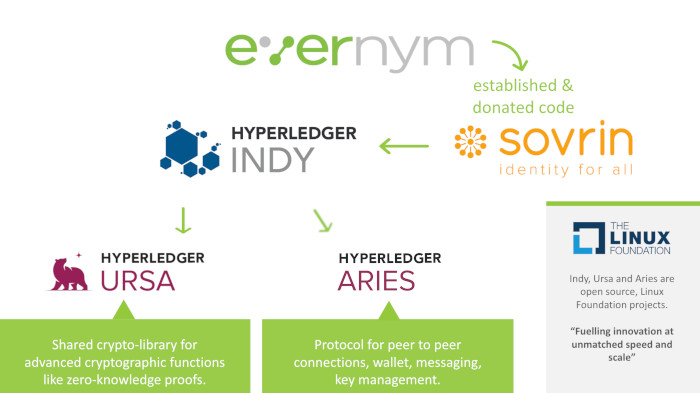
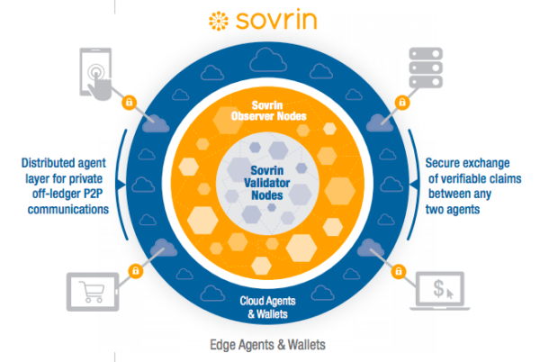
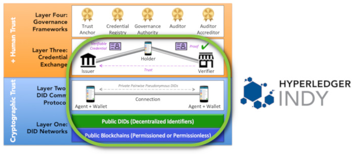
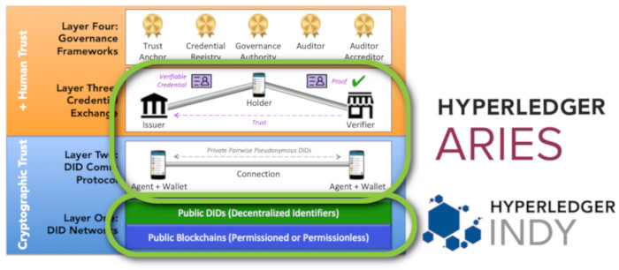
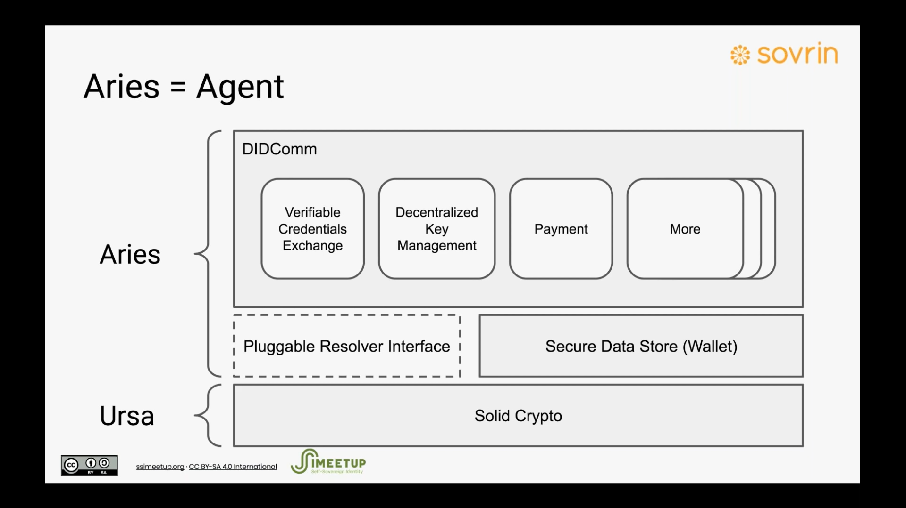
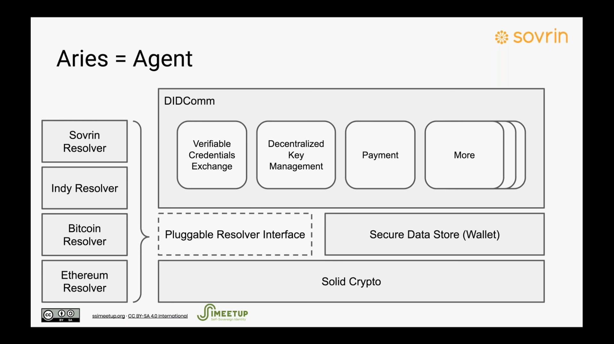
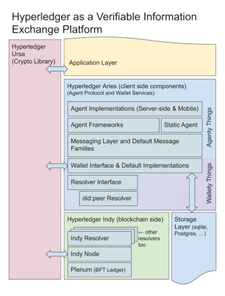

# Hyperledger Aries

`Need to know Hyperledger Indy before learn Hyperledger Aries`

[github : `aries`](https://github.com/hyperledger/aries)<br>



 - Aries = Agent




<br>
<hr>
<br>

# [ What is Hyperledger Aries ]

<br><br>

## _프로젝트 개요_

`indy-node`를 통해 DID 및 신원 인증 관련 데이터를 블록체인에 저장하고 `indy-sdk`를 통해 클라이언트단과 블록체인 네트워크와 통신하였다.

Hyperledger Aries는 클라이언트 간의 데이터 전송에 관련된 표준과 프레임워크를 개발하는 프로젝트이다.

프로젝트 개발 프로세스는 다음과 같다.

 - `aries-rfcs` ACCEPT --> Aries Framework 개발

 - `aries-rfcs` ACCEPT --> Aries Cloud/Static Agent 개발


[github : `aries-rfcs`](https://github.com/hyperledger/aries-rfcs)<br>

<br><br>

## _Why Aries_



When it first began, the Hyperledger Indy project included code for all three of the lower layers—for the Indy SSI ledger at layer 1; for SSI agents, wallets and DID-to-DID communications at layer 2, and for ZKP-based credential exchange at layer 3.

This was very powerful, but also somewhat overwhelming for new developers. And it gave the impression that layers 2 and 3 were tied to the Hyperledger Indy permissioned blockchain code at layer 1.

Separating out layer 2 and 3 code into a new independent project brings clarity to the fact that the goal of this four-layer stack is universal interoperability among all SSI ledgers, agents, wallets, verifiable credentials, and governance frameworks. This includes new DID networks such as the Bitcoin-based ION network announced by Microsoft at Consensus, the Ethereum network, the Veres One network, or any other modern blockchain capable of supporting DIDs and the other cryptographic primitives necessary for the DID Communications protocol at layer 2.



<br><br>

## _Aries 구조_





All Aries agent deployments have two logical components: a `framework` and a `controller`.


### - Framework

The framework contains the standard capabilities that enable an Aries agent to interact with its surroundings—ledgers, storage and other agents. A framework is an artifact of an Aries project that you don’t have to create or maintain, you just embed in your solution. The framework knows how to initiate connections, respond to requests, send messages and more. However, a framework needs to be told when to initiate a connection. It doesn’t know what response should be sent to a given request. It just sits there until it’s told what to do.

### - Controller

The controller is the component that, well, controls, an instance of an Aries framework’s behavior—the business rules for that particular instance of an agent. The controller is the part of a deployment that you build to create an Aries agent that handles your use case for responding to requests from other agents, and for initiating requests.

<br><br>


## _Indy + Aries 플랫폼_



<br><br>

## _대표 Framework_ : `aries-cloudagent-python`

[github : `aries-cloudagent-python`](https://github.com/hyperledger/aries-cloudagent-python)<br>


### - USAGE

```
usage: aca-py start [-h] [--admin <host> <port>] [--admin-api-key <api-key>]
                    [--admin-insecure-mode] [--no-receive-invites]
                    [--help-link <help-url>] [--webhook-url <url#api_key>]
                    [--admin-client-max-request-size ADMIN_CLIENT_MAX_REQUEST_SIZE]
                    [--debug] [--debug-seed <debug-did-seed>]
                    [--debug-connections] [--debug-credentials]
                    [--debug-presentations] [--invite] [--connections-invite]
                    [--invite-label <label>] [--invite-multi-use]
                    [--invite-public] [--invite-metadata-json <metadata-json>]
                    [--test-suite-endpoint <endpoint>] [--auto-accept-invites]
                    [--auto-accept-requests] [--auto-respond-messages]
                    [--auto-respond-credential-proposal]
                    [--auto-respond-credential-offer]
                    [--auto-respond-credential-request]
                    [--auto-respond-presentation-proposal]
                    [--auto-respond-presentation-request]
                    [--auto-store-credential] [--auto-verify-presentation]
                    [--arg-file ARG_FILE] [--plugin <module>]
                    [--plugin-config PLUGIN_CONFIG]
                    [-o <KEY=VALUE> [<KEY=VALUE> ...]]
                    [--storage-type <storage-type>]
                    [-e <endpoint> [<endpoint> ...]]
                    [--profile-endpoint <profile_endpoint>]
                    [--read-only-ledger]
                    [--tails-server-base-url <tails-server-base-url>]
                    [--tails-server-upload-url <tails-server-upload-url>]
                    [--ledger-pool-name <ledger-pool-name>]
                    [--genesis-transactions <genesis-transactions>]
                    [--genesis-file <genesis-file>]
                    [--genesis-url <genesis-url>] [--no-ledger]
                    [--ledger-keepalive LEDGER_KEEPALIVE]
                    [--ledger-socks-proxy <host:port>]
                    [--log-config <path-to-config>] [--log-file <log-file>]
                    [--log-level <log-level>] [--auto-ping-connection]
                    [--auto-accept-intro-invitation-requests]
                    [--invite-base-url <base-url>] [--monitor-ping]
                    [--monitor-forward] [--public-invites] [--timing]
                    [--timing-log <log-path>] [--trace]
                    [--trace-target <trace-target>] [--trace-tag <trace-tag>]
                    [--trace-label <trace-label>]
                    [--preserve-exchange-records] [--emit-new-didcomm-prefix]
                    [--emit-new-didcomm-mime-type]
                    [--exch-use-unencrypted-tags] [--auto-provision]
                    [-it <module> <host> <port>] [-ot <module>]
                    [-oq OUTBOUND_QUEUE] [-l <label>] [--image-url IMAGE_URL]
                    [--max-message-size <message-size>]
                    [--enable-undelivered-queue]
                    [--max-outbound-retry MAX_OUTBOUND_RETRY]
                    [--open-mediation]
                    [--mediator-invitation <invite URL to mediator>]
                    [--mediator-connections-invite]
                    [--default-mediator-id <mediation id>]
                    [--clear-default-mediator] [--seed <wallet-seed>]
                    [--wallet-local-did] [--wallet-key <wallet-key>]
                    [--wallet-rekey <wallet-rekey>]
                    [--wallet-name <wallet-name>]
                    [--wallet-type <wallet-type>]
                    [--wallet-storage-type <storage-type>]
                    [--wallet-storage-config <storage-config>]
                    [--wallet-storage-creds <storage-creds>]
                    [--replace-public-did] [--recreate-wallet] [--multitenant]
                    [--jwt-secret <jwt-secret>] [--multitenant-admin]

Args that start with '--' (eg. --admin) can also be set in a config file
(specified via --arg-file). The config file uses YAML syntax and must
represent a YAML 'mapping' (for details, see
http://learn.getgrav.org/advanced/yaml). If an arg is specified in more than
one place, then commandline values override environment variables which
override config file values which override defaults.

optional arguments:
  -h, --help            show this help message and exit

Admin:
  --admin <host> <port>
                        Specify the host and port on which to run the
                        administrative server. If not provided, no admin
                        server is made available. [env var: ACAPY_ADMIN]
  --admin-api-key <api-key>
                        Protect all admin endpoints with the provided API key.
                        API clients (e.g. the controller) must pass the key in
                        the HTTP header using 'X-API-Key: <api key>'. Either
                        this parameter or the '--admin-insecure-mode'
                        parameter MUST be specified. [env var:
                        ACAPY_ADMIN_API_KEY]
  --admin-insecure-mode
                        Run the admin web server in insecure mode. DO NOT USE
                        FOR PRODUCTION DEPLOYMENTS. The admin server will be
                        publicly available to anyone who has access to the
                        interface. Either this parameter or the '--api-key'
                        parameter MUST be specified. [env var:
                        ACAPY_ADMIN_INSECURE_MODE]
  --no-receive-invites  Prevents an agent from receiving invites by removing
                        the '/connections/receive-invite' route from the
                        administrative interface. Default: false. [env var:
                        ACAPY_NO_RECEIVE_INVITES]
  --help-link <help-url>
                        A URL to an administrative interface help web page
                        that a controller user interface can get from the
                        agent and provide as a link to users. [env var:
                        ACAPY_HELP_LINK]
  --webhook-url <url#api_key>
                        Send webhooks containing internal state changes to the
                        specified URL. Optional API key to be passed in the
                        request body can be appended using a hash separator
                        [#]. This is useful for a controller to monitor agent
                        events and respond to those events using the admin
                        API. If not specified, webhooks are not published by
                        the agent. [env var: ACAPY_WEBHOOK_URL]
  --admin-client-max-request-size ADMIN_CLIENT_MAX_REQUEST_SIZE
                        Maximum client request size to admin server, in
                        megabytes: default 1 [env var:
                        ACAPY_ADMIN_CLIENT_MAX_REQUEST_SIZE]

Debug:
  --debug               Enables a remote debugging service that can be
                        accessed using ptvsd for Visual Studio Code. The
                        framework will wait for the debugger to connect at
                        start-up. Default: false. [env var: ACAPY_DEBUG]
  --debug-seed <debug-did-seed>
                        Specify the debug seed to use. [env var:
                        ACAPY_DEBUG_SEED]
  --debug-connections   Enable additional logging around connections. Default:
                        false. [env var: ACAPY_DEBUG_CONNECTIONS]
  --debug-credentials   Enable additional logging around credential exchanges.
                        Default: false. [env var: ACAPY_DEBUG_CREDENTIALS]
  --debug-presentations
                        Enable additional logging around presentation
                        exchanges. Default: false. [env var:
                        ACAPY_DEBUG_PRESENTATIONS]
  --invite              After startup, generate and print a new out-of-band
                        connection invitation URL. Default: false. [env var:
                        ACAPY_INVITE]
  --connections-invite  After startup, generate and print a new connections
                        protocol style invitation URL. Default: false. [env
                        var: ACAPY_CONNECTIONS_INVITE]
  --invite-label <label>
                        Specify the label of the generated invitation. [env
                        var: ACAPY_INVITE_LABEL]
  --invite-multi-use    Flag specifying the generated invite should be multi-
                        use. [env var: ACAPY_INVITE_MULTI_USE]
  --invite-public       Flag specifying the generated invite should be public.
                        [env var: ACAPY_INVITE_PUBLIC]
  --invite-metadata-json <metadata-json>
                        Add metadata json to invitation created with --invite
                        argument. [env var: ACAPY_INVITE_METADATA_JSON]
  --test-suite-endpoint <endpoint>
                        URL endpoint for sending messages to the test suite
                        agent. [env var: ACAPY_TEST_SUITE_ENDPOINT]
  --auto-accept-invites
                        Automatically accept invites without firing a webhook
                        event or waiting for an admin request. Default: false.
                        [env var: ACAPY_AUTO_ACCEPT_INVITES]
  --auto-accept-requests
                        Automatically accept connection requests without
                        firing a webhook event or waiting for an admin
                        request. Default: false. [env var:
                        ACAPY_AUTO_ACCEPT_REQUESTS]
  --auto-respond-messages
                        Automatically respond to basic messages indicating the
                        message was received. Default: false. [env var:
                        ACAPY_AUTO_RESPOND_MESSAGES]
  --auto-respond-credential-proposal
                        Auto-respond to credential proposals with
                        corresponding credential offers [env var:
                        ACAPY_AUTO_RESPOND_CREDENTIAL_PROPOSAL]
  --auto-respond-credential-offer
                        Automatically respond to Indy credential offers with a
                        credential request. Default: false [env var:
                        ACAPY_AUTO_RESPOND_CREDENTIAL_OFFER]
  --auto-respond-credential-request
                        Auto-respond to credential requests with corresponding
                        credentials [env var:
                        ACAPY_AUTO_RESPOND_CREDENTIAL_REQUEST]
  --auto-respond-presentation-proposal
                        Auto-respond to presentation proposals with
                        corresponding presentation requests [env var:
                        ACAPY_AUTO_RESPOND_PRESENTATION_PROPOSAL]
  --auto-respond-presentation-request
                        Automatically respond to Indy presentation requests
                        with a constructed presentation if a corresponding
                        credential can be retrieved for every referent in the
                        presentation request. Default: false. [env var:
                        ACAPY_AUTO_RESPOND_PRESENTATION_REQUEST]
  --auto-store-credential
                        Automatically store an issued credential upon receipt.
                        Default: false. [env var: ACAPY_AUTO_STORE_CREDENTIAL]
  --auto-verify-presentation
                        Automatically verify a presentation when it is
                        received. Default: false. [env var:
                        ACAPY_AUTO_VERIFY_PRESENTATION]

General:
  --arg-file ARG_FILE   Load aca-py arguments from the specified file. Note
                        that this file *must* be in YAML format.
  --plugin <module>     Load <module> as external plugin module. Multiple
                        instances of this parameter can be specified. [env
                        var: ACAPY_PLUGIN]
  --plugin-config PLUGIN_CONFIG
                        Load YAML file path that defines external plugin
                        configuration. [env var: ACAPY_PLUGIN_CONFIG]
  -o <KEY=VALUE> [<KEY=VALUE> ...], --plugin-config-value <KEY=VALUE> [<KEY=VALUE> ...]
                        Set an arbitrary plugin configuration option in the
                        format KEY=VALUE. Use dots in KEY to set deeply nested
                        values, as in "a.b.c=value". VALUE is parsed as yaml.
  --storage-type <storage-type>
                        Specifies the type of storage provider to use for the
                        internal storage engine. This storage interface is
                        used to store internal state Supported internal
                        storage types are 'basic' (memory) and 'indy'. The
                        default (if not specified) is 'indy' if the wallet
                        type is set to 'indy', otherwise 'basic'. [env var:
                        ACAPY_STORAGE_TYPE]
  -e <endpoint> [<endpoint> ...], --endpoint <endpoint> [<endpoint> ...]
                        Specifies the endpoints to put into DIDDocs to inform
                        other agents of where they should send messages
                        destined for this agent. Each endpoint could be one of
                        the specified inbound transports for this agent, or
                        the endpoint could be that of another agent (e.g.
                        'https://example.com/agent-endpoint') if the routing
                        of messages to this agent by a mediator is configured.
                        The first endpoint specified will be used in
                        invitations. The endpoints are used in the formation
                        of a connection with another agent. [env var:
                        ACAPY_ENDPOINT]
  --profile-endpoint <profile_endpoint>
                        Specifies the profile endpoint for the (public) DID.
                        [env var: ACAPY_PROFILE_ENDPOINT]
  --read-only-ledger    Sets ledger to read-only to prevent updates. Default:
                        false. [env var: ACAPY_READ_ONLY_LEDGER]
  --tails-server-base-url <tails-server-base-url>
                        Sets the base url of the tails server in use. [env
                        var: ACAPY_TAILS_SERVER_BASE_URL]
  --tails-server-upload-url <tails-server-upload-url>
                        Sets the base url of the tails server for upload,
                        defaulting to the tails server base url. [env var:
                        ACAPY_TAILS_SERVER_UPLOAD_URL]

Ledger:
  --ledger-pool-name <ledger-pool-name>
                        Specifies the name of the indy pool to be opened. This
                        is useful if you have multiple pool configurations.
                        [env var: ACAPY_LEDGER_POOL_NAME]
  --genesis-transactions <genesis-transactions>
                        Specifies the genesis transactions to use to connect
                        to a Hyperledger Indy ledger. The transactions are
                        provided as string of JSON e.g.
                        '{"reqSignature":{},"txn":{"data":{"d... <snip>}}}'
                        [env var: ACAPY_GENESIS_TRANSACTIONS]
  --genesis-file <genesis-file>
                        Specifies a local file from which to read the genesis
                        transactions. [env var: ACAPY_GENESIS_FILE]
  --genesis-url <genesis-url>
                        Specifies the url from which to download the genesis
                        transactions. For example, if you are using 'von-
                        network', the URL might be
                        'http://localhost:9000/genesis'. Genesis transactions
                        URLs are available for the Sovrin test/main networks.
                        [env var: ACAPY_GENESIS_URL]
  --no-ledger           Specifies that aca-py will run with no ledger
                        configured. This must be set if running in no-ledger
                        mode. Overrides any specified ledger or genesis
                        configurations. Default: false. [env var:
                        ACAPY_NO_LEDGER]
  --ledger-keepalive LEDGER_KEEPALIVE
                        Specifies how many seconds to keep the ledger open.
                        Default: 5 [env var: ACAPY_LEDGER_KEEP_ALIVE]
  --ledger-socks-proxy <host:port>
                        Specifies the socks proxy (NOT http proxy) hostname
                        and port in format 'hostname:port'. This is an
                        optional parameter to be passed to ledger pool
                        configuration and ZMQ in case if aca-py is running in
                        a corporate/private network behind a corporate proxy
                        and will connect to the public (outside of corporate
                        network) ledger pool [env var:
                        ACAPY_LEDGER_SOCKS_PROXY]

Logging:
  --log-config <path-to-config>
                        Specifies a custom logging configuration file [env
                        var: ACAPY_LOG_CONFIG]
  --log-file <log-file>
                        Overrides the output destination for the root logger
                        (as defined by the log config file) to the named <log-
                        file>. [env var: ACAPY_LOG_FILE]
  --log-level <log-level>
                        Specifies a custom logging level as one of: ('debug',
                        'info', 'warning', 'error', 'critical') [env var:
                        ACAPY_LOG_LEVEL]

Protocol:
  --auto-ping-connection
                        Automatically send a trust ping immediately after a
                        connection response is accepted. Some agents require
                        this before marking a connection as 'active'. Default:
                        false. [env var: ACAPY_AUTO_PING_CONNECTION]
  --auto-accept-intro-invitation-requests
                        Automatically accept introduction invitations.
                        Default: false. [env var:
                        ACAPY_AUTO_ACCEPT_INTRO_INVITATION_REQUESTS]
  --invite-base-url <base-url>
                        Base URL to use when formatting connection invitations
                        in URL format. [env var: ACAPY_INVITE_BASE_URL]
  --monitor-ping        Send a webhook when a ping is sent or received. [env
                        var: ACAPY_MONITOR_PING]
  --monitor-forward     Send a webhook when a forward is received. [env var:
                        ACAPY_MONITOR_FORWARD]
  --public-invites      Send invitations out, and receive connection requests,
                        using the public DID for the agent. Default: false.
                        [env var: ACAPY_PUBLIC_INVITES]
  --timing              Include timing information in response messages. [env
                        var: ACAPY_TIMING]
  --timing-log <log-path>
                        Write timing information to a given log file. [env
                        var: ACAPY_TIMING_LOG]
  --trace               Generate tracing events. [env var: ACAPY_TRACE]
  --trace-target <trace-target>
                        Target for trace events ("log", "message", or http
                        endpoint). [env var: ACAPY_TRACE_TARGET]
  --trace-tag <trace-tag>
                        Tag to be included when logging events. [env var:
                        ACAPY_TRACE_TAG]
  --trace-label <trace-label>
                        Label (agent name) used logging events. [env var:
                        ACAPY_TRACE_LABEL]
  --preserve-exchange-records
                        Keep credential exchange records after exchange has
                        completed. [env var: ACAPY_PRESERVE_EXCHANGE_RECORDS]
  --emit-new-didcomm-prefix
                        Emit protocol messages with new DIDComm prefix; i.e.,
                        'https://didcomm.org/' instead of (default) prefix
                        'did:sov:BzCbsNYhMrjHiqZDTUASHg;spec/'. [env var:
                        ACAPY_EMIT_NEW_DIDCOMM_PREFIX]
  --emit-new-didcomm-mime-type
                        Send packed agent messages with the DIDComm MIME type
                        as of RFC 0044; i.e., 'application/didcomm-envelope-
                        enc' instead of 'application/ssi-agent-wire'. [env
                        var: ACAPY_EMIT_NEW_DIDCOMM_MIME_TYPE]
  --exch-use-unencrypted-tags
                        Store tags for exchange protocols (credential and
                        presentation) using unencrypted rather than encrypted
                        tags [env var: ACAPY_EXCH_USE_UNENCRYPTED_TAGS]

Start-up:
  --auto-provision      If the requested profile does not exist, initialize it
                        with the given parameters. [env var:
                        ACAPY_AUTO_PROVISION]

Transport:
  -it <module> <host> <port>, --inbound-transport <module> <host> <port>
                        REQUIRED. Defines the inbound transport(s) on which
                        the agent listens for receiving messages from other
                        agents. This parameter can be specified multiple times
                        to create multiple interfaces. Built-in inbound
                        transport types include 'http' and 'ws'. However,
                        other transports can be loaded by specifying an
                        absolute module path. [env var:
                        ACAPY_INBOUND_TRANSPORT]
  -ot <module>, --outbound-transport <module>
                        REQUIRED. Defines the outbound transport(s) on which
                        the agent will send outgoing messages to other agents.
                        This parameter can be passed multiple times to supoort
                        multiple transport types. Supported outbound transport
                        types are 'http' and 'ws'. [env var:
                        ACAPY_OUTBOUND_TRANSPORT]
  -oq OUTBOUND_QUEUE, --outbound-queue OUTBOUND_QUEUE
                        Defines the location of the Outbound Queue Engine.
                        This must be a 'dotpath' to a Python module on the
                        PYTHONPATH, followed by a colon, followed by the name
                        of a Python class that implements BaseOutboundQueue.
                        This commandline option is the official entry point of
                        ACA-py's pluggable queue interface. The default value
                        is: 'aries_cloudagent.transport.outbound.queue.redis:R
                        edisOutboundQueue'. [env var:
                        ACAPY_OUTBOUND_TRANSPORT_QUEUE]
  -l <label>, --label <label>
                        Specifies the label for this agent. This label is
                        publicized (self-attested) to other agents as part of
                        forming a connection. [env var: ACAPY_LABEL]
  --image-url IMAGE_URL
                        Specifies the image url for this agent. This image url
                        is publicized (self-attested) to other agents as part
                        of forming a connection. [env var: ACAPY_IMAGE_URL]
  --max-message-size <message-size>
                        Set the maximum size in bytes for inbound agent
                        messages. [env var: ACAPY_MAX_MESSAGE_SIZE]
  --enable-undelivered-queue
                        Enable the outbound undelivered queue that enables
                        this agent to hold messages for delivery to agents
                        without an endpoint. This option will require
                        additional memory to store messages in the queue. [env
                        var: ACAPY_ENABLE_UNDELIVERED_QUEUE]
  --max-outbound-retry MAX_OUTBOUND_RETRY
                        Set the maximum retry number for undelivered outbound
                        messages. Increasing this number might cause to
                        increase the accumulated messages in message queue.
                        Default value is 4. [env var:
                        ACAPY_MAX_OUTBOUND_RETRY]

Mediation:
  --open-mediation      Enables didcomm mediation. After establishing a
                        connection, if enabled, an agent may request message
                        mediation, which will allow the mediator to forward
                        messages on behalf of the recipient. See aries-
                        rfc:0211. [env var: ACAPY_MEDIATION_OPEN]
  --mediator-invitation <invite URL to mediator>
                        Connect to mediator through provided invitation and
                        send mediation request and set as default mediator.
                        [env var: ACAPY_MEDIATION_INVITATION]
  --mediator-connections-invite
                        Connect to mediator through a connection invitation.
                        If not specified, connect using an OOB invitation.
                        Default: false. [env var:
                        ACAPY_MEDIATION_CONNECTIONS_INVITE]
  --default-mediator-id <mediation id>
                        Set the default mediator by ID [env var:
                        ACAPY_DEFAULT_MEDIATION_ID]
  --clear-default-mediator
                        Clear the stored default mediator. [env var:
                        ACAPY_CLEAR_DEFAULT_MEDIATOR]

Wallet:
  --seed <wallet-seed>  Specifies the seed to use for the creation of a public
                        DID for the agent to use with a Hyperledger Indy
                        ledger, or a local ('--wallet-local-did') DID. If
                        public, the DID must already exist on the ledger. [env
                        var: ACAPY_WALLET_SEED]
  --wallet-local-did    If this parameter is set, provisions the wallet with a
                        local DID from the '--seed' parameter, instead of a
                        public DID to use with a Hyperledger Indy ledger. [env
                        var: ACAPY_WALLET_LOCAL_DID]
  --wallet-key <wallet-key>
                        Specifies the master key value to use to open the
                        wallet. [env var: ACAPY_WALLET_KEY]
  --wallet-rekey <wallet-rekey>
                        Specifies a new master key value to which to rotate
                        and to open the wallet next time. [env var:
                        ACAPY_WALLET_REKEY]
  --wallet-name <wallet-name>
                        Specifies the wallet name to be used by the agent.
                        This is useful if your deployment has multiple
                        wallets. [env var: ACAPY_WALLET_NAME]
  --wallet-type <wallet-type>
                        Specifies the type of Indy wallet provider to use.
                        Supported internal storage types are 'basic' (memory)
                        and 'indy'. The default (if not specified) is 'basic'.
                        [env var: ACAPY_WALLET_TYPE]
  --wallet-storage-type <storage-type>
                        Specifies the type of Indy wallet backend to use.
                        Supported internal storage types are 'basic' (memory),
                        'default' (sqlite), and 'postgres_storage'. The
                        default, if not specified, is 'default'. [env var:
                        ACAPY_WALLET_STORAGE_TYPE]
  --wallet-storage-config <storage-config>
                        Specifies the storage configuration to use for the
                        wallet. This is required if you are for using
                        'postgres_storage' wallet storage type. For example,
                        '{"url":"localhost:5432",
                        "wallet_scheme":"MultiWalletSingleTable"}'. This
                        configuration maps to the indy sdk postgres plugin
                        (PostgresConfig). [env var:
                        ACAPY_WALLET_STORAGE_CONFIG]
  --wallet-storage-creds <storage-creds>
                        Specifies the storage credentials to use for the
                        wallet. This is required if you are for using
                        'postgres_storage' wallet For example,
                        '{"account":"postgres","password":
                        "mysecretpassword","admin_account":"postgres",
                        "admin_password":"mysecretpassword"}'. This
                        configuration maps to the indy sdk postgres plugin
                        (PostgresCredentials). NOTE: admin_user must have the
                        CREATEDB role or else initialization will fail. [env
                        var: ACAPY_WALLET_STORAGE_CREDS]
  --replace-public-did  If this parameter is set and an agent already has a
                        public DID, and the '--seed' parameter specifies a new
                        DID, the agent will use the new DID in place of the
                        existing DID. Default: false. [env var:
                        ACAPY_REPLACE_PUBLIC_DID]
  --recreate-wallet     If an existing wallet exists with the same name,
                        remove and recreate it during provisioning. [env var:
                        ACAPY_RECREATE_WALLET]

Multitenant:
  --multitenant         Enable multitenant mode. [env var: ACAPY_MULTITENANT]
  --jwt-secret <jwt-secret>
                        Specify the secret to be used for Json Web Token (JWT)
                        creation and verification. The JWTs are used to
                        authenticate and authorize multitenant wallets. [env
                        var: ACAPY_MULTITENANT_JWT_SECRET]
  --multitenant-admin   Specify whether to enable the multitenant admin api.
                        [env var: ACAPY_MULTITENANT_ADMIN]
```


### - faber-local.py

```py
PYTHONPATH=.. ../bin/aca-py start \
   --endpoint http://127.0.0.1:8020 \
   --label faber.agent \
   --inbound-transport http 0.0.0.0 8020 \
   --outbound-transport http \
   --admin 0.0.0.0 8021 \
   --admin-insecure-mode \
   --wallet-type indy \
   --wallet-name faber.agent916333 \
   --wallet-key faber.agent916333 \
   --preserve-exchange-records \
   --auto-provision \
   --genesis-url http://localhost:9000/genesis \
   --trace-target log \
   --trace-tag acapy.events \
   --trace-label faber.agent.trace \
   --auto-ping-connection \
   --auto-respond-messages \
   --auto-accept-invites \
   --auto-accept-requests \
   --auto-respond-credential-proposal \
   --auto-respond-credential-offer \
   --auto-respond-credential-request \
   --auto-store-credential
```

### - alice-local.py

```py
PYTHONPATH=.. ../bin/aca-py start \
   --endpoint http://127.0.0.1:8030 \
   --label alice.agent \
   --inbound-transport http 0.0.0.0 8030 \
   --outbound-transport http \
   --admin 0.0.0.0 8031 \
   --admin-insecure-mode \
   --wallet-type indy \
   --wallet-name alice.agent420695 \
   --wallet-key alice.agent420695 \
   --preserve-exchange-records \
   --auto-provision \
   --genesis-url http://localhost:9000/genesis \
   --trace-target log \
   --trace-tag acapy.events \
   --trace-label alice.agent.trace \
   --auto-ping-connection \
   --auto-respond-messages \
   --auto-accept-invites \
   --auto-accept-requests \
   --auto-respond-credential-proposal \
   --auto-respond-credential-offer \
   --auto-respond-credential-request \
   --auto-store-credential
```

### - MY TEST

가상환경
```
python3 -m venv tutorial-env
source ~/myenv/bin/activate
pip install --upgrade pip
```

```
pip install aries_cloudagent
pip install aiohttp
sudo apt-get install sqlite3 libsqlite3-dev
pip3 install -r requirements.txt -r requirements.askar.txt -r requirements.bbs.txt -r requirements.dev.txt
```
명령어
```py
./aca-py start \
   --endpoint http://127.0.0.1:8040 \
   --label rhie.agent \
   --inbound-transport http 0.0.0.0 8040 \
   --outbound-transport http \
   --admin 0.0.0.0 8041 \
   --admin-insecure-mode \
   --wallet-type indy \
   --wallet-name rhie.agent111118 \
   --wallet-key rhie.agent111118 \
   --preserve-exchange-records \
   --auto-provision \
   --genesis-file ./genesis/greenlight.bcovrin.dev.txn\
   --trace-target log \
   --trace-tag acapy.events \
   --trace-label rhie.agent.trace \
   --auto-ping-connection \
   --auto-respond-messages \
   --auto-accept-invites \
   --auto-accept-requests \
   --auto-respond-credential-proposal \
   --auto-respond-credential-offer \
   --auto-respond-credential-request \
   --auto-store-credential
```


<br><br><br><br><hr><br><br><br><br>

# [DEMO : Aries OpenAPI DEMO]

[HERE](./getting_started_memo/01.OpenAPI.md)

## _If Want to Stop Containers_

```cmd
docker stop faber
docker stop alice
```
<br><br>

## _build VON network locally_

Comming Soon


<br><br><br><br><hr><br><br><br><br>

# [Explore]

## _Aries_

[aries](https://github.com/hyperledger/aries)<br>
[aries-rfcs](https://github.com/hyperledger/aries-rfcs)<br>

## _Aries SDK_

[aries-sdk-javascript](https://github.com/hyperledger/aries-sdk-javascript)<br>
[aries-sdk-android](https://github.com/hyperledger/aries-sdk-android)<br>
[aries-sdk-java](https://github.com/hyperledger/aries-sdk-java)<br>
[aries-sdk-ruby](https://github.com/hyperledger/aries-sdk-ruby)<br>

## _Aries Framework_

[aries-cloudagent-python](https://github.com/hyperledger/aries-cloudagent-python)<br>


The Aries Cloud Agent Python currently only supports Hyperledger Indy-based verifiable credentials and public ledger. Longer term (as we'll see later in this guide) protocols will be extended or added to support other verifiable credential implementations and public ledgers.

[aries-framework-dotnet](https://github.com/hyperledger/aries-framework-dotnet)<br>
[aries-framework-javascript](https://github.com/hyperledger/<br>aries-framework-javascript)<br>
[aries-framework-javascript-ext](https://github.com/hyperledger/<br>aries-framework-javascript-ext)<br>
[aries-framework-go](https://github.com/hyperledger/aries-framework-go)<br>
[aries-framework-go-ext](https://github.com/hyperledger/aries-framework-go-ext)<br>

## _vcx_

[aries-vcx](https://github.com/hyperledger/aries-vcx)<br>

## _more..._

[GITHUB EXPLORER](https://github.com/orgs/hyperledger/repositories?language=&q=aries&sort=&type=)


<br><br><br><br><hr><br><br><br><br>

# [ Issue & On-going ]


<br><br><br><br><hr><br><br><br><br>

# [ Thinking ]


