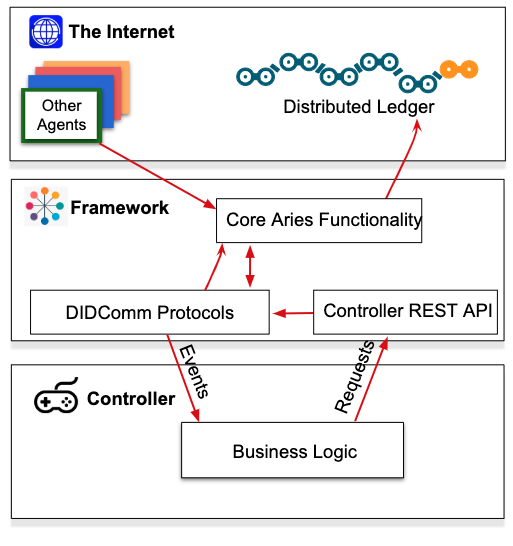

# Hyperledger Aries

`Need to know Hyperledger Indy before learn Hyperledger Aries`

[github : `aries`](https://github.com/hyperledger/aries)<br>


 - Aries = Agent


<br>
<hr>
<br>

# [ What is Hyperledger Aries ]

<br><br>

## _프로젝트 개요_

`indy-node`를 통해 DID 및 신원 인증 관련 데이터를 블록체인에 저장하고 `indy-sdk`를 통해 클라이언트단과 블록체인 네트워크와 통신하였다.

Hyperledger Aries는 클라이언트 간의 데이터 전송에 관련된 표준과 프레임워크를 개발하는 프로젝트이다.

프로젝트 개발 프로세스는 다음과 같다.

 - `aries-rfcs` ACCEPT --> Aries Framework 개발

 - `aries-rfcs` ACCEPT --> Aries Cloud/Static Agent 개발


[github : `aries-rfcs`](https://github.com/hyperledger/aries-rfcs)<br>

<br><br>

## _Why Aries_


When it first began, the Hyperledger Indy project included code for all three of the lower layers—for the Indy SSI ledger at layer 1; for SSI agents, wallets and DID-to-DID communications at layer 2, and for ZKP-based credential exchange at layer 3.

This was very powerful, but also somewhat overwhelming for new developers. And it gave the impression that layers 2 and 3 were tied to the Hyperledger Indy permissioned blockchain code at layer 1.

Separating out layer 2 and 3 code into a new independent project brings clarity to the fact that the goal of this four-layer stack is universal interoperability among all SSI ledgers, agents, wallets, verifiable credentials, and governance frameworks. This includes new DID networks such as the Bitcoin-based ION network announced by Microsoft at Consensus, the Ethereum network, the Veres One network, or any other modern blockchain capable of supporting DIDs and the other cryptographic primitives necessary for the DID Communications protocol at layer 2.


<br><br>

## _Aries 구조_


All Aries agent deployments have two logical components: a `framework` and a `controller`.


### - Framework

The framework contains the standard capabilities that enable an Aries agent to interact with its surroundings—ledgers, storage and other agents. A framework is an artifact of an Aries project that you don’t have to create or maintain, you just embed in your solution. The framework knows how to initiate connections, respond to requests, send messages and more. However, a framework needs to be told when to initiate a connection. It doesn’t know what response should be sent to a given request. It just sits there until it’s told what to do.

### - Controller

The controller is the component that, well, controls, an instance of an Aries framework’s behavior—the business rules for that particular instance of an agent. The controller is the part of a deployment that you build to create an Aries agent that handles your use case for responding to requests from other agents, and for initiating requests.

<br><br>


## _대표 Framework_ : `aries-cloudagent-python`

[github : `aries-cloudagent-python`](https://github.com/hyperledger/aries-cloudagent-python)<br>



## _Indy + Aries 플랫폼_


<br><br><br><br><hr><br><br><br><br>

# [DEMO : Aries OpenAPI DEMO]

_`DIDComm Layer`_

## _Using GreenLight Dev Ledger `vonx.io`_

http://dev.greenlight.bcovrin.vonx.io/

<br><br>

## _aries-cloudagent-python_

```cmd
git clone https://github.com/hyperledger/aries-cloudagent-python
```

<br><br>

## _Terminal A : Start the Faber Agent_

```cmd
cd aries-cloudagent-python/demo

LEDGER_URL=http://dev.greenlight.bcovrin.vonx.io ./run_demo faber --events --no-auto --bg

docker logs -f faber
```
`Starting [faber] agent with args [--port 8020 --no-auto`

###### Initializing demo agent faber with AIP 20 and credential type indy

 - RESULT : Provision an agent and wallet, get back configuration details
```
Faber      | nym_info: {'did': 'RaHkkJkCgSm4ZWVVPNigN6', 'seed': 'd_000000000000000000000000437328', 'verkey': 'EPqC54fvoWsXG8Bp6PvVxVbKuAhuT8qCuUYWfSraEyAP'}
Faber      | Registered DID: RaHkkJkCgSm4ZWVVPNigN6
```
 
 - RESULT : Created public DID

```
[
  '/home/indy/.pyenv/versions/3.6.13/bin/python', '-m', 'aries_cloudagent', 'start', 
  '--endpoint', 'http://10.0.2.15:8020', 
  '--label', 'faber.agent', 
  '--auto-ping-connection', 
  '--auto-respond-messages', 
  '--inbound-transport', 'http', '0.0.0.0', '8020', '--outbound-transport', 'http', 
  '--admin', '0.0.0.0', '8021',
  '--admin-insecure-mode', 
  '--wallet-type', 'indy', 
  '--wallet-name', 'faber.agent437328', 
  '--wallet-key', 'faber.agent437328', 
  '--preserve-exchange-records', 
  '--auto-provision', 
  '--emit-new-didcomm-prefix', 
  '--genesis-transactions', '{
    "reqSignature": {},
    "txn": {
        "data": {
            "data": {
                "alias": "Node1",
                "blskey": "4N8aUNHSgjQVgkpm8nhNEfDf6txHznoYREg9kirmJrkivgL4oSEimFF6nsQ6M41QvhM2Z33nves5vfSn9n1UwNFJBYtWVnHYMATn76vLuL3zU88KyeAYcHfsih3He6UHcXDxcaecHVz6jhCYz1P2UZn2bDVruL5wXpehgBfBaLKm3Ba",
                "blskey_pop": "RahHYiCvoNCtPTrVtP7nMC5eTYrsUA8WjXbdhNc8debh1agE9bGiJxWBXYNFbnJXoXhWFMvyqhqhRoq737YQemH5ik9oL7R4NTTCz2LEZhkgLJzB3QRQqJyBNyv7acbdHrAT8nQ9UkLbaVL9NBpnWXBTw4LEMePaSHEw66RzPNdAX1",
                "client_ip": "159.203.21.90",
                "client_port": 9702,
                "node_ip": "159.203.21.90",
                "node_port": 9701,
                "services": [
                    "VALIDATOR"
                ]
            },
            "dest": "Gw6pDLhcBcoQesN72qfotTgFa7cbuqZpkX3Xo6pLhPhv"
        },
        "metadata": {
            "from": "Th7MpTaRZVRYnPiabds81Y"
        },
        "type": "0"
    },
    "txnMetadata": {
        "seqNo": 1,
        "txnId": "fea82e10e894419fe2bea7d96296a6d46f50f93f9eeda954ec461b2ed2950b62"
    },
    "ver": "1"
}\n
{
    "reqSignature": {},
    "txn": {
        "data": {
            "data": {
                "alias": "Node2",
                "blskey": "37rAPpXVoxzKhz7d9gkUe52XuXryuLXoM6P6LbWDB7LSbG62Lsb33sfG7zqS8TK1MXwuCHj1FKNzVpsnafmqLG1vXN88rt38mNFs9TENzm4QHdBzsvCuoBnPH7rpYYDo9DZNJePaDvRvqJKByCabubJz3XXKbEeshzpz4Ma5QYpJqjk",
                "blskey_pop": "Qr658mWZ2YC8JXGXwMDQTzuZCWF7NK9EwxphGmcBvCh6ybUuLxbG65nsX4JvD4SPNtkJ2w9ug1yLTj6fgmuDg41TgECXjLCij3RMsV8CwewBVgVN67wsA45DFWvqvLtu4rjNnE9JbdFTc1Z4WCPA3Xan44K1HoHAq9EVeaRYs8zoF5",
                "client_ip": "159.203.21.90",
                "client_port": 9704,
                "node_ip": "159.203.21.90",
                "node_port": 9703,
                "services": [
                    "VALIDATOR"
                ]
            },
            "dest": "8ECVSk179mjsjKRLWiQtssMLgp6EPhWXtaYyStWPSGAb"
        },
        "metadata": {
            "from": "EbP4aYNeTHL6q385GuVpRV"
        },
        "type": "0"
    },
    "txnMetadata": {
        "seqNo": 2,
        "txnId": "1ac8aece2a18ced660fef8694b61aac3af08ba875ce3026a160acbc3a3af35fc"
    },
    "ver": "1"
}\n
{
    "reqSignature": {},
    "txn": {
        "data": {
            "data": {
                "alias": "Node3",
                "blskey": "3WFpdbg7C5cnLYZwFZevJqhubkFALBfCBBok15GdrKMUhUjGsk3jV6QKj6MZgEubF7oqCafxNdkm7eswgA4sdKTRc82tLGzZBd6vNqU8dupzup6uYUf32KTHTPQbuUM8Yk4QFXjEf2Usu2TJcNkdgpyeUSX42u5LqdDDpNSWUK5deC5",
                "blskey_pop": "QwDeb2CkNSx6r8QC8vGQK3GRv7Yndn84TGNijX8YXHPiagXajyfTjoR87rXUu4G4QLk2cF8NNyqWiYMus1623dELWwx57rLCFqGh7N4ZRbGDRP4fnVcaKg1BcUxQ866Ven4gw8y4N56S5HzxXNBZtLYmhGHvDtk6PFkFwCvxYrNYjh",
                "client_ip": "159.203.21.90",
                "client_port": 9706,
                "node_ip": "159.203.21.90",
                "node_port": 9705,
                "services": [
                    "VALIDATOR"
                ]
            },
            "dest": "DKVxG2fXXTU8yT5N7hGEbXB3dfdAnYv1JczDUHpmDxya"
        },
        "metadata": {
            "from": "4cU41vWW82ArfxJxHkzXPG"
        },
        "type": "0"
    },
    "txnMetadata": {
        "seqNo": 3,
        "txnId": "7e9f355dffa78ed24668f0e0e369fd8c224076571c51e2ea8be5f26479edebe4"
    },
    "ver": "1"
}\n
{
    "reqSignature": {},
    "txn": {
        "data": {
            "data": {
                "alias": "Node4",
                "blskey": "2zN3bHM1m4rLz54MJHYSwvqzPchYp8jkHswveCLAEJVcX6Mm1wHQD1SkPYMzUDTZvWvhuE6VNAkK3KxVeEmsanSmvjVkReDeBEMxeDaayjcZjFGPydyey1qxBHmTvAnBKoPydvuTAqx5f7YNNRAdeLmUi99gERUU7TD8KfAa6MpQ9bw",
                "blskey_pop": "RPLagxaR5xdimFzwmzYnz4ZhWtYQEj8iR5ZU53T2gitPCyCHQneUn2Huc4oeLd2B2HzkGnjAff4hWTJT6C7qHYB1Mv2wU5iHHGFWkhnTX9WsEAbunJCV2qcaXScKj4tTfvdDKfLiVuU2av6hbsMztirRze7LvYBkRHV3tGwyCptsrP",
                "client_ip": "159.203.21.90",
                "client_port": 9708,
                "node_ip": "159.203.21.90",
                "node_port": 9707,
                "services": [
                    "VALIDATOR"
                ]
            },
            "dest": "4PS3EDQ3dW1tci1Bp6543CfuuebjFrg36kLAUcskGfaA"
        },
        "metadata": {
            "from": "TWwCRQRZ2ZHMJFn9TzLp7W"
        },
        "type": "0"
    },
    "txnMetadata": {
        "seqNo": 4,
        "txnId": "aa5e817d7cc626170eca175822029339a444eb0ee8f0bd20d3b0b76e566fb008"
    },
    "ver": "1"
}\n', 
  '--seed', 'd_000000000000000000000000437328', 
  '--webhook-url', 'http://10.0.2.15:8022/webhooks', 
  '--trace-target', 'log', 
  '--trace-tag', 'acapy.events', 
  '--trace-label', 'faber.agent.trace'
]
```
```
Faber      | 
Faber      | ::::::::::::::::::::::::::::::::::::::::::::::
Faber      | :: faber.agent                              ::
Faber      | ::                                          ::
Faber      | ::                                          ::
Faber      | :: Inbound Transports:                      ::
Faber      | ::                                          ::
Faber      | ::   - http://0.0.0.0:8020                  ::
Faber      | ::                                          ::
Faber      | :: Outbound Transports:                     ::
Faber      | ::                                          ::
Faber      | ::   - http                                 ::
Faber      | ::   - https                                ::
Faber      | ::                                          ::
Faber      | :: Public DID Information:                  ::
Faber      | ::                                          ::
Faber      | ::   - DID: RaHkkJkCgSm4ZWVVPNigN6          ::
Faber      | ::                                          ::
Faber      | :: Administration API:                      ::
Faber      | ::                                          ::
Faber      | ::   - http://0.0.0.0:8021                  ::
Faber      | ::                                          ::
Faber      | ::                           ver: 0.7.2-rc0 ::
Faber      | ::::::::::::::::::::::::::::::::::::::::::::::
Faber      | 
Faber      | Listening...
Faber      | 
Startup duration: 6.53s
Admin URL is at: http://10.0.2.15:8021
Endpoint URL is at: http://10.0.2.15:8020
```
- RESULT : Create a new schema/cred def on the ledge
```
EVENT: Controller POST /schemas request to Agent with data: 
{
    "schema_name": "degree schema",
    "schema_version": "51.50.14",
    "attributes": [
        "name",
        "date",
        "degree",
        "birthdate_dateint",
        "timestamp"
    ]
}

EVENT: Response from POST /schemas received: 
{
    "schema_id": "RaHkkJkCgSm4ZWVVPNigN6:2:degree schema:51.50.14",
    "schema": {
        "ver": "1.0",
        "id": "RaHkkJkCgSm4ZWVVPNigN6:2:degree schema:51.50.14",
        "name": "degree schema",
        "version": "51.50.14",
        "attrNames": [
            "degree",
            "timestamp",
            "name",
            "birthdate_dateint",
            "date"
        ],
        "seqNo": 101692
    }
}
Schema:
  {
    "schema_id": "RaHkkJkCgSm4ZWVVPNigN6:2:degree schema:51.50.14",
    "schema": {
      "ver": "1.0",
      "id": "RaHkkJkCgSm4ZWVVPNigN6:2:degree schema:51.50.14",
      "name": "degree schema",
      "version": "51.50.14",
      "attrNames": [
        "degree",
        "timestamp",
        "name",
        "birthdate_dateint",
        "date"
      ],
      "seqNo": 101692
    }
  }
  
Schema ID: RaHkkJkCgSm4ZWVVPNigN6:2:degree schema:51.50.14

EVENT: Controller POST /credential-definitions request to Agent with data: 
{
    "schema_id": "RaHkkJkCgSm4ZWVVPNigN6:2:degree schema:51.50.14",
    "support_revocation": false,
    "tag": "faber.agent.degree_schema"
}

EVENT: Response from POST /credential-definitions received: 
{
    "credential_definition_id": "RaHkkJkCgSm4ZWVVPNigN6:3:CL:101692:faber.agent.degree_schema"
}
Cred def ID: RaHkkJkCgSm4ZWVVPNigN6:3:CL:101692:faber.agent.degree_schema
Publish schema/cred def duration: 18.66s
```
- RESULT : Create a connection to alice and print out the invite details

```
EVENT: Controller POST /connections/create-invitation request to Agent

EVENT: Response from POST /connections/create-invitation received: 
{
    "connection_id": "a2546d65-b0f7-42bf-980d-011c19f204b1",
    "invitation": {
        "@type": "https://didcomm.org/connections/1.0/invitation",
        "@id": "33c3ca94-22fa-4b63-bf6e-27be6dff7012",
        "label": "faber.agent",
        "recipientKeys": [
            "9HUpUKC6bJHZjRRsFPVDxmPTThdE2cfbwd9SehGTptca"
        ],
        "serviceEndpoint": "http://10.0.2.15:8020"
    },
    "invitation_url": "http://10.0.2.15:8020?c_i=eyJAdHlwZSI6ICJodHRwczovL2RpZGNvbW0ub3JnL2Nvbm5lY3Rpb25zLzEuMC9pbnZpdGF0aW9uIiwgIkBpZCI6ICIzM2MzY2E5NC0yMmZhLTRiNjMtYmY2ZS0yN2JlNmRmZjcwMTIiLCAibGFiZWwiOiAiZmFiZXIuYWdlbnQiLCAicmVjaXBpZW50S2V5cyI6IFsiOUhVcFVLQzZiSkhaalJSc0ZQVkR4bVBUVGhkRTJjZmJ3ZDlTZWhHVHB0Y2EiXSwgInNlcnZpY2VFbmRwb2ludCI6ICJodHRwOi8vMTAuMC4yLjE1OjgwMjAifQ=="
}
Generate invitation duration: 0.02s
Use the following JSON to accept the invite from another demo agent. Or use the QR code to connect from a mobile agent.
Invitation Data:
{"@type": "https://didcomm.org/connections/1.0/invitation", "@id": "33c3ca94-22fa-4b63-bf6e-27be6dff7012", "label": "faber.agent", "recipientKeys": ["9HUpUKC6bJHZjRRsFPVDxmPTThdE2cfbwd9SehGTptca"], "serviceEndpoint": "http://10.0.2.15:8020"}
```

 - RESULT : `/connections`

```
EVENT: Agent called controller webhook: handle_connections
POST http://10.0.2.15:8022/webhooks/topic/connections/ with payload: 
{
    "invitation_mode": "once",
    "created_at": "2021-10-18 06:47:39.519021Z",
    "updated_at": "2021-10-18 06:47:39.519021Z",
    "rfc23_state": "invitation-sent",
    "state": "invitation",
    "routing_state": "none",
    "connection_id": "a2546d65-b0f7-42bf-980d-011c19f204b1",
    "connection_protocol": "connections/1.0",
    "invitation_key": "9HUpUKC6bJHZjRRsFPVDxmPTThdE2cfbwd9SehGTptca",
    "accept": "manual",
    "their_role": "invitee"
}
```

<br><br>

## _Terminal B : Start the Alice Agent_
```cmd
cd aries-cloudagent-python/demo

LEDGER_URL=http://dev.greenlight.bcovrin.vonx.io ./run_demo alice --events --no-auto --bg

docker logs -f alice
```
`Starting [alice] agent with args [--port 8030 --no-auto]`

###### Initializing demo agent alice with AIP 20 and credential type None
- RESULT : Provision an agent and wallet, get back configuration details
```
[
  '/home/indy/.pyenv/versions/3.6.13/bin/python', '-m', 'aries_cloudagent', 'start', 
  '--endpoint', 'http://10.0.2.15:8030', 
  '--label', 'alice.agent', 
  '--auto-ping-connection', 
  '--auto-respond-messages', 
  '--inbound-transport', 'http', '0.0.0.0', '8030', 
  '--outbound-transport', 'http', 
  '--admin', '0.0.0.0', '8031', 
  '--admin-insecure-mode', 
  '--wallet-type', 'indy', 
  '--wallet-name', 'alice.agent483200', 
  '--wallet-key', 'alice.agent483200', 
  '--preserve-exchange-records', 
  '--auto-provision', 
  '--emit-new-didcomm-prefix', 
  '--genesis-transactions', '{
    "reqSignature": {},
    "txn": {
        "data": {
            "data": {
                "alias": "Node1",
                "blskey": "4N8aUNHSgjQVgkpm8nhNEfDf6txHznoYREg9kirmJrkivgL4oSEimFF6nsQ6M41QvhM2Z33nves5vfSn9n1UwNFJBYtWVnHYMATn76vLuL3zU88KyeAYcHfsih3He6UHcXDxcaecHVz6jhCYz1P2UZn2bDVruL5wXpehgBfBaLKm3Ba",
                "blskey_pop": "RahHYiCvoNCtPTrVtP7nMC5eTYrsUA8WjXbdhNc8debh1agE9bGiJxWBXYNFbnJXoXhWFMvyqhqhRoq737YQemH5ik9oL7R4NTTCz2LEZhkgLJzB3QRQqJyBNyv7acbdHrAT8nQ9UkLbaVL9NBpnWXBTw4LEMePaSHEw66RzPNdAX1",
                "client_ip": "159.203.21.90",
                "client_port": 9702,
                "node_ip": "159.203.21.90",
                "node_port": 9701,
                "services": [
                    "VALIDATOR"
                ]
            },
            "dest": "Gw6pDLhcBcoQesN72qfotTgFa7cbuqZpkX3Xo6pLhPhv"
        },
        "metadata": {
            "from": "Th7MpTaRZVRYnPiabds81Y"
        },
        "type": "0"
    },
    "txnMetadata": {
        "seqNo": 1,
        "txnId": "fea82e10e894419fe2bea7d96296a6d46f50f93f9eeda954ec461b2ed2950b62"
    },
    "ver": "1"
}\n
{
    "reqSignature": {},
    "txn": {
        "data": {
            "data": {
                "alias": "Node2",
                "blskey": "37rAPpXVoxzKhz7d9gkUe52XuXryuLXoM6P6LbWDB7LSbG62Lsb33sfG7zqS8TK1MXwuCHj1FKNzVpsnafmqLG1vXN88rt38mNFs9TENzm4QHdBzsvCuoBnPH7rpYYDo9DZNJePaDvRvqJKByCabubJz3XXKbEeshzpz4Ma5QYpJqjk",
                "blskey_pop": "Qr658mWZ2YC8JXGXwMDQTzuZCWF7NK9EwxphGmcBvCh6ybUuLxbG65nsX4JvD4SPNtkJ2w9ug1yLTj6fgmuDg41TgECXjLCij3RMsV8CwewBVgVN67wsA45DFWvqvLtu4rjNnE9JbdFTc1Z4WCPA3Xan44K1HoHAq9EVeaRYs8zoF5",
                "client_ip": "159.203.21.90",
                "client_port": 9704,
                "node_ip": "159.203.21.90",
                "node_port": 9703,
                "services": [
                    "VALIDATOR"
                ]
            },
            "dest": "8ECVSk179mjsjKRLWiQtssMLgp6EPhWXtaYyStWPSGAb"
        },
        "metadata": {
            "from": "EbP4aYNeTHL6q385GuVpRV"
        },
        "type": "0"
    },
    "txnMetadata": {
        "seqNo": 2,
        "txnId": "1ac8aece2a18ced660fef8694b61aac3af08ba875ce3026a160acbc3a3af35fc"
    },
    "ver": "1"
}\n
{
    "reqSignature": {},
    "txn": {
        "data": {
            "data": {
                "alias": "Node3",
                "blskey": "3WFpdbg7C5cnLYZwFZevJqhubkFALBfCBBok15GdrKMUhUjGsk3jV6QKj6MZgEubF7oqCafxNdkm7eswgA4sdKTRc82tLGzZBd6vNqU8dupzup6uYUf32KTHTPQbuUM8Yk4QFXjEf2Usu2TJcNkdgpyeUSX42u5LqdDDpNSWUK5deC5",
                "blskey_pop": "QwDeb2CkNSx6r8QC8vGQK3GRv7Yndn84TGNijX8YXHPiagXajyfTjoR87rXUu4G4QLk2cF8NNyqWiYMus1623dELWwx57rLCFqGh7N4ZRbGDRP4fnVcaKg1BcUxQ866Ven4gw8y4N56S5HzxXNBZtLYmhGHvDtk6PFkFwCvxYrNYjh",
                "client_ip": "159.203.21.90",
                "client_port": 9706,
                "node_ip": "159.203.21.90",
                "node_port": 9705,
                "services": [
                    "VALIDATOR"
                ]
            },
            "dest": "DKVxG2fXXTU8yT5N7hGEbXB3dfdAnYv1JczDUHpmDxya"
        },
        "metadata": {
            "from": "4cU41vWW82ArfxJxHkzXPG"
        },
        "type": "0"
    },
    "txnMetadata": {
        "seqNo": 3,
        "txnId": "7e9f355dffa78ed24668f0e0e369fd8c224076571c51e2ea8be5f26479edebe4"
    },
    "ver": "1"
}\n
{
    "reqSignature": {},
    "txn": {
        "data": {
            "data": {
                "alias": "Node4",
                "blskey": "2zN3bHM1m4rLz54MJHYSwvqzPchYp8jkHswveCLAEJVcX6Mm1wHQD1SkPYMzUDTZvWvhuE6VNAkK3KxVeEmsanSmvjVkReDeBEMxeDaayjcZjFGPydyey1qxBHmTvAnBKoPydvuTAqx5f7YNNRAdeLmUi99gERUU7TD8KfAa6MpQ9bw",
                "blskey_pop": "RPLagxaR5xdimFzwmzYnz4ZhWtYQEj8iR5ZU53T2gitPCyCHQneUn2Huc4oeLd2B2HzkGnjAff4hWTJT6C7qHYB1Mv2wU5iHHGFWkhnTX9WsEAbunJCV2qcaXScKj4tTfvdDKfLiVuU2av6hbsMztirRze7LvYBkRHV3tGwyCptsrP",
                "client_ip": "159.203.21.90",
                "client_port": 9708,
                "node_ip": "159.203.21.90",
                "node_port": 9707,
                "services": [
                    "VALIDATOR"
                ]
            },
            "dest": "4PS3EDQ3dW1tci1Bp6543CfuuebjFrg36kLAUcskGfaA"
        },
        "metadata": {
            "from": "TWwCRQRZ2ZHMJFn9TzLp7W"
        },
        "type": "0"
    },
    "txnMetadata": {
        "seqNo": 4,
        "txnId": "aa5e817d7cc626170eca175822029339a444eb0ee8f0bd20d3b0b76e566fb008"
    },
    "ver": "1"
}\n', 
  '--webhook-url', 'http://10.0.2.15:8032/webhooks', 
  '--trace-target', 'log', 
  '--trace-tag', 'acapy.events', 
  '--trace-label', 'alice.agent.trace'
]
```
```
Alice      | 
Alice      | ::::::::::::::::::::::::::::::::::::::::::::::
Alice      | :: alice.agent                              ::
Alice      | ::                                          ::
Alice      | ::                                          ::
Alice      | :: Inbound Transports:                      ::
Alice      | ::                                          ::
Alice      | ::   - http://0.0.0.0:8030                  ::
Alice      | ::                                          ::
Alice      | :: Outbound Transports:                     ::
Alice      | ::                                          ::
Alice      | ::   - http                                 ::
Alice      | ::   - https                                ::
Alice      | ::                                          ::
Alice      | :: Administration API:                      ::
Alice      | ::                                          ::
Alice      | ::   - http://0.0.0.0:8031                  ::
Alice      | ::                                          ::
Alice      | ::                           ver: 0.7.2-rc0 ::
Alice      | ::::::::::::::::::::::::::::::::::::::::::::::
Alice      | 
Alice      | Listening...
Alice      | 
Startup duration: 7.56s
Admin URL is at: http://10.0.2.15:8031
Endpoint URL is at: http://10.0.2.15:8030
```

<br><br>

## _SCENARIO : Connect Agent_

### - Faber : Create an Invitation

`POST /connections/create-invitation`

```js
body : {}
```
 - RESULT
```
{
  "connection_id": "a1dc85f7-b609-4c78-a918-778e3a7e8827",
  "invitation": {
    "@type": "https://didcomm.org/connections/1.0/invitation",
    "@id": "123e991a-39f3-4521-92c8-d750ec196612",
    "label": "faber.agent",
    "recipientKeys": [
      "CNAmtsSE7i1E1DzPwFng7t8qgTYeMB6YGBKKE7g5uGWk"
    ],
    "serviceEndpoint": "http://10.0.2.15:8020"
  },
  "invitation_url": "http://10.0.2.15:8020?c_i=eyJAdHlwZSI6ICJodHRwczovL2RpZGNvbW0ub3JnL2Nvbm5lY3Rpb25zLzEuMC9pbnZpdGF0aW9uIiwgIkBpZCI6ICIxMjNlOTkxYS0zOWYzLTQ1MjEtOTJjOC1kNzUwZWMxOTY2MTIiLCAibGFiZWwiOiAiZmFiZXIuYWdlbnQiLCAicmVjaXBpZW50S2V5cyI6IFsiQ05BbXRzU0U3aTFFMUR6UHdGbmc3dDhxZ1RZZU1CNllHQktLRTdnNXVHV2siXSwgInNlcnZpY2VFbmRwb2ludCI6ICJodHRwOi8vMTAuMC4yLjE1OjgwMjAifQ=="
}
```

<br><br>

### - Faber : Copy the Invitation Object

```
{
  "@type": "https://didcomm.org/connections/1.0/invitation",
  "@id": "123e991a-39f3-4521-92c8-d750ec196612",
  "label": "faber.agent",
  "recipientKeys": [
    "CNAmtsSE7i1E1DzPwFng7t8qgTYeMB6YGBKKE7g5uGWk"
  ],
  "serviceEndpoint": "http://10.0.2.15:8020"
}
```

<br><br>

### - Faber : make state `invitation`

`GET /connections`

 - RESULT

```
{
  "results": [
    {
      "connection_id": "a2546d65-b0f7-42bf-980d-011c19f204b1",
      "invitation_mode": "once",
      "created_at": "2021-10-18 06:47:39.519021Z",
      "updated_at": "2021-10-18 06:47:39.519021Z",
      "rfc23_state": "invitation-sent",
      "state": "invitation",
      "routing_state": "none",
      "connection_protocol": "connections/1.0",
      "invitation_key": "9HUpUKC6bJHZjRRsFPVDxmPTThdE2cfbwd9SehGTptca",
      "accept": "manual",
      "their_role": "invitee"
    },
    {
      "connection_id": "a1dc85f7-b609-4c78-a918-778e3a7e8827",
      "invitation_mode": "once",
      "created_at": "2021-10-18 13:03:18.535318Z",
      "updated_at": "2021-10-18 13:03:18.535318Z",
      "rfc23_state": "invitation-sent",
      "state": "invitation",
      "routing_state": "none",
      "connection_protocol": "connections/1.0",
      "invitation_key": "CNAmtsSE7i1E1DzPwFng7t8qgTYeMB6YGBKKE7g5uGWk",
      "accept": "manual",
      "their_role": "invitee"
    }
  ]
}
```

<br><br>

### - Alice : receive Faber's invitation

`POST /connections/receive-invitation`

```
body : 
{
    "@type": "https://didcomm.org/connections/1.0/invitation",
    "@id": "123e991a-39f3-4521-92c8-d750ec196612",
    "label": "faber.agent",
    "recipientKeys": [
      "CNAmtsSE7i1E1DzPwFng7t8qgTYeMB6YGBKKE7g5uGWk"
    ],
    "serviceEndpoint": "http://10.0.2.15:8020"
}
```
 - RESULT

```
{
  "connection_id": "62d5c22d-04d1-4e21-bf9c-20ff1cc1bef5",
  "invitation_msg_id": "123e991a-39f3-4521-92c8-d750ec196612",
  "invitation_key": "CNAmtsSE7i1E1DzPwFng7t8qgTYeMB6YGBKKE7g5uGWk",
  "rfc23_state": "invitation-received",
  "routing_state": "none",
  "invitation_mode": "once",
  "their_role": "inviter",
  "accept": "manual",
  "connection_protocol": "connections/1.0",
  "state": "invitation",
  "their_label": "faber.agent",
  "updated_at": "2021-10-18 13:08:40.938031Z",
  "created_at": "2021-10-18 13:08:40.938031Z"
}
```

<br><br>

### - Alice : Accept Faber's invitation

`POST /connections/{conn_id}/accept-invitation`

```
conn_id = 62d5c22d-04d1-4e21-bf9c-20ff1cc1bef5
```
 - RESULT

```
{
  "connection_id": "62d5c22d-04d1-4e21-bf9c-20ff1cc1bef5",
  "invitation_msg_id": "123e991a-39f3-4521-92c8-d750ec196612",
  "invitation_key": "CNAmtsSE7i1E1DzPwFng7t8qgTYeMB6YGBKKE7g5uGWk",
  "request_id": "5fb6daa1-d73a-4e0c-bc3a-e54f6d32d018",
  "rfc23_state": "request-sent",
  "routing_state": "none",
  "invitation_mode": "once",
  "their_role": "inviter",
  "accept": "manual",
  "connection_protocol": "connections/1.0",
  "state": "request",
  "their_label": "faber.agent",
  "updated_at": "2021-10-18 13:10:01.105749Z",
  "created_at": "2021-10-18 13:08:40.938031Z",
  "my_did": "LyVtYXexi2auYYS4KKXcr"
}
```

 - Faber Receive Message From Alice

```
{
  "connection_id": "a1dc85f7-b609-4c78-a918-778e3a7e8827",
  "invitation_mode": "once",
  "created_at": "2021-10-18 13:03:18.535318Z",
  "updated_at": "2021-10-18 13:10:01.141944Z",
  "their_did": "LyVtYXexi2auYYS4KKXcr",
  "rfc23_state": "request-received",
  "state": "request",
  "routing_state": "none",
  "connection_protocol": "connections/1.0",
  "invitation_key": "CNAmtsSE7i1E1DzPwFng7t8qgTYeMB6YGBKKE7g5uGWk",
  "accept": "manual",
  "their_role": "invitee",
  "their_label": "alice.agent"
}
```

<br><br>

### - Faber : Get Request

`POST /connections/{conn_id}/accept-request`

```
conn_id = a1dc85f7-b609-4c78-a918-778e3a7e8827
```
 - RESULT

```
{
  "invitation_mode": "once",
  "created_at": "2021-10-18 13:03:18.535318Z",
  "updated_at": "2021-10-18 13:17:04.077343Z",
  "their_did": "LyVtYXexi2auYYS4KKXcr",
  "rfc23_state": "response-sent",
  "state": "response",
  "routing_state": "none",
  "connection_id": "a1dc85f7-b609-4c78-a918-778e3a7e8827",
  "connection_protocol": "connections/1.0",
  "invitation_key": "CNAmtsSE7i1E1DzPwFng7t8qgTYeMB6YGBKKE7g5uGWk",
  "accept": "manual",
  "their_role": "invitee",
  "my_did": "G7aL2vuSXNPADUtjzwG1sG",
  "their_label": "alice.agent"
}
```

<br><br>

### - Alice : Review Connection Status

`GET /connections`

```
{
  "results": [
    {
      "connection_id": "62d5c22d-04d1-4e21-bf9c-20ff1cc1bef5",
      "state": "active", <--- 확인~!
      "invitation_msg_id": "123e991a-39f3-4521-92c8-d750ec196612",
      "invitation_key": "CNAmtsSE7i1E1DzPwFng7t8qgTYeMB6YGBKKE7g5uGWk",
      "their_did": "G7aL2vuSXNPADUtjzwG1sG",
      "request_id": "5fb6daa1-d73a-4e0c-bc3a-e54f6d32d018",
      "rfc23_state": "completed",
      "routing_state": "none",
      "invitation_mode": "once",
      "their_role": "inviter",
      "accept": "manual",
      "connection_protocol": "connections/1.0",
      "their_label": "faber.agent",
      "updated_at": "2021-10-18 13:17:04.174725Z",
      "created_at": "2021-10-18 13:08:40.938031Z",
      "my_did": "LyVtYXexi2auYYS4KKXcr"
    }
  ]
}
```

<br><br>

### - Faber : Review Connection Status

`GET /connections`

```
{
  "results": [
    {
      "connection_id": "a1dc85f7-b609-4c78-a918-778e3a7e8827",
      "state": "active", <--- 확인~!
      "invitation_mode": "once",
      "created_at": "2021-10-18 13:03:18.535318Z",
      "updated_at": "2021-10-18 13:17:04.149638Z",
      "their_did": "LyVtYXexi2auYYS4KKXcr",
      "rfc23_state": "completed",
      "routing_state": "none",
      "connection_protocol": "connections/1.0",
      "invitation_key": "CNAmtsSE7i1E1DzPwFng7t8qgTYeMB6YGBKKE7g5uGWk",
      "accept": "manual",
      "their_role": "invitee",
      "my_did": "G7aL2vuSXNPADUtjzwG1sG",
      "their_label": "alice.agent"
    },
    {
      "invitation_mode": "once",
      "created_at": "2021-10-18 06:47:39.519021Z",
      "updated_at": "2021-10-18 06:47:39.519021Z",
      "rfc23_state": "invitation-sent",
      "state": "invitation",
      "routing_state": "none",
      "connection_id": "a2546d65-b0f7-42bf-980d-011c19f204b1",
      "connection_protocol": "connections/1.0",
      "invitation_key": "9HUpUKC6bJHZjRRsFPVDxmPTThdE2cfbwd9SehGTptca",
      "accept": "manual",
      "their_role": "invitee"
    }
  ]
}
```

## _SCENARIO : Send Message_


### - Connection ID Check

 - Faber : `a1dc85f7-b609-4c78-a918-778e3a7e8827`
 - Alice : `62d5c22d-04d1-4e21-bf9c-20ff1cc1bef5`

<br><br>

### - Alice : Send Message --> Faber

`POST /connections/{conn_id}/send-message`

```
body: {"content": "Hello Faber"}
```

<br><br>

## _SCENARIO : Credential_

Faber agent issue a credential to Alice’s agent.

we have not used the Indy ledger at all

stablishing the connection and messaging has been done with pairwise DIDs based on the `did:peer` method

Verifiable credentials must be rooted in a public DID ledger to enable the presentation of proofs.

Before the Faber agent can issue a credential, it must register a DID on the Indy public ledger, publish a schema, and create a credential definition.

In the “real world”, the Faber agent would do this before connecting with any other agents

 we are using the handy "./run_demo" scripts to start up our agents, the Faber version of the script has already:

 1. registered a public DID and stored it on the ledger;
 1. created a schema and registered it on the ledger;
 1. created a credential definition and registered it on the ledger.

### - DID 확인해보기

You can confirm the schema and credential definition were published by going back to the Indy ledger browser tab using Faber's public DID.

you will see Faber's public DID by using `GET /wallet/did/public`

 - RESULT

```
{
  "result": {
    "did": "RaHkkJkCgSm4ZWVVPNigN6",
    "verkey": "EPqC54fvoWsXG8Bp6PvVxVbKuAhuT8qCuUYWfSraEyAP",
    "posture": "posted",
    "key_type": "ed25519",
    "method": "sov"
  }
}
```

On the ledger browser of the BCovrin ledger, click the Domain page, refresh, and paste the Faber public DID into the Filter: field:

http://dev.greenlight.bcovrin.vonx.io/


<br><br>

## - DID Document 확인해보기

`GET /resolver/resolve/{did}`

```
did = did:sov:RaHkkJkCgSm4ZWVVPNigN6
```

 - RESULT

```
{
  "did_document": {
    "@context": [
      "https://www.w3.org/ns/did/v1"
    ],
    "id": "did:sov:RaHkkJkCgSm4ZWVVPNigN6",
    "verificationMethod": [
      {
        "id": "did:sov:RaHkkJkCgSm4ZWVVPNigN6#key-1",
        "type": "Ed25519VerificationKey2018",
        "controller": "did:sov:RaHkkJkCgSm4ZWVVPNigN6",
        "publicKeyBase58": "EPqC54fvoWsXG8Bp6PvVxVbKuAhuT8qCuUYWfSraEyAP"
      }
    ],
    "authentication": [
      "did:sov:RaHkkJkCgSm4ZWVVPNigN6#key-1"
    ],
    "assertionMethod": [
      "did:sov:RaHkkJkCgSm4ZWVVPNigN6#key-1"
    ],
    "service": [
      {
        "id": "did:sov:RaHkkJkCgSm4ZWVVPNigN6#did-communication",
        "type": "did-communication",
        "serviceEndpoint": "http://10.0.2.15:8020",
        "recipientKeys": [
          "did:sov:RaHkkJkCgSm4ZWVVPNigN6#key-1"
        ],
        "routingKeys": [],
        "priority": 1
      }
    ]
  },
  "metadata": {
    "resolver_type": "native",
    "resolver": "IndyDIDResolver",
    "retrieved_time": "2021-10-18T13:59:29Z",
    "duration": 1673
  }
}
```

<br><br>

### - Credential Schema와 Credential Definition 확인하기

`GET /schemas/created`

 - RESULT

```
{
  "schema_ids": [
    "RaHkkJkCgSm4ZWVVPNigN6:2:degree schema:51.50.14"
  ]
}
```

`GET /credential-definitions/created`

 - RESULT

```
{
  "credential_definition_ids": [
    "RaHkkJkCgSm4ZWVVPNigN6:3:CL:101692:faber.agent.degree_schema"
  ]
}
```

<br><br>

#### * Connection ID Check

 - Faber : `a1dc85f7-b609-4c78-a918-778e3a7e8827`
 - Alice : `62d5c22d-04d1-4e21-bf9c-20ff1cc1bef5`

<br><br>

### - 

`POST /issue-credential-2.0/send`

```

```


<br><br>

## _Stop Containers_

```cmd
docker stop faber
docker stop alice
```
<br><br>

## _build VON network locally_


<br><br><br><br><hr><br><br><br><br>

# [Explore]

## _Aries_

[aries](https://github.com/hyperledger/aries)<br>
[aries-rfcs](https://github.com/hyperledger/aries-rfcs)<br>

## _Aries SDK_

[aries-sdk-javascript](https://github.com/hyperledger/aries-sdk-javascript)<br>
[aries-sdk-android](https://github.com/hyperledger/aries-sdk-android)<br>
[aries-sdk-java](https://github.com/hyperledger/aries-sdk-java)<br>
[aries-sdk-ruby](https://github.com/hyperledger/aries-sdk-ruby)<br>

## _Aries Framework_

[aries-cloudagent-python](https://github.com/hyperledger/aries-cloudagent-python)<br>


The Aries Cloud Agent Python currently only supports Hyperledger Indy-based verifiable credentials and public ledger. Longer term (as we'll see later in this guide) protocols will be extended or added to support other verifiable credential implementations and public ledgers.

[aries-framework-dotnet](https://github.com/hyperledger/aries-framework-dotnet)<br>
[aries-framework-javascript](https://github.com/hyperledger/<br>aries-framework-javascript)<br>
[aries-framework-javascript-ext](https://github.com/hyperledger/<br>aries-framework-javascript-ext)<br>
[aries-framework-go](https://github.com/hyperledger/aries-framework-go)<br>
[aries-framework-go-ext](https://github.com/hyperledger/aries-framework-go-ext)<br>

## _vcx_

[aries-vcx](https://github.com/hyperledger/aries-vcx)<br>

## _more..._

[GITHUB EXPLORER](https://github.com/orgs/hyperledger/repositories?language=&q=aries&sort=&type=)


<br><br><br><br><hr><br><br><br><br>

# [ Issue & On-going ]


<br><br><br><br><hr><br><br><br><br>

# [ Thinking ]


